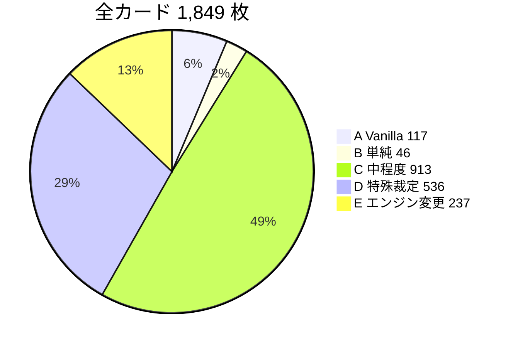

# 全カード実装分類（A〜E）

**日付:** 2026-06-09  
**対象:** Wiki 収録 **1,849 枚**（`docs/wiki/cards/*.md`）  
**生成:** `packages/cards/scripts/classify-all-cards.mjs`  
**データ:** `packages/cards/pipeline/data/card-classification.json`

---

## 分類定義

| 区分 | 意味 | 典型例 |
|------|------|--------|
| **A — Vanilla** | 効果文なし。stats / コンボナンバー / 印刷能力のみ | BK 素体、RS-044 |
| **B — 単純 Effect** | 単一 primitive 相当（draw、SP1、単純選択+移動/破棄、※1 件） | RS-059 未来予知、RS-020、RS-006 |
| **C — 中程度 Effect** | 常駐・条件付き・複合 ※・ゾード標準・複数誘発 | RS-046、RS-025、RS-069 |
| **D — 特殊裁定** | FAQ/キーワード依存・コンボ特例・相手選択・裁定要 | ウイング、チェイス、RS-032、RS-014 |
| **E — エンジン変更** | コマンダー・母艦・多段ウィザード・新 State/Action | RS-001、XC-001、RS-076 |

**判定順:** E → A → B/C（本文パターン）→ D（裁定キーワード / 複雑 FAQ）

---

## 集計サマリー

| 区分 | 枚数 | 比率 |
|------|------|------|
| **A** Vanilla | **117** | **6.3%** |
| **B** 単純 Effect | **46** | **2.5%** |
| **C** 中程度 Effect | **913** | **49.4%** |
| **D** 特殊裁定 | **536** | **29.0%** |
| **E** エンジン変更 | **237** | **12.8%** |
| **合計** | **1,849** | 100% |



---

## カード種別別内訳

| 種別 | 合計 | A | B | C | D | E |
|------|------|---|---|---|---|---|
| Sユニット | 1,082 | 9 | 12 | 563 | 341 | 157 |
| オペレーション | 242 | 95 | 0 | 47 | 64 | 36 |
| Mユニット | 200 | 8 | 6 | 106 | 72 | 8 |
| Lユニット | 180 | 4 | 1 | 98 | 65 | 12 |
| Sビークル | 70 | 0 | 1 | 48 | 20 | 1 |
| XLユニット | 37 | 0 | 0 | 22 | 10 | 5 |
| SCユニット | 8 | 1 | 0 | 4 | 3 | 0 |
| M/Lビークル | 13 | 0 | 0 | 9 | 1 | 1 |
| コマンダー | 17 | 0 | 0 | 0 | 0 | 17 |

---

## シリーズ別（主要プレフィックス）

| プレフィックス | 合計 | A | B | C | D | E |
|----------------|------|---|---|---|---|---|
| RS | 690 | 26 | 28 | 231 | 317 | 88 |
| XG1–7 | 494 | 0 | 8 | 248 | 168 | 70 |
| RK | 248 | 0 | 3 | 120 | 89 | 36 |
| RM | 62 | 0 | 0 | 38 | 18 | 6 |
| BK | 19 | 19 | 0 | 0 | 0 | 0 |
| XP | 31 | 0 | 1 | 18 | 8 | 4 |
| XC | 8 | 0 | 0 | 0 | 0 | 8 |
| PR/PM/PK 等 | 残り | — | — | — | — | — |

---

## 区分別の特徴

### A（117）— Vanilla

- 効果文ブロックが空、または atwiki 未取得で stats のみ
- BK ベルトコレクション 19 枚はほぼ全て A
- オペレーション 95 枚はテキスト未収録の常駐/即時枠

### B（46）— 単純 Effect

- `draw 1`、`place_in_power`、単純カウンター（RS-006）
- ※コマンドホールド 1 件のみ（RS-038）
- `grant_sp1` 単体（一部ユニット）

### C（913）— 中程度 Effect

- 全体の約半数。DSL primitives + `grant_keyword` で表現可能な見込みが大きい
- 常駐 OP、optional 誘発、ゾード `rushAdditionalCondition`、BP 修正

### D（536）— 特殊裁定

| サブカテゴリ | 推定枚数 | 判定根拠 |
|-------------|----------|----------|
| ウイング | ~94 | テキストに「ウイング」 |
| チェイス | ~14 | テキストに「チェイス」 |
| コンボ特例 | ~80+ | ナンバー無関係発動、本来 BP バトル |
| FAQ 複合 | ~200+ | grnrngr FAQ + 複数誘発/条件 |
| ストライク/代替 | ~50+ | 無効化、かわりにバトル |

### E（237）— エンジン変更

| サブカテゴリ | 枚数 | 例 |
|-------------|------|-----|
| コマンダー | 17 | XC-001〜008 |
| NC フィニッシャー OP | 3 | RS-001, RS-002, RS-015 相当 |
| 多段ウィザード OP | 5+ | RS-004, RS-013, RS-008 |
| 母艦/モノシップ | ~30 | RS-076, RS-105 |
| レジスト/複合ルール | 少数 | PK-009 等 |
| モード選択 OP | 多数 | BK-001 型「次の効果から1つ」 |

---

## 旧 A/B/C 分類との対応

| 旧（codebase-scalability-review） | 新 A〜E |
|-----------------------------------|---------|
| A JSON のみ（115） | **A**（117） |
| B JSON+共通 Effect（1,625） | **B + C**（955） |
| C TypeScript 必要（109） | **D + E**（777）の一部 |

新分類は「実装難度」と「裁定依存」を分離。旧 C のうちウイング/チェイスは **D**（キーワード実装後 B/C へ降格可）、コマンダー/母艦は **E**。

---

## 再現

```bash
cd packages/cards
node scripts/classify-all-cards.mjs
# → pipeline/data/card-classification.json
```

---

## 限界・注意

1. **テキスト品質:** 未取得カードは A に寄る。atwiki ブロック追加で再分類が変わる。
2. **ヒューリスティック:** 正規表現ベース。境界付近（B/C, C/D）は ±10% のぶれを想定。
3. **L1-L3 実装済み 179 枚**は `unitEffects.json` との突合で個別補正可能（今回は Wiki 均一解析）。
