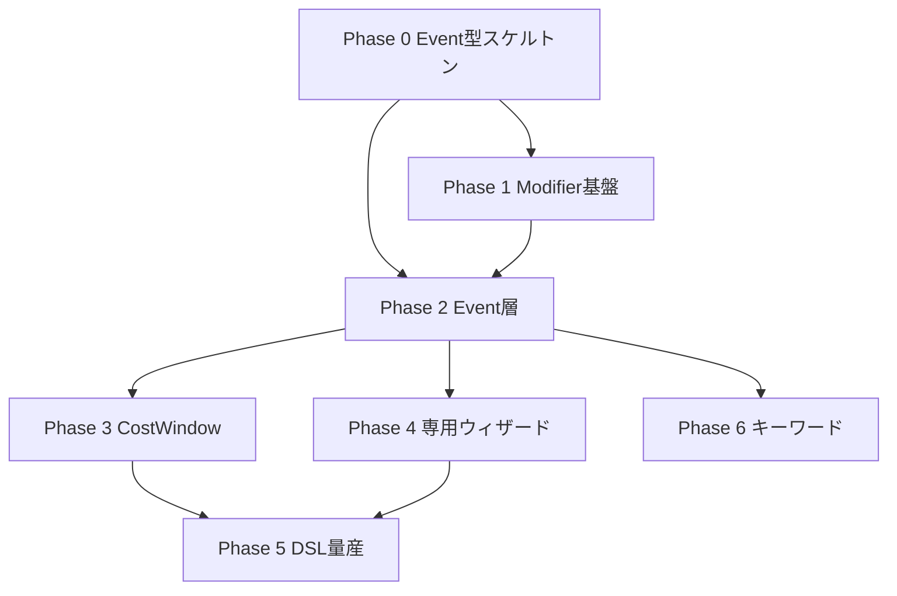

# カード固有フラグ分析 & イベント駆動移行計画

**対象:** 実装済みカード（Legend 1–3 コアループ）と `GameState`  
**参照:** `game.ts`, `state-gap-analysis.md`, `event-architecture.md`, `effect_catalog.md`, `trigger_catalog.md`  
**日付:** 2026-06-09  
**コード変更:** なし（分析・計画のみ）

---

## エグゼクティブサマリー

現行エンジンは **GameState 上の 60+ フィールド** と **カード定義側の 18 種 UnnamedUnitRule** でカード固有挙動を表現している。実装済み効果はおおよそ **オペ 39 枚 / ユニット効果 80+ effectId / NC 35 種**（重複カード含む）に達するが、その多くは `applyAction.ts`・`pendingChoices.ts`・`namedUnitEffects.ts` への **命令型ハンドラ分散** で接続されている。

| 分類 | 件数目安 | 移行先 |
|------|----------|--------|
| **イベント駆動化可能** | 効果ハンドラ ~120、Pending 反応窓 10 | `EventQueue` + TimingResolver |
| **Modifier 化可能** | State フラグ ~25、UnnamedRule 14 | `ModifierStack` / 汎用 TurnModifier |
| **専用実装が必要** | ~30 効果 + キーワード未実装 3 | Pending ウィザード・ゾーン操作チェーン |

推奨は **全面リライトではなく** `event-architecture.md` のハイブリッド構成: `pending*` を正としつつ Event 層で誘発を統一し、カード別 boolean の増殖を Modifier 型へ集約する。

---

## 1. GameState フラグ一覧（スコープ別）

### 1.1 CardInstance（インスタンス永続・ターン一時）

| フィールド | 関連カード/用途 | スコープ |
|-----------|----------------|----------|
| `bpModifier` | NC/アタック/常駐 BP 修正全般 | ターン終了クリア |
| `spModifier` | `grant_sp1`, RS-048 CN5 等 | ターン終了クリア |
| `commandHeld` | ※バトル進入・コスト支払い | 永続（ゾーン内） |
| `mothershipHold` | ゾード母艦支払い | 永続 |
| `faceDown` | ダメージマーカー | 永続 |
| `battleActed` | 1T1回バトル/ストライク制限 | ターン終了クリア |
| `activatedNcEffects` | NC 1T1回制限 | ターン終了クリア |
| `zordMaterialCardId` | RS-009 融合回収 | ラッシュ時設定 |
| `mountedOnInstanceId` | RC ライディングコンボ | 永続 |
| `shironLightUsedThisRush` | RS-013 | ラッシュフェイズ終了クリア |
| `registerHeld` | レジスト留場 | 永続 |

### 1.2 PlayerState（プレイヤー単位）

#### フェイズ行程フラグ（汎用・カード非依存）

| フィールド | 用途 |
|-----------|------|
| `hasChargedThisTurn` | チャージ 1T1枚 |
| `hasDrawnThisStart` | スタートドロー済 |
| `hasReleasedCommandsThisStart` | コマンドリリース済 |
| `hasReturnedBattleThisStart` | バトル→ラッシュ戻し済 |
| `hasPaidEarthForceUpkeep` | RS-022 アップキープ |

#### コスト支払い中間フラグ（カード固有支払いの痕跡）

| フィールド | 関連カード | 有効期間 |
|-----------|-----------|----------|
| `battleEntryHoldReady` | ※進入ホールド支払い済 | `move_to_battle` まで |
| `rushCategoryHoldReady` | ラッシュカテゴリ支払い | rush 完了まで |
| `counterCategoryHoldReady` | カウンターカテゴリ支払い | `play_counter` まで |
| `battleEntryRushDiscardReady` | RS-132 | `move_to_battle` まで |
| `battleEntryDiscardedCardId` | RS-132 → 反バイオ粒子砲判定 | 同上 |
| `battleEntryHandDiscardReady` | RS-165 | `move_to_battle` まで |
| `shironLightRushInstanceId` | RS-013 公開ユニット | ラッシュフェイズ |

### 1.3 TurnModifiers（ターン修飾子）

| フィールド | 関連カード | 効果 |
|-----------|-----------|------|
| `comboNumberDelta` | RS-015 等 | コンボ番号補正（スタック） |
| `sComboFinisher` | RS-001 / RS-002 | Sのみコンボ時フィニッシャー強化 |
| `battleBlockedInstanceIds` | RS-003 等 | 再バトル進入不可 |
| `shironLightUsed` | RS-013 / RS-071 | ラッシュフェイズ使用済 |
| `hidoraEggUsed` | RS-071 | 同上 |
| `infiniteChainActive` | RS-072 | 相手パーマ無効・カウンター不可 |
| `deaceSniperActive` | RS-107 (NC) | 相手カウンターホールド→捨札 |
| `zenibombActive` | RS-110 (NC) | 新規ラッシュ→バトル不可 |
| `rushedThisTurnInstanceIds` | RS-106 / RS-090 | ラッシュ済み追跡 |
| `ghostAbsorptionBp` | RS-094 | バトル BP 上書きマップ |
| `shiftUpSp1InstanceIds` | RS-119 | シフトアップ SP+1 |
| `auraPowerInstanceId` | RS-011 | 自ダメージごと S BP+2000 |
| `superDynamiteActive` | RS-123 (常駐) | S は守り側印刷 BP 使用 |
| `bakiBakiExtraAttackIds` | RS-158 | 追加アタック可（ストライク不可） |

### 1.4 Pending* メタフラグ（反応窓・ウィザード）

| 型 | カード固有メタ | 役割 |
|----|---------------|------|
| `PendingStrike` | `damageCancelled`, `damageApplied` | ストライク応答 |
| `PendingBattle` | `battleCancelled` (RS-006), `substituteInstanceId` (RS-018), `mirageBeamBpOverride` / `mirageBeamDiscard` (RS-131) | アタック応答 |
| `PendingLeave` | `superShieldInstanceId` (RS-052), `skipRegister`, `resumePendingStrike` | 離場応答 |
| `PendingEffectChoice` | `superBrainDiscardSecond` (RS-014), `maxPowerCost` (RS-178), `bpBudget` (RS-106), `shironLightMeta`, `denjiMachineMeta`, `seabedDrawMeta` | 選択ウィザード |
| `PendingCommandPayment` | `prismSubstitute`, `continuation` 各種 | コマンド支払いチェーン |
| `PendingZordSetup` | 素材/行き先/母艦ステップ | ゾードアップ |
| `PendingDamagePayment` | `choosingPlayerId` (RS-149) | ダメージ支払い選択権 |
| `GameState` | `pendingBattleToRushQueue` (falcon_claw 等) | スタート効果キュー |

### 1.5 カード定義側フラグ（`unitEffects.json` / `effects.ts`）

#### UnnamedUnitRule（18 種）

| rule id | 代表カード | エンジン接続 |
|---------|-----------|-------------|
| `battle_entry_hold` | RS-051〜053 等 | `restrictions.ts` |
| `auto_battle_entry_each_turn` | RS-054 等 | `startPhase.ts` |
| `auto_battle_entry_on_rush` | — | 部分 |
| `destroy_self_damage` | RS-054 等 | leave 時 |
| `deck_copy_unlimited` | ヒドラ等 | `deckRules.ts` |
| `needs_ally_s_in_battle` | RS-114 | `restrictions.ts` |
| `win_but_destroyed_vs_sp1` | RS-092 等 | バトル解決 |
| `return_to_hand_at_6_damage` | RS-112 | `fieldEffects.ts` |
| `no_battle_entry_turn_rushed` | RS-106 | `errata.ts` + TurnModifiers |
| `no_attack_turn_rushed` / `no_strike_turn_rushed` | RS-090 | 同上 |
| `cannot_enter_battle` | RS-093, RS-116 | `restrictions.ts` |
| `fusion_material_alias` | ゾード系 | デッキ構築のみ |
| `opponent_may_draw_on_enter` | — | **未実装** |
| `rush_power_to_discard` | RS-128/129 | `legend3/rushEffects.ts` |
| `cannot_enter_battle_own_turn` | RS-170 | `legend3/fieldEffects.ts` |
| `battle_entry_discard_s_from_rush` | RS-132 | PlayerState フラグ連鎖 |
| `can_attack_enemy_rush_s` / `cannot_attack_enemy_battle_s` | RS-154 | `restrictions.ts` |
| `requires_aircraft_attacker` | RS-135 | `restrictions.ts` |
| `battle_entry_combo_from` | RS-147 | `restrictions.ts` |
| `battle_entry_combo_from_own_turn` | RS-146 | `restrictions.ts` |
| `battle_entry_discard_from_hand` | RS-165 | PlayerState フラグ連鎖 |
| `battle_adds_ma_category` | RS-166 | バトル中カテゴリ |

#### 実装済み effectId（カタログ接続済み）

**オペレーション（39 枚相当）**

- 即時 19: `place_in_power`, `dynamite_power`, `aura_power`, `judgment`, `bp_boost_4000`, `discard_to_hand`, `discard_s_unit_to_hand`, `science_academy`, `goren_storm`, `jacker_hurricane`, `bird_nick_wave`, `denji_machine`, `land_balkan`, `cyber_s_rider`, `compression_freeze`, `power_bazooka`, `infinite_chain`, `animal_heart`
- 常駐 15: `battle_dance`, `super_brain`, `prism_power`, `shiron_light`, `five_tech`, `ki_power`, `super_power`, `earth_force`, `courage_magic`, `adventure`, `plasma_energy`, `lightning_gravity`, `hidora_egg`, `super_dynamite`, `super_electron_radar`
- カウンター 5: `new_gymnastics`, `dino_chronicle`, `hidden_ninja`, `shippu_ninja`, `dino_guts`

**ユニット named effect（82 effectId）**

| トリガー | 数 | 代表 |
|---------|-----|------|
| `on_rush` | 18 | armor_attack, submerge, earth_resource_absorb |
| `conditional` | 14 | ghost_absorption, falcon_claw, sagas_sniper |
| `on_attack` | 14 | mirage_beam, moonlight_sonic |
| `enter_battle` | 11 | anti_bio_cannon, crown_final_crush |
| `passive` / while_in_field | 24 | lightning_gravity 相当, traffic_control, stealth |
| `on_turn_end` | 1 | karakuri_fire_hawk |

**NC / コンボ（35 effectId）**

`grant_sp1`, `zenibomb`, `deace_sniper`, `side_knuckle`, `star_raiser`, `juu_kun_do` 等 — `numberComboEffects.ts` switch 接続。

**ジョイント / ライディング**

`joint_combo_l/r`, `riding_combo` — `comboEffects.ts` + `namedUnitEffects.ts` 専用分岐。

---

## 2. 三分類

### 2.1 イベント駆動へ移行可能

**定義:** 特定ゲーム事実（`GameEvent`）の発生をトリガに、ハンドラが State を更新するだけで表現できる。プレイヤー入力は既存 `pending*` で足りる。

| カテゴリ | 現行接続点 | 移行先 Event |
|---------|-----------|--------------|
| ラッシュ誘発 | `rushEffects.ts`, `legend2/3/rushEffects.ts` | `UnitRushed` → on_rush リスナー |
| バトル進入 | `namedUnitEffects.ts`, `ncEffects.ts` | `UnitEnteredBattle` → enter_battle / NC |
| アタック | `legend2/3/battleEffects.ts` | `BattleDeclared` → on_attack |
| 離場・破壊 | `destroyEffects.ts`, `fusionReturn.ts` | `UnitLeftZone` → on_leave |
| ストライク | `strikeReactions.ts`, `operationCounters.ts` | `StrikeDeclared` / `DamageApplied` |
| ターン終了 | `endTurnEffects.ts` | `TurnEnding` → on_turn_end |
| ダメージ受領 | `damagePayment` フロー | `DamageAssigned` → 誘発効果 |
| カウンター窓 | `operationCounters.ts` | 各 `*Declared` 後の反応フェイズ |
| NC コンボ | `numberComboEffects.ts` | `UnitEnteredBattle` + comboNumber コンテキスト |

**対象 effectId（抜粋・ほぼ全 IMPLEMENTED_* リスト）**

- on_rush 18、enter_battle 11、on_attack 14、on_turn_end 1
- NC 35（TurnModifier 書き込みを伴うものは Event 後に Modifier 適用）
- 即時オペの大半（`place_in_power`, `judgment`, `bp_boost_4000` 等）
- カウンター 5（反応窓は Pending 維持、解決本体は Event）

**移行時の原則**

1. Action Handler はゾーン移動のみ行い、事実を `EventQueue` に enqueue
2. `resolveUntilBlocked()` が Pending を開くまでループ
3. 既存 `buildEffectStack` 優先順位は維持

### 2.2 Modifier 化可能

**定義:** 「場にいる間」「このターン」「このインスタンスに」適用される静的/準静的ルール。イベント連鎖なしで **参照時計算** または **スコープ付き修飾子スタック** で表現できる。

| 現行表現 | Modifier 型案 | 例 |
|---------|--------------|-----|
| `bpModifier` / `spModifier` | `StatModifier { stat, delta, source, expires }` | 汎用 BP/SP |
| `TurnModifiers.*Active` boolean | `RuleModifier { ruleId, scope: turn, playerId }` | zenibomb, infiniteChain |
| `battleBlockedInstanceIds` | `RestrictionModifier { cannotEnterBattle, instanceId }` | RS-003 |
| `rushedThisTurnInstanceIds` | `TrackingModifier { rushedThisTurn }` | RS-106/090 判定 |
| `ghostAbsorptionBp` | `BpOverrideModifier { instanceId → bp }` | RS-094 |
| `superDynamiteActive` | `RuleModifier { usePrintedDefenderBp }` | RS-123 |
| `comboNumberDelta` | `ComboModifier { delta }` | RS-015 |
| `sComboFinisher` | `ComboModifier { finisherId }` | RS-001/002 |
| UnnamedRule 静的制限 | `StaticRuleModifier` from card definition | battle_entry_hold, cannot_enter_battle |
| 常駐オペ効果 | `AuraModifier { effectId, zone: operation }` | lightning_gravity, earth_force |
| `battle_adds_ma_category` | `CategoryModifier` | RS-166 |
| `hasResist` | `KeywordModifier { resist }` | レジスト相当 |
| フィールド走査型 | `FieldPresenceRule` | RS-047 パットサイナー, RS-069 累積 |

**hold-ready フラグ群の集約案**

`battleEntryHoldReady` 等 6 フラグ → `PendingCostPayment { kind, satisfied: boolean }` 1 オブジェクトに統合（`state-gap-analysis.md` §重複 2 参照）。Modifier ではなく **CostWindow State** だが、カード別 boolean 乱立はここで止める。

**TurnModifiers 汎用化案**

```typescript
type ScopedModifier =
  | { kind: "rule"; ruleId: string; scope: "turn" | "rush_phase"; payload?: unknown }
  | { kind: "stat"; instanceId: string; stat: "bp" | "sp"; delta: number }
  | { kind: "restriction"; instanceId: string; restriction: string };

type PlayerState = {
  // ...
  modifiers: ScopedModifier[];  // ターン終了 / フェイズ終了でフィルタ
};
```

カード追加時に `TurnModifiers` 型を拡張しなくて済む。

### 2.3 専用実装が必要

**定義:** 多段ウィザード、ゾーン操作の非標準チェーン、代替バトル、状態の部分書き換えなど、汎用 Event + Modifier では表現コストが高いもの。

| カテゴリ | 現行実装 | 理由 |
|---------|---------|------|
| **多段ウィザード** | `PendingZordSetup`, `DenjiMachineMeta`, `ShironLightMeta`, `pit_in_dive` | 3+ ステップ UI・合法手生成が固有 |
| **代替バトル** | RS-018 `substituteInstanceId` | バトル参加者の差し替え |
| **融合回収** | RS-009 `zordMaterialCardId` + `fusionReturn.ts` | 捨札から特定カードを戦場へ（効果不発） |
| **レジスト** | `PendingRegister`, `registerHeld` | 撃破時留場選択 |
| **スーパーシールド** | RS-052 `superShieldInstanceId` | 破壊時任意代用 |
| **ミラージュビーム** | `mirageBeamBpOverride` + デッキ公開 | バトル中 BP 上書き + 事後捨札 |
| **ゴースト吸収** | conditional + `ghostAbsorptionBp` マップ | 任意対象 + ターン中 BP 上書き |
| **サイドナックル** | `choosingPlayerId` 反転 | ダメージ支払い選択権の例外 |
| **電磁マシーン** | `denji_machine` | 公開→手札/山札下→順序付け |
| **ジュウクンドー** | `bpBudget` 選択 | 複数ユニット BP 合計制約 |
| **サガススナイパー** | `maxPowerCost` デッキサーチ | 破壊ユニットコスト上限 |
| **サイバーSライダー** | `applyAction.ts` 特例分岐 | ラッシュ+バトル同時進入 |
| **バキバキ** | `bakiBakiExtraAttackIds` | 追加アタック可・ストライク不可の複合 |
| **ジョイント/ライディング** | `joint_combo_*`, `riding_combo` | 隣接・乗車状態依存 |
| **未実装キーワード** | チェイス、ウイング、コマンダー | 新 Pending 型が必要 |
| **同時効果順序** | `simultaneousGroupId` 未使用 | プレイヤー順序選択 UI |

**RS-013 シロンライト** は専用 + Modifier 混在（4 層トラッキング）— 移行時に **1 Pending + 1 rush_phase modifier** へ統合を最優先。

---

## 3. 実装済みカードとフラグの対応マトリクス（主要）

| カード | State フラグ / Pending | 分類 |
|--------|------------------------|------|
| RS-001/002 | `sComboFinisher` | Modifier |
| RS-003 | `battleBlockedInstanceIds` | Modifier |
| RS-006 | `PendingBattle.battleCancelled` | Event + 専用 |
| RS-009 | `zordMaterialCardId` | 専用 |
| RS-011 | `auraPowerInstanceId` | Event→Modifier |
| RS-013 | shiron 4 層 | 専用（統合対象） |
| RS-014 | `superBrainDiscardSecond` | Event |
| RS-015 | `comboNumberDelta` | Modifier |
| RS-018 | `substituteInstanceId` | 専用 |
| RS-022 | `hasPaidEarthForceUpkeep` | Event（スタート） |
| RS-030 | 常駐 + ターン終了 | Event |
| RS-052 | `superShieldInstanceId` | 専用 |
| RS-054 | destroy_self + auto_battle_entry | Modifier + Event |
| RS-069 | フィールド走査（Aura） | Modifier |
| RS-072 | `infiniteChainActive` | Modifier |
| RS-090 | `rushedThisTurn` + unnamed | Modifier |
| RS-094 | `ghostAbsorptionBp` | 専用 |
| RS-106 | `zenibomb` + `bpBudget` | Modifier + 専用 |
| RS-107 | `deaceSniperActive` | Modifier |
| RS-110 | `zenibombActive` | Modifier |
| RS-112 | `return_to_hand_at_6_damage` | Event（ダメージ閾値） |
| RS-123 | `superDynamiteActive` | Modifier |
| RS-131 | mirage beam pending meta | 専用 |
| RS-132 | rush discard ready 連鎖 | 専用（CostWindow 化可） |
| RS-149 | `choosingPlayerId` | 専用 |
| RS-154 | unnamed 攻撃制限 ×2 | Modifier |
| RS-158 | `bakiBakiExtraAttackIds` | 専用 |
| RS-165 | hand discard ready | 専用（CostWindow 化可） |
| RS-178 | `maxPowerCost` | 専用 |

---

## 4. 移行計画

### Phase 0 — 準備（1–2 週）

**目的:** 現状の可視化と回帰防止。

- [ ] `packages/engine/src/events/` スケルトン（`GameEvent` 型、`EventQueue`、`enqueue`/`dequeue`）
- [ ] 既存 integration test 100% 維持を CI ゲートに
- [ ] `card-flags-migration.md` を `effectStack.test.ts` のケース一覧と突合
- [ ] `TurnModifiers` 追加禁止ルール（lint or PR checklist）

**成果物:** Event 型定義、`docs/architecture/event-architecture.md` との差分ゼロ確認。

### Phase 1 — Modifier 基盤（2–3 週）

**目的:** カード別 boolean 増殖を止める。

1. `ScopedModifier[]` 導入（`bpModifier`/`spModifier` と並行、読み取りは helper 経由）
2. `TurnModifiers` の boolean を `ruleId` ベースへ段階移行  
   - 先行: `zenibombActive`, `infiniteChainActive`, `deaceSniperActive`, `superDynamiteActive`
3. UnnamedRule → `getStaticRestrictions(cardId)` 集約 API（`restrictions.ts` の入口一本化）
4. `clearTurnModifiers` / `resetRushPhaseFlags` を modifier フィルタに置換

**完了条件:** 新規カード追加で `game.ts` 型変更が不要。

### Phase 2 — Event 層（コアタイミング）（3–4 週）

**目的:** 命令型ハンドラの主戦場を Event に移す。

| 順序 | Event | 移行ハンドラ |
|------|-------|-------------|
| 1 | `UnitRushed` | `rushEffects.ts` 一式 |
| 2 | `UnitEnteredBattle` | enter_battle + NC 入口 |
| 3 | `BattleDeclared` | on_attack, BP 修正 |
| 4 | `UnitLeftZone` | destroy, fusion return |
| 5 | `StrikeDeclared` / `DamageApplied` | strike/counter |
| 6 | `TurnEnding` | end_turn, RS-030 |

**パターン:**

```
applyAction → zone change → enqueue(events)
resolveUntilBlocked:
  event → findListeners(trigger) → run handler
  handler may enqueue more events or open pending*
```

**完了条件:** `namedUnitEffects.ts` の直接呼び出しが Event resolver 経由に。

### Phase 3 — CostWindow 統合（2 週）

**目的:** hold-ready 6 フラグ + `PendingCommandPayment` の二重表現解消。

- `PlayerState.costWindow?: { kind, steps, satisfied }` 導入
- RS-132 / RS-165 支払いチェーンを CostWindow ステップに
- `battleEntryDiscardedCardId` は CostWindow の `metadata` へ

**完了条件:** `state-gap-analysis.md` §重複 2 のフラグが 1 型に。

### Phase 4 — 専用ウィザード整理（3–4 週）

**優先度順:**

1. RS-013 シロンライト（4 層 → 1 Pending）
2. ゾード `PendingZordSetup`（既に分離済み — Event 前後のフックのみ追加）
3. `denji_machine` / `pit_in_dive` / `sagas_sniper`（`EffectChoiceKind` 拡張の見直し）
4. RS-018 代替バトル（`PendingBattle` 専用 resolver）
5. RS-131 ミラージュビーム、RS-094 ゴースト吸収

**完了条件:** `pendingChoices.ts` 行数横ばい（新カードは DSL + registry）。

### Phase 5 — DSL 接続 & カード量産（継続）

**目的:** `implementation-feasibility.md` の A+B（82.5%）を実装。

- DSL interpreter を Event listener registry に接続
- `effect_catalog.md` の高頻度 Effect を Phase 2 の汎用ハンドラに追加
- C 区分（17.5%）は Phase 4 以降の専用キューで対応

### Phase 6 — 未実装キーワード（スコープ外〜将来）

| キーワード | 必要 State | 依存 |
|-----------|-----------|------|
| チェイス | `PendingChase?` | Phase 2 Battle 系 |
| ウイング | 空バトル例外フラグ | restrictions 拡張 |
| コマンダー | `commander` ゾーン運用 | framework 既存 |

---

## 5. 依存関係図



---

## 6. リスクと緩和

| リスク | 影響 | 緩和 |
|--------|------|------|
| Event 導入で Pending 優先順位が崩れる | 裁定違反 | `effectStack.test.ts` 拡張、1 タイミングずつ移行 |
| Modifier 参照の性能 | AI シミュ遅延 | 場にいる間のみキャッシュ、`effectiveBp` 集約 |
| 専用ウィザードの DSL 化失敗 | C 区分が残存 | `EffectChoiceKind` プラグイン型 |
| 二重実装期間の肥大 | メンテコスト | Phase ごとに旧ハンドラを `@deprecated` 削除 |

---

## 7. 成功指標

| 指標 | 現状 | Phase 2 後 | Phase 5 後 |
|------|------|-----------|-----------|
| `game.ts` カード固有フィールド数 | ~20 | ≤10 | ≤5 |
| `applyAction.ts` 行数 | 大 | −30% | −50% |
| 新カード実装タッチファイル数 | 3–5 | 1–2 (DSL) | 1 (DSL) |
| A+B 実装可能率 | 82.5% | 85% | 95% |
| 100 試合 AI 完走率 | 100% | 100% | 100% |

---

## 8. 次のアクション（推奨）

1. **Phase 0** として `packages/engine/src/events/types.ts` に `GameEvent` union を定義（`event-architecture.md` §2 から転記）
2. **Phase 1** 先行対象: `zenibombActive` / `infiniteChainActive` を `ScopedModifier` へ最初の 2 例として移行
3. **Phase 2** 先行対象: `UnitRushed` — 既存 `rushEffects.test.ts` を Event 経由に差し替え

---

## 参照ファイル

| ファイル | 役割 |
|---------|------|
| `packages/engine/src/types/game.ts` | State 型の単一ソース |
| `packages/engine/src/rules/turnModifiers.ts` | ターン修飾子 API |
| `packages/cards/src/effectTaxonomy.ts` | UnnamedUnitRule 定義 |
| `packages/cards/src/unitEffectCatalog.ts` | 実装済みユニット effectId |
| `packages/cards/src/operationCatalog.ts` | 実装済みオペ effectId |
| `docs/architecture/event-architecture.md` | Event 層設計 |
| `docs/architecture/state-gap-analysis.md` | 重複・ギャップ分析 |
