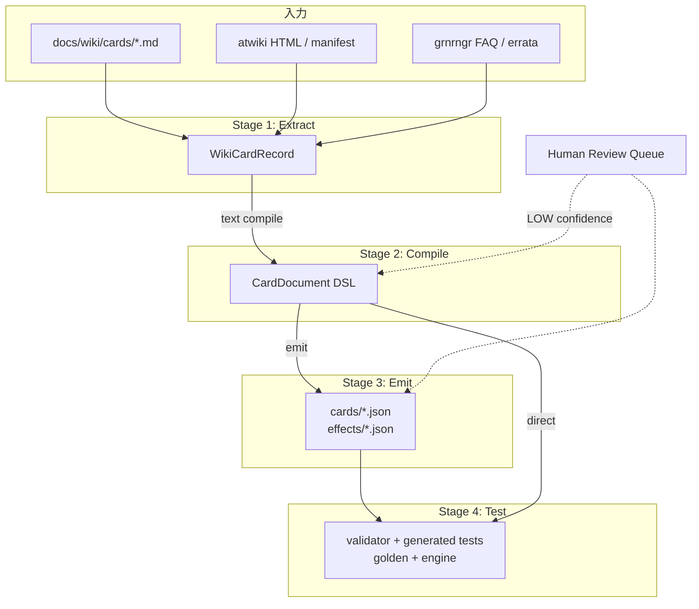
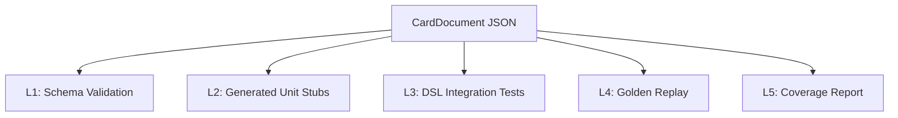

# カード生成パイプライン設計 — Wiki → DSL → JSON → 自動テスト

**目的:** Wiki 情報を起点に、カードテキストから DSL・JSON・テストまで一気通貫で生成する  
**対象:** `docs/wiki/`, `packages/cards/`, `packages/engine/`  
**関連:** [full-card-rollout-process.md](./full-card-rollout-process.md)（**全カード反映の運用プロセス**）, [codebase-scalability-review.md](./codebase-scalability-review.md) §6, [test-strategy.md](./test-strategy.md), [replay-system-design.md](./replay-system-design.md)  
**日付:** 2026-06-10

> **運用と技術の分担:** 本ドキュメントは Wiki→DSL の**技術設計**（Stage 1–4）。週次イテレーション・ゲート判定・完了定義は [full-card-rollout-process.md](./full-card-rollout-process.md) を参照。

---

## 0. パイプライン概要



| Stage | 入力 | 出力 | 自動化度 |
|-------|------|------|----------|
| **1 Extract** | Wiki md / atwiki | `WikiCardRecord` | 95% |
| **2 Compile** | 効果文 + stats | `CardDocument` (DSL) | A:100% / B:60–80% / C:0% |
| **3 Emit** | CardDocument | `cards.json` シャード + `effects/` | 100% |
| **4 Test** | JSON | vitest + golden + coverage | 100% |

**既存資産との関係:**

| 既存 | パイプラインでの位置 |
|------|---------------------|
| `atwikiText.js` | Stage 1 |
| `wikiReference.ts` | Stage 1 の優先ソース（L1-L3） |
| `dsl/validator.ts` | Stage 4 |
| `dsl/loader.ts` | Stage 3 逆方向（レガシー → DSL） |
| `dsl/testGenerator.ts` | Stage 4 |
| `validate-cards.ts` | Stage 4 CI |

---

## 1. Stage 1 — Wiki → カードテキスト（Extract）

### 1.1 目的

1849 枚の Wiki を **単一の正規化レコード** `WikiCardRecord` に集約する。  
効果文の優先順位を固定し、差分検出可能にする。

### 1.2 効果文優先順位（公式）

```
1. grnrngr errata（修正後テキスト）
2. atwiki「テキスト」ブロック（修正後 > 通常）
3. docs/wiki/cards/*.md の atwiki 効果文
4. wikiReference.ts / unitEffects.json（リポジトリ既存）
5. wikiwiki.jp（未収録時のみ）
```

### 1.3 WikiCardRecord スキーマ

```typescript
type WikiCardRecord = {
  id: string;                    // RS-046
  name: string;
  expansion: string;             // 収録 → legend1 等にマップ
  category: Category | Category[];
  cardType: "unit" | "operation" | "vehicle" | "commander";
  stats: {
    powerCost?: number | string;
    bp?: number;
    sp?: number | "special" | null;
    size?: Size;
    comboNumber?: number | "L" | "R" | "RC";
    features?: string[];
    tags?: string[];             // 常駐 / カウンター
  };
  /** 正規化済み効果文（※ と 【】 を保持） */
  effectText: string;
  /** 構造化ブロック */
  blocks: EffectTextBlock[];
  sources: {
    wikiMd: string;              // docs/wiki/cards/RS-046.md
    atwikiUrl?: string;
    errataUrl?: string;
    confidence: "HIGH" | "MEDIUM" | "LOW" | "MISSING";
  };
  /** A/B/C 分類（codebase-scalability-review 準拠） */
  implClass: "A" | "B" | "C";
  /** 既存リポジトリとの差分 */
  drift?: {
    cardsJson?: string;
    unitEffects?: string;
    wikiReference?: string;
  };
};

type EffectTextBlock =
  | { kind: "unnamed"; text: string }           // ※ 行
  | { kind: "named"; name: string; body: string }  // 【名前】本文
  | { kind: "raw"; text: string };              // オペ単一文
```

### 1.4 Extract 実装

```
packages/cards/pipeline/
  extract/
    parseWikiMd.ts       # docs/wiki/cards/*.md パーサ
    parseAtwikiHtml.ts   # atwikiText.js を TS 移植
    mergeSources.ts      # 優先順位マージ
    classifyImpl.ts      # A/B/C 分類
    buildWikiIndex.ts    # WikiCardRecord[] 生成
  data/
    wiki-index.json      # 生成物（git 管理）
    wiki-drift.json      # cards.json との差分レポート
```

```bash
# CLI
npm run pipeline:extract
# → packages/cards/pipeline/data/wiki-index.json
# → packages/cards/pipeline/data/wiki-drift.json
```

### 1.5 parseWikiMd 抽出ルール

`docs/wiki/cards/RS-046.md` から:

| フィールド | 抽出元 |
|-----------|--------|
| `id` | `CARD_ID:` |
| `name` | `カード名:` |
| `category` | `カテゴリ:` |
| `effectText` | `atwiki 効果文:` > `効果文（リポジトリ参照）:` |
| `stats.*` | `atwiki ステータス:` ブロック |
| `confidence` | md 内 `confidence: HIGH` 集計 |

```typescript
function parseEffectBlocks(text: string): EffectTextBlock[] {
  // 1. ※ で始まる行 → unnamed
  // 2. 【([^】]+)】(.+) → named（複数可）
  // 3. 残り → raw（オペ）
}
```

---

## 2. Stage 2 — カードテキスト → DSL（Compile）

### 2.1 目的

`WikiCardRecord` から **`CardDocument`**（[card.schema.json](../../packages/cards/schema/card.schema.json) 準拠）を生成する。

### 2.2 コンパイル戦略（implClass 別）

| Class | 戦略 | 出力 |
|-------|------|------|
| **A**（素体） | stats のみ。`effects: []` | 完全自動 |
| **B**（共通 Effect） | ルールベース + パターンマッチ → primitives | 自動 + 要レビュー |
| **C**（TS 必要） | `fallback_handler` + `implementation.handler: typescript` | スタブ自動、primitives は人間 |

### 2.3 コンパイラパイプライン（内部）

```mermaid
flowchart LR
  T[effectText] --> LEX[Lexer<br/>※ / 【】 / 数値 / キーワード]
  LEX --> PAR[Parser<br/>EffectTextBlock[]]
  PAR --> TRG[TriggerResolver<br/>effectTaxonomy]
  PAR --> COND[ConditionBuilder]
  PAR --> PRIM[PrimitiveEmitter]
  TRG --> DOC[CardDocument]
  COND --> DOC
  PRIM --> DOC
```

### 2.4 TriggerResolver — 日本語 → trigger

| 効果文パターン | trigger |
|---------------|---------|
| `これをラッシュしたとき` | `{ type: "on_rush" }` |
| `バトルエリアに出たとき` / `バトルに進入` | `{ type: "enter_battle" }` or `nc` |
| `アタックしたとき` | `{ type: "on_attack" }` |
| `破壊したとき` | `{ type: "on_destroy" }` |
| `場を離れるとき` | `{ type: "on_leave" }` |
| `ターンを終えるとき` | `{ type: "on_turn_end" }` |
| `コンビネーション` + 位置 | `{ type: "nc" }` |
| `常駐` / オペ配置 | `{ type: "while_in_field" }` or `operation.resident` |
| `カウンター` | `{ type: "operation", timing: "counter" }` |
| `※` のみ | `unnamedRules[]`（rule id マップ） |

`effectTaxonomy.ts` の `UnnamedUnitRule` と **テキスト→rule id** 辞書を `pipeline/compile/unnamedRules.ts` に保持。

### 2.5 PrimitiveEmitter — 日本語 → primitives

| パターン | primitive |
|----------|-----------|
| `ドロー` / `N枚引` | `{ type: "draw", amount: N }` |
| `BP＋N` / `BP＋Nされる` | `{ type: "modify_bp", amount: N, duration: "turn" }` |
| `BP N以下の…を1体選び…パワーに送` | `choose(select_unit)` + `move(to: power)` |
| `撃破` / `破壊` | `move(to: discard)` or `enqueue_trigger` |
| `ホールド` | `hold_command` |
| `ダメージ N` | `deal_damage` |
| `発動できる` | `optional: true` on effect |
| マッチ不可 | `{ type: "fallback_handler", effectId }` |

**effectId 生成:** `【アーマーアタック】` → `armor_attack`（既存 id と突合、なければ snake_case 新規）。

### 2.6 コンパイル結果メタデータ

```typescript
type CompileResult = {
  document: CardDocument;
  confidence: number;          // 0.0–1.0
  warnings: CompileWarning[];
  unmatchedSpans: TextSpan[];  // 未翻訳テキスト（人手用）
  suggestedReview: boolean;
};
```

| confidence | 扱い |
|------------|------|
| ≥ 0.9 | 自動マージ |
| 0.7–0.9 | CI warning、人間レビュー推奨 |
| < 0.7 | `pipeline/review/` に出力、マージ禁止 |
| C カード | `fallback_handler` のみ、confidence = 0 |

### 2.7 実装配置

```
packages/cards/pipeline/
  compile/
    lexer.ts
    parser.ts
    triggerResolver.ts
    conditionBuilder.ts
    primitiveEmitter.ts
    unnamedCompiler.ts
    effectIdRegistry.ts      # 既存 effectId との正規化
    compileCard.ts           # WikiCardRecord → CompileResult
    patterns/                # 宣言的パターン（YAML or TS）
      on_rush.yaml
      modify_bp.yaml
      choose_move.yaml
```

```bash
npm run pipeline:compile -- RS-046
npm run pipeline:compile -- --all --min-confidence 0.9
# → packages/cards/src/generated/dsl/RS-046.json
# → packages/cards/pipeline/review/RS-004.json（LOW のみ）
```

### 2.8 人手修正ループ

```
pipeline/review/RS-004.json   # コンパイル失敗・LOW
        ↓ 人間が primitives 追記
packages/cards/src/dsl/overrides/RS-004.json   # 手動上書き（git 管理）
        ↓ compile 時に merge
generated/dsl/RS-004.json     # override が優先
```

**ルール:** `overrides/` はコンパイラ再実行で消えない。`generated/` は常に再生成可。

---

## 3. Stage 3 — DSL → JSON（Emit）

### 3.1 目的

`CardDocument` を実行時・ビルド時に使う **JSON シャード** へ分割出力する。

### 3.2 出力先

| 出力 | 内容 | 用途 |
|------|------|------|
| `generated/catalog/{expansion}/cards.json` | CardDefinition 配列 | アプリ・エンジン |
| `generated/effects/{id}.json` | EffectDefinition[] | interpreter |
| `generated/index.json` | cardId → ファイルパス | ローダ |
| `generated/manifest.json` | catalogHash, 件数, 日時 | CI / replay |

**レガシー移行期:** `legend1/cards.json` は `generated` から同期コピー（diff ゼロまで）。

### 3.3 Emit ルール

```typescript
function emitCardDocument(doc: CardDocument): EmittedFiles {
  // 1. CardDefinition（effects 除く）→ cards.json エントリ
  // 2. effects[] → effects/{id}.json または unitEffects 互換ブロック
  // 3. unnamedRules → unnamedRules 配列
  // 4. implementation メタを manifest に集計
}
```

```typescript
// cards.json エントリ（効果は別ファイル）
{
  "id": "RS-046",
  "name": "パトアーマー",
  "type": "unit",
  "category": "OT",
  "effectRef": "effects/RS-046.json"   // 新形式
}
```

### 3.4 ローダ統合

```typescript
// packages/cards/src/dsl/loader.ts（拡張）
export function loadCardFromGenerated(id: string): CardDocument {
  const def = loadCardDefinition(id);
  const effects = loadEffectFile(def.effectRef);
  return merge(def, effects);
}

export function createCardRegistryFromGenerated(): CardRegistry;
```

### 3.5 CLI

```bash
npm run pipeline:emit
# extract + compile（confidence ≥ threshold）+ emit を一括

npm run pipeline:sync-legacy
# generated → legend1|2|3/cards.json + unitEffects.json（差分 PR 用）
```

---

## 4. Stage 4 — JSON → 自動テスト（Test）

### 4.1 テスト生成の層



### 4.2 L1 — Schema Validation（既存）

```bash
npm run validate-cards
```

| 検証 | ツール |
|------|--------|
| JSON Schema | `validator.ts` |
| effectId 一意 | `registry.ts` |
| trigger 型 | `effectTaxonomy` |
| primitive 型 | `PRIMITIVE_TYPES` |

**CI:** PR 必須。失敗でマージ不可。

### 4.3 L2 — Generated Unit Stubs（既存拡張）

`testGenerator.ts` から:

```
packages/cards/src/dsl/generated/
  RS-046.generated.test.ts      # カード別
  registry.smoke.generated.test.ts
```

| implClass | 生成内容 |
|-----------|----------|
| A | `it("has no effects")` のみ |
| B + interpreter | **実行テスト**（fixture + applyAction） |
| B + fallback | `it.skip` + TODO |
| C | `it.skip` + `golden_required` タグ |

**拡張 — 自動 fixture 生成:**

```typescript
// testGenerator.ts 拡張
function generateSetupCode(card: CardDocument, effect: EffectDefinition): string {
  // trigger に応じた最小 GameState + deck 配置を TS コード生成
  // on_rush → 手札に card、phase: rush
  // operation → 手札 + 必要パワー
}
```

### 4.4 L3 — DSL Integration Tests（engine）

interpreter 接続後:

```
packages/engine/src/generated/
  RS-046.integration.generated.test.ts
```

```typescript
// 生成例
it("RS-046 armor_attack moves target to power", () => {
  const state = loadGeneratedFixture("RS-046", "armor_attack");
  const after = runScenario(state, [
    { action: { type: "rush", instanceId: "..." } },
    { action: { type: "resolve_effect_choice", instanceId: "enemy" } },
  ]);
  expectZone(after, "player2", "power", ["enemy-id"]);
});
```

**生成条件:** `implementation.handler === "interpreter"` かつ primitives に `fallback_handler` なし。

### 4.5 L4 — Golden Replay（test-strategy 連携）

コンパイル時に **期待イベント列** を静的推論:

```typescript
// compileCard.ts
const expectedEvents = TRIGGER_EVENTS[trigger.type]; // testGenerator と共有
```

Golden 候補として `packages/engine/golden/candidates/{id}.json` を出力。人間承認後 `golden/cases/` へ。

### 4.6 L5 — Coverage Report

```bash
npm run pipeline:coverage
```

| 指標 | 説明 |
|------|------|
| `extract_coverage` | wiki-index / 1849 |
| `compile_coverage` | confidence ≥ 0.9 の割合 |
| `dsl_primitive_coverage` | fallback なし effect の割合 |
| `test_skip_rate` | it.skip / 総テスト |
| `engine_pass_rate` | integration generated の pass |
| `drift_count` | wiki vs cards.json 差分 |

CI で PR コメントに投稿。

---

## 5.  end-to-end CLI

### 5.1 コマンド一覧

| コマンド | 処理 |
|----------|------|
| `pipeline:extract` | Wiki → wiki-index.json |
| `pipeline:compile` | wiki-index → generated/dsl/ |
| `pipeline:emit` | dsl → catalog + effects |
| `pipeline:test` | validate + generate-card-tests + vitest |
| `pipeline:all` | extract → compile → emit → test |
| `pipeline:card -- RS-046` | 単卡デバッグ |
| `pipeline:drift` | wiki-index vs レガシー差分 |
| `pipeline:coverage` | レポート出力 |

### 5.2 単卡フロー例（RS-046）

```bash
# 1. Wiki からテキスト抽出
npm run pipeline:extract -- --id RS-046

# 2. 効果文 → DSL
npm run pipeline:compile -- RS-046
# → generated/dsl/RS-046.json
#    confidence: 0.95, warnings: []

# 3. DSL → 実行 JSON
npm run pipeline:emit -- RS-046
# → generated/catalog/legend1/cards.json（マージ）
# → generated/effects/RS-046.json

# 4. テスト生成 + 実行
npm run pipeline:test -- RS-046
# → dsl/generated/RS-046.generated.test.ts
# → vitest run
```

### 5.3 CI パイプライン

```yaml
# .github/workflows/card-pipeline.yml
jobs:
  pipeline:
    steps:
      - run: npm run pipeline:extract
      - run: npm run pipeline:compile -- --all --min-confidence 0.9
      - run: npm run pipeline:emit
      - run: npm run validate-cards
      - run: npm run generate-card-tests
      - run: npm run test --workspace=@rangers-strike/cards
      - run: npm run pipeline:coverage
      - uses: actions/upload-artifact@v4
        with:
          name: wiki-drift
          path: packages/cards/pipeline/data/wiki-drift.json
```

| トリガー | 実行範囲 |
|----------|----------|
| PR（cards/ wiki/ 変更） | 変更 cardId のみ `--changed` |
| main nightly | `--all` + drift レポート |
| 手動 | `pipeline:card RS-xxx` |

---

## 6. ディレクトリ構成（目標）

```
packages/cards/
  pipeline/
    extract/          # Stage 1
    compile/          # Stage 2
    emit/             # Stage 3
    data/
      wiki-index.json
      wiki-drift.json
    review/           # LOW confidence（gitignore 可）
  schema/             # 既存 JSON Schema
  src/
    dsl/
      overrides/      # 人手修正（永続）
      examples/       # 手本（RS-046）
    generated/        # 自動生成（CI 再生成）
      dsl/
      catalog/
      effects/
  scripts/
    pipeline.ts       # エントリ CLI
    validate-cards.ts
    generate-card-tests.ts
```

```
packages/engine/src/
  generated/          # interpreter integration tests
  golden/
    candidates/       # パイプライン出力 → 人間承認
    cases/            # 承認済み
```

---

## 7. A/B/C 別パイプライン動作

| Class | Extract | Compile | Emit | Test |
|-------|---------|---------|------|------|
| **A** (115) | stats のみ | `effects: []` | cards.json のみ | schema + smoke |
| **B** (1625) | 全文 | primitives 自動 | cards + effects | validator + integration（interpreter 後） |
| **C** (109) | 全文 | `fallback_handler` | cards + effects stub | skip + golden 必須 |

**C カードの人手フロー:**

1. パイプラインが stub DSL を生成
2. engine に TS 実装
3. `overrides/{id}.json` で primitives 化を段階的に置換
4. `implementation.handler` を `typescript` → `interpreter` に変更
5. 生成テストの `skip` を外す

---

## 8. 品質ゲート

| ゲート | 条件 | ブロック |
|--------|------|----------|
| G0 Extract | `confidence !== MISSING` | 効果文なしカードは A のみ自動 |
| G1 Compile | `confidence ≥ 0.9` または override 存在 | generated へのマージ |
| G2 Validate | `validateCardDocument.ok` | CI fail |
| G3 Drift | `wiki-drift.json` の P0 差分 | リリースブランチ |
| G4 Test | smoke 100% pass | CI fail |
| G5 Engine | B カード integration pass 率 ≥ 閾値 | nightly アラート |

---

## 9. 実装ロードマップ

### Phase 0（1 週）— Extract + Drift

- [ ] `parseWikiMd.ts` — 1849 md → wiki-index.json
- [ ] `wiki-drift.json` vs legend1-3
- [ ] `pipeline:extract` CLI
- [ ] CI: drift artifact

### Phase 1（2 週）— Compile 基本

- [ ] `unnamedCompiler` — ※ → UnnamedUnitRule
- [ ] `primitiveEmitter` — draw / modify_bp / choose+move
- [ ] A カード一括 compile
- [ ] `overrides/` マージ機構

### Phase 2（3 週）— Emit + Test

- [ ] `generated/catalog` + `effects/`
- [ ] `loader.ts` 拡張
- [ ] `testGenerator` fixture 自動生成
- [ ] `pipeline:all` CI

### Phase 3（4 週）— B カードスケール

- [ ] patterns/ 50 パターン
- [ ] L1-L3 confidence ≥ 0.9 を 80%+
- [ ] engine `generated/*.integration.test.ts`
- [ ] golden candidates 自動出力

### Phase 4 — 全弾

- [ ] atwiki 再フェッチ統合
- [ ] errata 自動優先
- [ ] 1810 枚 compile + coverage dashboard

---

## 10. RS-046 端到端例

**入力（Wiki）:**

> 【アーマーアタック】これをラッシュしたとき発動できる。敵軍バトルエリアからBP8000以下のユニットを1体選ぶ。選んだユニットを持ち主のパワーゾーンに送る。

**Compile 出力:** [RS-046.dsl.json](../../packages/cards/src/dsl/examples/RS-046.dsl.json) と同等

**Emit 出力:**

- `generated/catalog/legend1/cards.json` に stats エントリ
- `generated/effects/RS-046.json` に effects 配列

**Test 出力:**

- `RS-046.generated.test.ts` — registry + skip なし（interpreter 後）
- `RS-046.integration.generated.test.ts` — rush + choose + move assert
- `golden/candidates/RS-046.json` — events: `rush_completed → effect_triggered`

---

## 参照

| 文書 / コード | 内容 |
|--------------|------|
| [full-card-rollout-process.md](./full-card-rollout-process.md) | 全カード反映の運用プロセス（G0–G5、週次コマンド） |
| [codebase-scalability-review.md](./codebase-scalability-review.md) §6 | A/B/C 分類 |
| [test-strategy.md](./test-strategy.md) | Golden / Replay |
| `packages/cards/schema/` | CardDocument schema |
| `packages/cards/src/dsl/testGenerator.ts` | テスト生成 |
| `packages/cards/scripts/atwikiText.js` | HTML 抽出（Stage 1 前身） |
| `docs/wiki/cards/*.md` | Wiki ソース |
