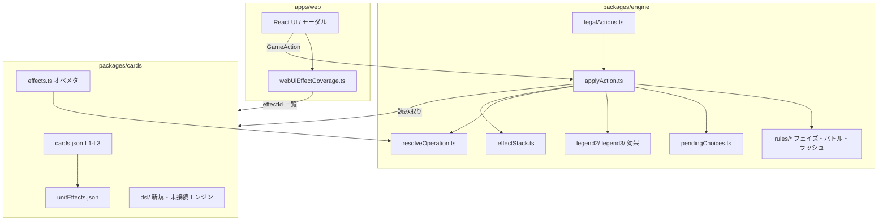
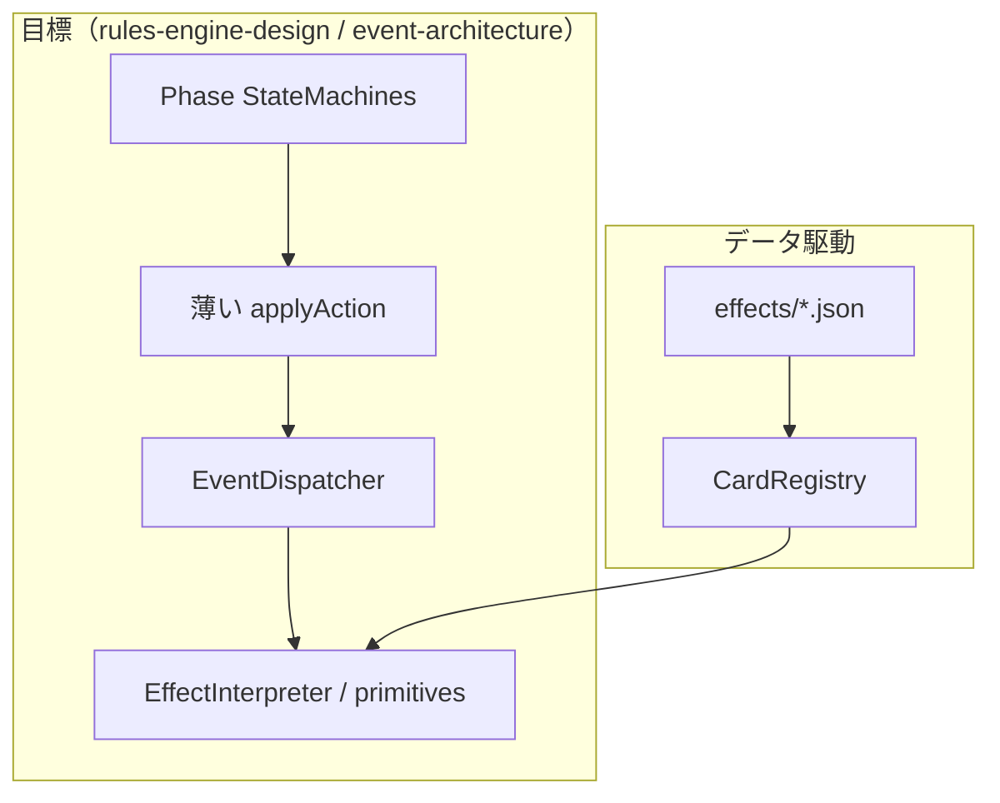
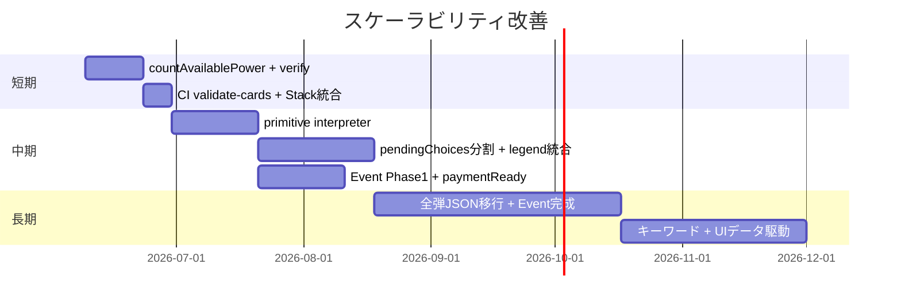
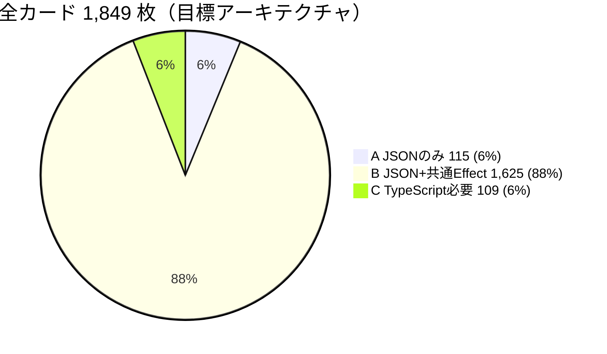

# コードベース全体レビュー — 全カード実装スケーラビリティ

**目的:** レンジャーズストライク全カード（1810+ 枚）を実装しても破綻しない構造かを評価する  
**対象:** `packages/engine`, `packages/cards`, `apps/web`, `docs/architecture/*`  
**日付:** 2026-06-09

---

## エグゼクティブサマリ

| 観点 | 評価 | 一言 |
|------|------|------|
| コアループ（フェイズ・反応窓・ダメージ） | **良好** | Wiki HIGH 領域は動作。EffectStack 導出は妥当 |
| カード効果の拡張性 | **不良** | effectId → TS 分岐が既定。O(cards) のコード増 |
| データ層 | **改善中** | unitEffects.json + 新 DSL 基盤あり。実行は未接続 |
| UI 層 | **中程度** | 効果ごとに手動配線（webUiEffectCoverage） |
| 設計ドキュメント | **充実** | 実装は Phase 0。文書とコードのギャップがリスク |

**結論:** 現状のまま全カードを実装すると **確実に破綻する**。コアループは維持しつつ、**効果実行を DSL + Event + primitive interpreter に移行**しない限り、Legend 4 以降で開発速度が指数的に低下する。

---

## 1. 現在のアーキテクチャ概要

### 1.1 パッケージ構成

```
rangers-strike/
├── packages/
│   ├── cards/          # カード定義・効果メタ・DSL（新規）
│   └── engine/         # ルールエンジン・AI
├── apps/
│   └── web/            # Next.js UI・効果配線
└── docs/
    ├── wiki/           # 仕様ソース（1849 カード md）
    └── architecture/   # 設計（イベント・DSL・ロードマップ）
```

| パッケージ | ソースファイル数（test 除く） | 役割 |
|-----------|------------------------------|------|
| `engine` | ~70 | ゲーム進行・効果解決 |
| `cards` | ~25 + DSL | 静的データ・カタログ |
| `web` | ~20 lib | プレイ UI・モーダル |

**実装規模（行数・上位）:**

| ファイル | 行数 | 性質 |
|----------|------|------|
| `applyAction.ts` | 1,722 | Orchestrator + カード特例 |
| `pendingChoices.ts` | 1,580 | 選択 UI 解決 God Object |
| `resolveOperation.ts` | 816 | オペ effectId switch |
| `namedUnitEffects.ts` | 723 | ユニット効果ルータ |
| `legalActions.ts` | ~700 | 合法手 + effectId 特例 |
| `restrictions.ts` | ~600 | 進入制限 + cardId 直書き |

### 1.2 レイヤ図（現行・実装済み）



### 1.3 データフロー（1 Action あたり）

```
ユーザー入力 (GameAction)
    │
    ▼
legalActions ── フェイズ / Pending トップ / effectId 特例
    │
    ▼
applyAction ──┬── ゾーン変異（即時）
              ├── rules/*（フェイズ・コスト・BP）
              ├── legend2|3/*Effects（effectId 分岐）
              ├── pendingChoices（選択解決）
              ├── resolveOperation（オペ switch）
              └── withSyncedEffectStack
    │
    ▼
GameState（pending* が正、effectStack は導出）
```

### 1.4 設計上の目標形（ドキュメントのみ・未実装）



### 1.5 実装カバレッジ（概算）

| 領域 | カタログ | 構造化データ | エンジン実装 |
|------|----------|-------------|-------------|
| カード定義 L1-L3 | 179 枚 | cards.json | 参照のみ |
| ユニット効果ブロック | ~228 キー | unitEffects.json | 部分（effectId 登録） |
| オペレーション | ~60 枚 L1-L3 | effects.ts | ~35 effectId |
| NC / JC / RC | 多数 | comboEffects.ts | 部分リスト |
| Wiki 全弾 | ~1810 枚 | cards/*.md | 未 |

---

## 2. 責務分離の評価

### 2.1 総合マトリクス

| 層 | 分離度 | 評価 | 主な問題 |
|----|--------|------|----------|
| **state** | 中 | B | コアは妥当。カード固有フィールドが型に侵入 |
| **action** | 中 | B- | 41 種は整理済み。カード固有 Action が残存 |
| **effect** | 低 | D+ | effectId → TS が正。DSL は cards にのみ存在 |
| **rule** | 高 | A- | フェイズ・コスト・反応窓は rules/* に分離 |
| **card** | 中 | C+ | データは cards。実行登録が engine に分散 |

### 2.2 state（ゲーム状態）

**担うもの:** `GameState`, `PlayerState`, `CardInstance`, `pending*`, `TurnModifiers`

| 良い点 | 問題点 |
|--------|--------|
| 7 ゾーン + Pending 10 種は Wiki と整合 | `TurnModifiers` にカード固有フィールド 8/15 |
| EffectStack は `pending*` から導出（単一優先度） | hold-ready boolean × 5（PlayerState） |
| `CardInstance` 修飾子はフィールド単位で明確 | RS-013 が 4 層に状態分散 |
| | `deferredBattleEntry` が Stack 外（UI 乖離リスク） |

**スケール判定:** コアループ用 State は **全カードでもほぼ不変**。カード追加で `game.ts` を触る頻度が高いのは **設計負債**。

### 2.3 action（プレイヤー意図）

**担うもの:** `GameAction` union, `legalActions`, `applyAction` 分岐

| 良い点 | 問題点 |
|--------|--------|
| フェイズ行動 / 反応 / 支払い / 選択で分類可能 | `shiron_light`, `hidora_egg`, `battle_dance_retreat` が独立 Action |
| Pending トップで合法手を制限 | `legalActions` に effectId 特例（cyber_s_rider, dino_chronicle 等） |
| 反応窓 5 種 + pass_* は一貫 | 新選択 UI → 新 Action または confirm 亜種の増殖リスク |

**スケール判定:** Action **型の数**は抑えられるが、**legalActions / applyAction 内の特例**がカードとともに増える。

### 2.4 effect（カード効果）

**担うもの:** `legend2/*`, `legend3/*`, `resolveOperation`, `pendingChoices`, `namedUnitEffects`

| 良い点 | 問題点 |
|--------|--------|
| trigger 概念は effectTaxonomy / unitEffects に存在 | **実行はすべて engine 内 TS** |
| operationCatalog / unitEffectCatalog で実装一覧 | 一覧と実装が二重管理 |
| 新 DSL + validator + registry（cards） | **エンジン未接続**（interpreter なし） |
| | legend2 / legend3 フォルダの鏡像増殖 |

**スケール判定:** **最大のボトルネック**。全カード実装 = 全 effectId 分岐の線形増加。

### 2.5 rule（ルールエンジン）

**担うもの:** `startPhase`, `rushEffects`, `battleEntry`, `damagePayment`, `effectStack`, `resist`, `zord`, `commandPayment`

| 良い点 | 問題点 |
|--------|--------|
| フェイズ・コスト・BP・ダメージはカード非依存 | `restrictions.ts` に cardId / effectId 直書き |
| 反応窓優先度は effectStack に集約 | I-01 敵マルチ→パワー未実装（ルールバグ） |
| RS-026 順序など公式裁定をコード化 | ウイング・チェイス未実装（キーワード = 新 rule モジュール） |
| テスト（integration, effectStack）あり | Event 層なし（rule と effect が applyAction 内で絡む） |

**スケール判定:** **コアルールはスケールする**。カード固有 **制限・例外**だけが `restrictions` に集中し肥大化。

### 2.6 card（カードデータ）

**担うもの:** `cards.json`, `unitEffects.json`, `effects.ts`, `wikiReference`, `dsl/*`

| 良い点 | 問題点 |
|--------|--------|
| 定義と効果文の分離（cards vs unitEffects） | cards.json と wiki 1810 枚未突合 |
| effectTaxonomy で trigger 型を共通化 | 実行用 primitives が cards にのみ（engine 側なし） |
| CardRegistry + schema バリデーション（新） | レガシーは fallback_handler 前提で統合 |
| errata / deckRules / zord 条件 ID | オペは effects.ts にハードコードマップ |

**スケール判定:** **データ層は拡張可能**。ボトルネックはデータではなく **engine への登録作業**。

---

## 3. 問題点一覧

### Critical（全カード実装のブロッカー）

| ID | 問題 | 影響 | 根拠 |
|----|------|------|------|
| C-01 | **効果実行が effectId → TS 一択** | カード N 枚 ≈ コード O(N)。1810 枚は非現実的 | `resolveOperation` 40+ case, `pendingChoices` 15+ effectId if |
| C-02 | **DSL / interpreter がエンジン未接続** | cards に schema あっても実行経路が変わらない | `packages/engine` に `interpretPrimitive` なし |
| C-03 | **敵マルチ→パワー未実装（I-01）** | ルール誤りが全カードテストを汚染 | `helpers.ts` `power.length` のみ |
| C-04 | **pendingChoices.ts God Object（1,580 行）** | 選択系カード追加のたび merge conflict・回帰 | 14 EffectChoiceKind + effectId 分岐 |

### High（Legend 4 前に解消必須）

| ID | 問題 | 影響 |
|----|------|------|
| H-01 | `applyAction.ts` 肥大（1,722 行） | フェイズ・効果・ログの変更が相互干渉 |
| H-02 | legend2 / legend3 ミラー構造 | 拡張番号ごとにフォルダ複製 |
| H-03 | TurnModifiers / PlayerState のカード固有フィールド | 型変更 + クリア漏れ |
| H-04 | カード固有 GameAction（shiron_light 等） | legalActions / AI / UI 全層に波及 |
| H-05 | webUiEffectCoverage 手動配線 | エンジン実装と UI が二重作業 |
| H-06 | cards.json ↔ Wiki 1810 枚未突合 | 効果文誤りの焼き付け |
| H-07 | 設計（Event / triggeredStack）未実装 | ドキュメントだけ増え実装が旧経路肥大化 |

### Medium（スケール時に顕在化）

| ID | 問題 | 影響 |
|----|------|------|
| M-01 | `restrictions.ts` の cardId 直書き（RS-047 等） | UnnamedUnitRule があるのに engine 直書き |
| M-02 | `legalActions` の effectId 特例 | 合法手と実効のズレ |
| M-03 | IMPLEMENTED_* リストが cards 内に散在 | カバレッジ把握が困難 |
| M-04 | deferredBattleEntry が EffectStack 外 | UI/AI のブロック状態誤解 |
| M-05 | simultaneousGroupId 未使用 | 同時効果カードで裁定不能 |
| M-06 | テストがカード ID 直書き（rs090.test 等） | fixture 爆発 |
| M-07 | AI（level1）が effectId / カード知識を内包 | 新カードで AI 更新必要 |

### Low（品質・保守）

| ID | 問題 | 影響 |
|----|------|------|
| L-01 | pendingScry deprecated 残存 | 混乱 |
| L-02 | glossary と createGame の先攻記述不整合 | docs のみ |
| L-03 | generated テストが placeholder | DSL 接続まで価値限定 |
| L-04 | ログ formatLog の effectId 分岐 | 表示文言の保守 |
| L-05 | monkey test のカバレッジ不明 | ランダム探索の限界 |

---

## 4. カード追加時のボトルネック

新カード 1 枚追加時に **触る可能性があるファイル**を、カード archetype 別に列挙する。

### 4.1 凡例

| 記号 | 意味 |
|------|------|
| **必** | ほぼ必須 |
| **△** | 効果内容による |
| **—** | 通常不要 |

### 4.2 データ層（cards）

| ファイル | 素体 | on_rush ユニット | オペ即時 | NC | ※制限のみ |
|----------|------|------------------|----------|-----|----------|
| `legend*/cards.json` | **必** | **必** | **必** | **必** | **必** |
| `legend*/unitEffects.json` | — | **必** | — | △ | **必** |
| `effects.ts`（オペ） | — | — | **必** | — | — |
| `wikiReference.ts` | △ | △ | △ | △ | △ |
| `unitEffectCatalog.ts` | — | **必** | — | △ | △ |
| `operationCatalog.ts` | — | — | **必** | — | — |
| `comboEffects.ts` | — | — | — | **必** | — |
| `dsl/examples/*.json`（将来） | — | △ | △ | △ | △ |

### 4.3 エンジン層（engine）

| ファイル | 素体 | on_rush | オペ | NC | 選択UI効果 | ※制限 |
|----------|------|---------|------|-----|-----------|-------|
| `applyAction.ts` | — | △ | △ | △ | **必** | △ |
| `legalActions.ts` | — | △ | △ | △ | △ | △ |
| `types/game.ts` | — | △ | — | — | △ | — |
| `types/actions.ts` | — | — | △ | — | △ | — |
| `pendingChoices.ts` | — | △ | △ | △ | **必** | — |
| `namedUnitEffects.ts` | — | **必** | — | △ | △ | — |
| `legend2\|3/rushEffects.ts` | — | **必** | — | — | — | — |
| `legend2\|3/battleEffects.ts` | — | — | — | △ | △ | — |
| `legend2\|3/ncEffects.ts` | — | — | — | **必** | — | — |
| `legend2\|3/destroyEffects.ts` | — | — | — | — | △ | — |
| `legend2\|3/enterBattleEffects.ts` | — | — | — | △ | △ | — |
| `legend2\|3/fieldEffects.ts` | — | — | — | — | △ | △ |
| `resolveOperation.ts` | — | — | **必** | — | △ | — |
| `restrictions.ts` | — | — | — | — | — | **必** |
| `turnModifiers.ts` | — | △ | △ | — | △ | — |
| `numberComboEffects.ts` | — | — | — | **必** | — | — |
| `combo.ts` | — | — | — | △ | △ | — |
| 専用モジュール（`denjiMachine.ts` 等） | — | — | △ | — | △ | — |
| `*.test.ts`（カード別） | △ | **必** | **必** | **必** | **必** | △ |

### 4.4 UI 層（web）

| ファイル | 素体 | on_rush | オペ | NC | 選択UI | 常駐オペ |
|----------|------|---------|------|-----|--------|----------|
| `webUiEffectCoverage.ts` | — | △ | **必** | △ | **必** | **必** |
| `webUiOperationRouting.ts` | — | — | △ | — | — | — |
| `effectChoiceBoardTap.ts` | — | △ | — | — | △ | — |
| 専用 UI（`battleDanceUi.ts` 等） | — | — | △ | — | △ | △ |
| `webUiIntegration.test.ts` | — | △ | △ | △ | △ | △ |

### 4.5 典型パターン別の修正ファイル数

| パターン | 最小 | 典型 | 最大（複雑） |
|----------|------|------|-------------|
| 素体ユニット（効果なし） | 1 | 1 | 2 |
| on_rush 1 効果（現行 TS） | 4 | 7 | 12 |
| オペ即時 | 5 | 8 | 11 |
| NC | 5 | 9 | 14 |
| 多段選択（デンジマシン級） | 8 | 12 | 18+ |
| **DSL + interpreter 完成後（目標）** | **1** | **2** | **4** |

### 4.6 ボトルネックの本質

```
現行:  1 カード → 平均 7 ファイル × TS 実装
目標:  1 カード → 1 JSON + 0〜1 primitive 追加（横展開）
```

**最大のボトルネックファイル TOP 5:**

1. `pendingChoices.ts` — 選択 UI 効果すべての終着点  
2. `applyAction.ts` — 特例の吸い込み  
3. `resolveOperation.ts` — オペ全集  
4. `namedUnitEffects.ts` + `legend*/rushEffects.ts` — ユニット誘発  
5. `webUiEffectCoverage.ts` — UI 配線の手動登録  

---

## 5. リファクタリング案

### 5.1 短期（1〜3 週間）— 破綻防止の土台

**目標:** コアループを正し、データパイプラインを固める。カード追加はまだ TS 可。

| # | 施策 | 成果物 | 効果 |
|---|------|--------|------|
| S-1 | **I-01 `countAvailablePower`** | `helpers.ts` + テスト | 全カードの前提ルールを修正 |
| S-2 | **verify-wiki-effects L1-L3** | cards.json 差分修正 | データ焼き付け防止 |
| S-3 | **pendingScry 削除** | legalActions 統一 | レガシー除去 |
| S-4 | **CardRegistry を CI に組込** | `npm run validate-cards` in CI | 179 枚のスキーマ維持 |
| S-5 | **IMPLEMENTED_* 一覧の自動生成** | registry.snapshot() ベース | カバレッジ可視化 |
| S-6 | **deferredBattleEntry → EffectStack** | effectStack.ts | UI/AI 乖離解消 |

**触らないこと:** Event 全面導入、pendingChoices 全面分割（コアループ未検証のまま大規模 diff は避ける）

### 5.2 中期（1〜3 ヶ月）— データ駆動への移行

**目標:** 新規カードの 70% を JSON のみで追加可能にする。

| # | 施策 | 成果物 | 効果 |
|---|------|--------|------|
| M-1 | **primitive interpreter（engine）** | `packages/engine/src/effects/interpreter/` | draw/move/modify_bp 等 10〜15 種 |
| M-2 | **EffectRegistry 接続** | cards CardRegistry → engine 起動時ロード | effectId → DSL 解決 |
| M-3 | **pendingChoices 分割** | kind 別モジュール（`choices/selectUnit.ts` 等） | God Object 解体 |
| M-4 | **legend2/3 統合** | `effects/handlers/` を trigger 別に再編 | 拡張番号フォルダ廃止 |
| M-5 | **Event Phase 1** | rush/leave/strike の Event 発行 | applyAction から誘発分離 |
| M-6 | **TurnModifiers → Record** | `activeEffects: Record<string, unknown>` | 型肥大化停止 |
| M-7 | **paymentReady 統合** | PlayerState 1 オブジェクト | hold-ready クリア漏れ防止 |
| M-8 | **汎用 EffectChoice UI** | web: kind → モーダルマップ | webUi 手動登録削減 |
| M-9 | **カード固有 Action 廃止** | shiron_light → play_operation + choice | Action 表面積固定 |

**マイルストーン:** Legend 3 残効果を「DSL 化可能は JSON、不可は fallback」の二層で完了。

### 5.3 長期（3〜6 ヶ月）— 全カードスケール

**目標:** 1810 枚をデータ + 限定的 fallback で運用。コード量は O(primitives) に収束。

| # | 施策 | 成果物 | 効果 |
|---|------|--------|------|
| L-1 | **全弾 verify + effects/*.json 移行** | 1810 枚パイプライン | 一括データ整備 |
| L-2 | **EventDispatcher 完成** | game-events-catalog 162 イベント | タイミングの単一入口 |
| L-3 | **Phase StateMachines** | start/rush/battle/payment SM | applyAction < 400 行 |
| L-4 | **キーワード rule モジュール** | ウイング・チェイス・JC/RC | カードではなく rule 追加 |
| L-5 | **fallback < 50 effectId** | 複雑効果のみ TS | 保守対象の上限 |
| L-6 | **UI データ駆動** | EffectChoiceKind → コンポーネント registry | OPERATION_UI_MECHANISMS 縮小 |
| L-7 | **AI カード非依存化** | 启发式 + legalActions のみ | 新カードで AI 変更不要 |
| L-8 | **E2E カードテスト生成** | testGenerator + engine interpreter | 回帰の自動化 |

### 5.4 リファクタリングロードマップ（時系列）



### 5.5 成功判定（全カード実装可能の定義）

| 指標 | 現状 | 中期目標 | 長期目標 |
|------|------|----------|----------|
| 新カード追加の TS ファイル数 | 7（典型） | ≤ 2 | ≤ 0（JSON のみ） |
| `applyAction.ts` 行数 | 1,722 | < 800 | < 400 |
| `pendingChoices.ts` 行数 | 1,580 | < 800 | kind 別 < 200/ファイル |
| effectId 直書き if（engine） | 100+ | < 40 | < 15（fallback のみ） |
| TurnModifiers 固定フィールド | 8+ | 0 | 0 |
| DSL カバー率（L1-L3） | ~0% | 50% | 85% |
| Wiki 突合 | 未 | L1-L3 完了 | 全弾 |

---

## 6. 全カード実装分類（A / B / C）

**対象:** Wiki 収録 **1,849 枚**（`docs/wiki/cards/*.md` の効果文・種類を機械分類 + 手動ルール補正）  
**前提:** interpreter + 共通 primitive（~30 種）+ `UnnamedUnitRule` taxonomy が完成した**目標アーキテクチャ**での分類。  
**注意:** 現行コードベースでは B 相当のカードもほぼすべて **C（TS 実装）** として書かれている。

### 6.1 分類定義

| 区分 | 意味 | 追加作業 |
|------|------|----------|
| **A — JSON のみ** | `cards.json`（stats / type / category / powerCost / comboNumber 等）だけでプレイ可能。効果定義・effectId 不要 | データ追加のみ |
| **B — JSON + 共通 Effect** | `cards.json` + `effects` DSL（`unitEffects.json` 後継）。既存 primitive・`UnnamedUnitRule`・`choose` UI の組み合わせで表現 | JSON 追加 + 既存 interpreter 利用 |
| **C — TypeScript 実装必要** | `fallback_handler` または新 keyword システム・新 State / Action・専用モジュールが必要 | engine / web に TS 追加 |

### 6.2 推定枚数（サマリ）



| 区分 | 枚数 | 比率 | 1枚あたり追加コスト |
|------|------|------|---------------------|
| **A** | **115** | **6%** | `cards.json` 1 ファイル |
| **B** | **1,625** | **88%** | JSON + 既存 primitive（新 effectId 登録のみ） |
| **C** | **109** | **6%** | JSON + engine/web TS + テスト |
| **合計** | **1,849** | 100% | |

**レンジ感（不確実性）:** A 100–130 / B 1,550–1,680 / C 90–180。効果文の曖昧さ・キーワード実装方針で ±10% 振れる。

### 6.3 カード種別別内訳

| 種別 | 合計 | A | B | C |
|------|------|---|---|---|
| Sユニット | 1,082 | 8 | 1,021 | 53 |
| Mユニット | 200 | 8 | 182 | 10 |
| Lユニット | 180 | 4 | 165 | 11 |
| Sビークル | 70 | 0 | 69 | 1 |
| XLユニット | 37 | 0 | 36 | 1 |
| SCユニット | 8 | 1 | 5 | 2 |
| M/Lビークル | 13 | 0 | 13 | 0 |
| オペレーション | 242 | 0 | 235 | 7 |
| コマンダー | 17 | 0 | 0 | 17 |
| プロモ等（XC/PM/SK） | 17 | 0 | 11 | 6 |

### 6.4 A — JSON のみ（115 枚）

**該当パターン:**
- 効果文なし / atwiki 未取得だがユニット種別（13 枚）
- `【】` も `※` もない素体ユニット・ビークル（102 枚）

**例:** RS-038, RS-044, RS-071 等（L1-L3 `unitEffects.json` で `namedEffects: []` の 12 枚と一致）

**含まれるもの:** 印刷 BP/SP・コンボナンバー・ラッシュコストのみ。NC 位置ボーナスはエンジン共通ロジックで処理（カード固有 effect 不要）。

### 6.5 B — JSON + 共通 Effect（1,625 枚）

| サブカテゴリ | 推定枚数 | 表現手段 |
|-------------|----------|----------|
| ※ のみ（無名ルール） | ~1,068 | `UnnamedUnitRule` id（`effectTaxonomy.ts`） |
| 【】1 個の単純誘発 | ~420 | `draw` / `move` / `modify_bp` / `deal_damage` / `choose` |
| オペレーション（標準） | ~235 | `resolveOperation` primitive 化後の DSL |
| 複合だが primitive 足り合い | ~133 | `choose` + `then` チェーン |

**典型例（B）:**
- RS-046 アーマーアタック → `choose(select_unit)` + `move`（[RS-046.dsl.json](../../packages/cards/src/dsl/examples/RS-046.dsl.json)）
- ※バトル進入時コマンド保持 → `battle_entry_hold`
- カウンター（標準）→ `open_reaction` + `deal_damage` 等

### 6.6 C — TypeScript 実装必要（109 枚）

| サブカテゴリ | 枚数 | 理由 |
|-------------|------|------|
| **コマンダー** | 17 | ゲーム開始前セットアップ・デッキ操作 |
| **ウイング** | 68 | キーワード rule モジュール未実装（実装後は B に降格可） |
| **チェイス** | 9 | 同上 |
| **母艦 / モノシップ系** | 7 | ターン跨ぎ・複合トリガー（`mothership.ts` 相当） |
| **複雑オペ** | 7 | NC 順位フィニッシャー・多段選択（ゴレンジャーストーム等） |
| **プロモ** | 6 | XC/PM/SK — 大会専用・効果未整備 |
| **その他複合** | ~15 | 3 段選択・公開確認・同時発動順・コピー等 |

**確実に C と判定した L1-L3 代表（エンジンに専用モジュールあり）:**

| カード | effectId / 理由 |
|--------|----------------|
| RS-004 デンジマシン | `denji_machine.ts` — 多段ウィザード |
| RS-013 シロンライト | `shironLight.ts` — 公開 + 専用 Action |
| RS-003 バトルダンス | 常駐 + クリック + 退却 |
| RS-001/002/027 NC フィニッシャー | コンボ順位依存の SP/BP 上書き |
| RS-047 パトサイナー | 進入制限 + 場効果 |
| RS-115 等 | `opponent_may_draw_on_enter` — 相手任意 |

### 6.7 キーワード実装後の再分類（参考）

ウイング / チェイス / JC / RC を **keyword rule モジュール**として実装した場合、C から B へ移動する見込み:

| キーワード | 効果文ヒット | C→B 移動 |
|-----------|-------------|----------|
| ウイング | 68 枚 | −68 |
| チェイス | 9 枚 | −9 |
| ジョイントコンビ | ~6 枚 | −6 |
| ライディングコンビ | ~2 枚 | −2 |

**再分類後の推定:** A 115 / B ~1,710 / C **~32–50**（コマンダー・母艦・多段ウィザード・プロモ中心）

### 6.8 L1-L3 実績との突合

| 指標 | L1-L3（179 枚） | 全弾推定 |
|------|-----------------|----------|
| A（素体） | 12 枚（`namedEffects: []`） | 115 枚 |
| B（DSL 化可能） | ~140 枚 | ~1,625 枚 |
| C（現行 TS 実装済） | ~35 effectId + 特例 | ~109 枚（目標時） |
| 現行 DSL 接続 | 0% | 目標 85% |

### 6.9 実装優先度への示唆

1. **A 115 枚** — データパイプライン検証用。最優先で `cards.json` 一括生成可能。
2. **B 1,625 枚** — interpreter + 30 primitive 完成がボトルネック。ここを通せば全弾の 88% はコード増なし。
3. **C 109 枚** — うち **77 枚はウイング/チェイス**（キーワード rule 1 本で一括解消）。残り ~32 枚が真の fallback。

---

## 参照

| 文書 | 内容 |
|------|------|
| [data-driven-architecture-review.md](./data-driven-architecture-review.md) | データ駆動化の詳細 |
| [final-architecture-review.md](./final-architecture-review.md) | GO_WITH_REFACTOR 判定 |
| [implementation-roadmap.md](./implementation-roadmap.md) | Tier 1-5 |
| [game-events-catalog.md](./game-events-catalog.md) | 162 イベント |
| [state-gap-analysis.md](./state-gap-analysis.md) | State 負債 |
