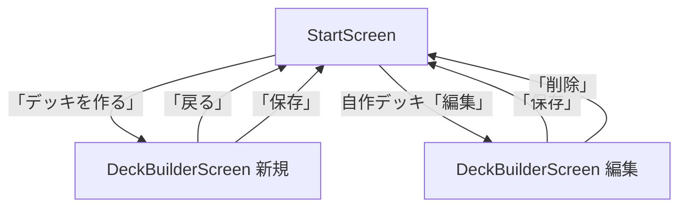

# デッキビルダー画面 UI 要件整理

**目的:** デッキビルダー（`DeckBuilderScreen`）の現行 UI 要件を一箇所に整理し、改善検討のたたき台とする。  
**更新:** 2026-06-11  
**実装:** `apps/web/components/DeckBuilderScreen.tsx`  
**関連:** [web-full-playable-requirements.md](./web-full-playable-requirements.md) §3.2, [web-full-playable-design.md](./web-full-playable-design.md)

---

## 1. 画面の目的

ユーザーが **1,849 枚**のカードプール（`fullPlayableCatalog`）から **40 枚**の自作デッキを組み、ブラウザに保存し、StartScreen から CPU 対戦に使えるようにする。

| 観点 | 要件 |
|------|------|
| 選べる | 検索・フィルタでカードを見つけ、デッキに追加できる |
| 組める | 40 枚・枚数制限・禁止カード等のルールを満たす |
| 分かる | 部分実装カードは警告で期待値を調整できる |
| 保存できる | localStorage に永続化（端末ローカルのみ） |

**スコープ外:** マルチプレイ、URL 共有、サーバー同期、公式大会ルールの完全再現。

---

## 2. 画面遷移



| 入口 | 条件 | 初期状態 |
|------|------|----------|
| 新規作成 | StartScreen「デッキを作る」 | デッキ名「マイデッキ」、空デッキ |
| 編集 | StartScreen で自作デッキ選択時の「編集」 | localStorage から既存デッキを読込 |

**状態管理:** `GameApp` の `appScreen: "deck-builder"`。URL クエリ・永続なし。

---

## 3. 画面構成（情報アーキテクチャ）

上から下への縦積みレイアウト（モバイルファースト）。PC（1024px+）のみ 2 カラム。

```
┌─────────────────────────────────────┐
│ ヘッダー: 戻る / タイトル / 枚数     │
├─────────────────────────────────────┤
│ デッキ名入力                         │
├─────────────────────────────────────┤
│ ツールバー: スターター読込 / クリア  │
├─────────────────────────────────────┤
│ 検証エラー（条件付き）               │
├─────────────────────────────────────┤
│ ┌ デッキ内容 ─┐ ┌ カードを追加 ─┐  │  ← PC: 横並び
│ │  40枚リスト  │ │  検索・フィルタ │  │
│ └─────────────┘ └───────────────┘  │
├─────────────────────────────────────┤
│ 保存エラー（条件付き）               │
├─────────────────────────────────────┤
│ 部分実装警告バナー（条件付き）       │
├─────────────────────────────────────┤
│ 固定フッター: 削除（編集時）/ 保存   │
└─────────────────────────────────────┘
```

### 3.1 ヘッダー

| 要素 | 仕様 |
|------|------|
| 戻る | `btn--ghost`。StartScreen に戻る（未保存変更は確認なし） |
| タイトル | 「デッキ作成」 |
| 枚数表示 | `{total} 枚（最低 40 枚）` — リアルタイム更新 |

### 3.2 デッキ名

| 項目 | 仕様 |
|------|------|
| ラベル | 「デッキ名」 |
| 入力 | `maxLength={40}`、プレースホルダ「マイデッキ」 |
| 必須 | 空の場合は保存不可（ボタン disabled + エラー文言） |

### 3.3 ツールバー

| 要素 | 動作 |
|------|------|
| スターターから読込 | `<select>` で 5 種スターターを選択 → 40 枚テンプレを一括読込 |
| クリア | デッキ内容を空にする（確認ダイアログなし） |

**スターター一覧（`STARTER_OPTIONS`）**

| ID | 表示名 |
|----|--------|
| abarenoh | Type A: アバレンオー |
| dekaranger | Type B: デカレンジャーロボ |
| magiking | Type C: マジキング |
| roaring-wings | 轟の翼: ダイタンケン |
| silver-adventurer | 銀の冒険者: ボウケンシルバー |

### 3.4 デッキ内容パネル（`aria-label="デッキ内容"`）

| 状態 | 表示 |
|------|------|
| 空 | 「カードを追加してください」 |
| 1 枚以上 | カード行リスト（最大高 280px、縦スクロール） |

**カード行（`deck-builder__deck-row`）**

| 要素 | 操作 |
|------|------|
| サムネイル | タップ → `CardModal` で詳細表示 |
| カード名 | 表示のみ（省略時 `text-overflow: ellipsis`） |
| − ボタン | 枚数 −1（0 になったら行削除） |
| 枚数 | 現在枚数 |
| + ボタン | 枚数 +1（上限到達で disabled） |

- 同名カードは **1 行に集約**（cardId 単位）
- 仮想スクロール **なし**（最大 40 行程度のため）

### 3.5 カード追加パネル（`aria-label="カード一覧"`）

#### 検索

| 項目 | 仕様 |
|------|------|
| プレースホルダ | 「名前または ID で検索」 |
| 対象 | カード名・ID の部分一致（大文字小文字無視） |
| 空検索 | **カタログ非表示**。促し文言のみ |
| 促し文言 | 「名前または ID で検索してください（全 1,849 枚）」 |
| 0 件 | 「『{query}』に一致するカードはありません」 |
| 1 件以上 | 「{N} 件」+ 仮想スクロールリスト |

> **設計意図（DB-03）:** 1,849 件を一括 DOM 描画しないため、検索入力が必須。

#### 収録セットフィルタ

| 項目 | 仕様 |
|------|------|
| ラベル | 「収録セット」 |
| データ源 | Wiki「収録」項目（`getWikiSetLabels()`） |
| デフォルト | 「全件」 |
| 表示 | 技術キー（`vanilla-promoted` 等）は **UI に出さない** |

#### タイプフィルタ

| ボタン | 値 |
|--------|-----|
| すべて | `all` |
| ユニット | `unit` |
| オペ | `operation` |

選択中は `btn--primary` スタイル。

#### カテゴリーフィルタ

| 項目 | 仕様 |
|------|------|
| ボタン | 「全カテゴリー」+ ET / WB / OT / MA / DA |
| 表示 | ボタンラベルは **略称 ID**（`title` に正式名） |
| 動的 | 現在の収録セット内に存在するカテゴリーのみ表示 |
| 無効化 | 収録変更で選択カテゴリーが消えた場合 → 「全カテゴリー」にリセット |

#### カタログ行（`DeckBuilderCatalogList`）

| 要素 | 仕様 |
|------|------|
| 行高 | 72px 固定（`@tanstack/react-virtual`） |
| サムネイル | タップ → `CardModal` |
| カード名 | + 実装ステータスバッジ（最大 2 件） |
| メタ | `{id} · {current}/{max}` |
| + ボタン | デッキに 1 枚追加（上限で disabled） |

**実装ステータスバッジ（`estimateCardUiCoverage`）**

| バッジ | 意味 | スタイル |
|--------|------|----------|
| Core | L1–3 コアカード | 黄 |
| UI配線 | コアかつ UI 効果配線あり | 黄 |
| DSL対応 | promoted かつ DSL ready | 青 |
| DSL未実装 | DSL 未実装 | 赤 |
| UI未確認 | promoted で UI 効果未確認 | 黄 |

#### カード詳細モーダル（`CardModal`）

- カタログ行・デッキ行のサムネイルから起動
- 画像（`resolveCardImageUrl`、失敗時プレースホルダ）
- 効果テキスト・ユニット効果・ラッシュ条件
- 実装ステータスバッジ表示

### 3.6 検証エラー表示

| 条件 | 表示 |
|------|------|
| デッキに 1 枚以上 **かつ** 検証 NG | `role="alert"` のリスト（`deck-builder__hint`） |
| 保存試行 NG | `action-error`（`role="alert"`） |

### 3.7 部分実装警告（`DeckWarningBanner`）

| 条件 | 表示 |
|------|------|
| promoted カード（core 以外）が 1 枚以上 | 「UI 未確認カードが N 枚含まれます」 |
| 補足 | 「一部カードは効果 UI 未対応の場合があります」 |

- **保存はブロックしない**（OQ-03: 枚数ベース MVP）
- デッキ内容が空のときは非表示

### 3.8 固定フッター

| 要素 | 条件 | 動作 |
|------|------|------|
| 削除 | 編集モードのみ | 確認ダイアログ → localStorage 削除 → StartScreen |
| 保存 | 常時 | 検証 OK + デッキ名ありで enabled |

- `position: fixed`、下 safe-area 対応
- コンテンツ下部に 96px パディング（フッター被り防止）

---

## 4. デッキルール（UI 連動）

| ルール | 値 | UI への反映 |
|--------|-----|-------------|
| 最小枚数 | 40 枚 | ヘッダー枚数、検証エラー、保存 disabled |
| 同名上限 | 基本 3 枚 | + ボタン disabled、検証エラー |
| 戦闘員等 | 最大 40 枚 | `maxCopiesForCard` |
| 禁止カード | atwiki page 2079（通常大会） | 検証エラー（カタログ未収録 ID は現状空） |
| カタログ | `fullPlayableCatalog`（1,849 枚） | 検索・検証・展開すべて同一ソース |

**検証エラー例（日本語）**

- `デッキは最低40枚必要です（現在 N 枚）。あと M 枚必要です`
- `{名前}（{id}）は最大 N 枚までです`
- `「{名前}（{ids}）」は同名で最大 N 枚までです`
- `禁止カードが含まれています: …`
- `カタログにないカードです: …`

---

## 5. データ永続化

| 項目 | 値 |
|------|-----|
| 保存先 | `localStorage` |
| キー | `rangers-strike/custom-decks/v1` |
| スキーマ | `{ id, name, entries: [{ cardId, count }], updatedAt }` |
| 警告フラグ | 保存しない（都度 `estimateDeckWarnings` で計算） |

---

## 6. レスポンシブ要件

### 6.1 ブレークポイント

| 幅 | レイアウト | リスト最大高 |
|----|-----------|-------------|
| 〜639px（モバイル） | 1 カラム縦積み | 280px |
| 640px〜1023px（タブレット） | 1 カラム | 360px |
| 1024px+（PC） | 2 カラム grid（0.95fr / 1.05fr） | `min(58vh, 560px)` |

### 6.2 モバイルファースト原則（AC-06）

- デフォルト `flex-direction: column`（`.deck-builder__panels`）
- タッチターゲット: アイコンボタン `min-width: 36px`
- カタログ行: 仮想スクロール + 固定行高でスクロール性能確保
- E2E 想定ビューポート: 390×844（Playwright `[mobile]`）

### 6.3 操作フロー（AC-06 E2E で検証）

1. 「デッキを作る」→ デッキ名入力
2. スターター読込 → 40 枚確認
3. 検索（例: BK-001）→ カタログ行表示
4. 保存 → StartScreen に戻る → localStorage に 40 枚デッキ

---

## 7. アクセシビリティ

| 項目 | 実装 |
|------|------|
| セクション | `aria-label`（デッキ内容 / カード一覧 / カテゴリー） |
| 增減ボタン | `aria-label="{名前} を増やす/減らす"` |
| 追加ボタン | `aria-label="{名前} を追加"` |
| エラー | `role="alert"` |
| 状態メッセージ | 空検索・0 件・件数に `role="status"` |
| 警告 | `role="status"` |
| 画像欠損 | `CardImage` で `card.name` を alt 代替 |

---

## 8. 要件 ID 対応表（DB-01〜DB-11）

| ID | 要件 | 状態 |
|----|------|------|
| DB-01 | カタログ `fullPlayableCatalog`（1,849 枚） | ✅ |
| DB-02 | `getFullPlayableCardById` で解決 | ✅ |
| DB-03 | 空検索時は促し文言（全件非表示） | ✅ |
| DB-04 | 収録セットフィルタ（Wiki 表記） | ✅ |
| DB-05 | type / category フィルタ | ✅ |
| DB-06 | カード行に実装ステータスバッジ | ✅ |
| DB-07 | 保存時警告（ブロックなし） | ✅ |
| DB-08 | 検証エラー日本語表示 | ✅ |
| DB-09 | スターター 5 種読込 | ✅ |
| DB-10 | カード詳細 Modal + DSL バッジ | ✅ |
| DB-11 | 仮想スクロール | ✅ |

---

## 9. 受け入れ基準（デッキビルダー関連）

| # | 基準 | 検証 |
|---|------|------|
| AC-01 | full カタログから検索・追加 | `g5Acceptance.test.ts` |
| AC-02 | 40 枚保存 + 警告表示 | `g5Acceptance.test.ts` |
| AC-06 | モバイルで検索・追加・保存完了 | `mobileDeckBuilderLayout.test.ts` + `e2e/deck-builder-mobile.spec.ts` |

---

## 10. 既知の制約・改善候補

現行実装と PO 決定に基づく、UI 改善検討時の論点。

### 10.1 UX 上の制約

| 論点 | 現状 | 影響 |
|------|------|------|
| 検索必須 | 空検索ではカード一覧なし | 初見ユーザーは「何も見えない」 |
| 収録セット `<select>` | 約 80 件、グルーピングなし | モバイルで長いスクロール |
| デッキ内容が上・カタログが下 | モバイル 1 カラム固定 | 追加のたびにスクロール往復 |
| 未保存で戻る | 確認なし | 誤操作で内容消失 |
| カテゴリーボタン | 略称 ID のみ | 初見で意味が分かりにくい |
| 画像 | promoted 666 枚はプレースホルダ | 視覚的識別が困難 |

### 10.2 未着手・部分対応

| 項目 | 状態 |
|------|------|
| 禁止カード（XG2 等） | 骨格のみ（カタログ ID 未収録） |
| 収録セット UI グルーピング | 将来検討（design.md §9） |
| localStorage v2（警告確認） | 未着手 |
| URL / 共有 | スコープ外 |
| デッキ内容パネルのバッジ | カタログのみ（デッキ行には未表示） |

### 10.3 改善検討の観点（提案用）

優先度は未決。改善 PR 前に PO / UX で取捨選択する。

1. **発見性:** 空検索時の「おすすめ」「最近追加」「スターター差分」等のショートカット
2. **操作効率:** モバイルでカタログを先に固定表示、またはタブ切替（デッキ / 追加）
3. **視認性:** デッキ内容行にも UI 未確認バッジ、カテゴリー正式名ツールチップ
4. **安全:** 戻る・クリア時の確認、未保存インジケータ
5. **収録フィルタ:** optgroup / 検索付きセレクト / よく使うセットのピン留め
6. **PC 活用:** 2 カラム時のデッキ内容 sticky、ドラッグ追加（将来）

---

## 11. 主要ファイル

| 種別 | パス |
|------|------|
| 画面 | `apps/web/components/DeckBuilderScreen.tsx` |
| カタログリスト | `apps/web/components/DeckBuilderCatalogList.tsx` |
| 警告 | `apps/web/components/DeckWarningBanner.tsx` |
| スタイル | `apps/web/app/globals.css`（`.deck-builder*`） |
| デッキ CRUD | `apps/web/lib/deckBuilder.ts` |
| 警告計算 | `apps/web/lib/deckWarnings.ts` |
| バッジ | `apps/web/lib/estimateCardUiCoverage.ts` |
| ルール | `packages/cards/src/deckRules.ts` |
| レイアウト契約 | `apps/web/lib/mobileDeckBuilderLayout.test.ts` |
| E2E | `apps/web/e2e/deck-builder-mobile.spec.ts` |

---

## 変更履歴

| 日付 | 内容 |
|------|------|
| 2026-06-11 | 初版 — 現行実装・DB 要件・AC を統合整理 |
