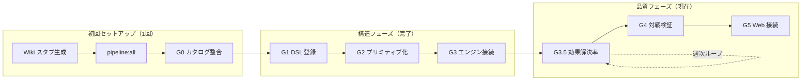
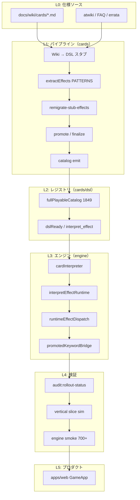

# 全カード反映プロセス（1,849 枚）

**目的:** Wiki 全カード（1,849 枚）をエンジンで対戦可能にし、効果が意図どおり解決される状態まで到達する。  
**更新:** 2026-06-10（G1–G3 完了後）  
**関連:** [card-generation-pipeline.md](./card-generation-pipeline.md)（Wiki→DSL 技術設計）, [implementation-feasibility.md](./implementation-feasibility.md), [card-classification-abcde.md](./card-classification-abcde.md)

---

## 0. このドキュメントの使い方

| 読者 | 読むセクション |
|------|----------------|
| 初めて触る | §1 完了定義 → §2 全体フロー → §5 週次イテレーション |
| パターン追加担当 | §4 interpret_effect → §6 Phase 4 → `extractEffects.ts` |
| エンジン担当 | §6 Phase 4–5 → `cardInterpreter.ts`, `promotedKeywordBridge.ts` |
| Web 担当 | §6 Phase 6（G5） |
| 進捗確認 | §7 コマンド → `npm run audit:rollout-status` |

**現在地（2026-06-10）**

| ゲート | 状態 | 一言 |
|--------|------|------|
| G0 カタログ整合 | ✅ | 1,849 枚 |
| G1 DSL 登録 | ✅ | `unimplemented=0` |
| G2 プリミティブ化 | ✅ | `effect_delegate=0` |
| G3 エンジン接続 | ✅ | `interpret_effect=1,426` |
| **G3.5 効果解決率** | 🔄 **主戦場** | rematch 未解決が多数残存 |
| G4 対戦検証 | 部分 | vertical slice PASS、フル昇格は拡張中 |
| G5 プロダクト | 未着手 | Web full-playable 未接続 |

---

## 1. 完了定義（Definition of Done）

「全カード反映完了」は **構造ゲート（G0–G3）** と **品質ゲート（G3.5–G5）** の両方を満たすこと。

### 1.1 構造ゲート（G0–G3）— 完了済み

| ゲート | 名称 | 完了条件 |
|--------|------|----------|
| **G0** | カタログ整合 | `fullPlayable === 1849`、`validationFailed === 0` |
| **G1** | DSL 登録 | `dslReady === 1849`、`unimplemented === 0`、`fallbackOnly === 0` |
| **G2** | 効果プリミティブ化 | `effect_delegate === 0`、`enqueue_trigger` のみ === 0 |
| **G3** | エンジン接続 | `interpret_effect` 登録済み、レガシー bridge 接続、engine smoke PASS |

### 1.2 品質ゲート（G3.5–G5）— 残作業

| ゲート | 名称 | 完了条件 |
|--------|------|----------|
| **G3.5** | 効果解決率 | promoted カードの `interpret_effect` が rematch または runtime で **実効果** を返す割合が目標値以上（下記 §3.5） |
| **G4** | 対戦検証 | vertical slice: `apply_failed === 0`、hybrid / full promoted シミュレーション PASS |
| **G5** | プロダクト接続 | Web `GameApp` が full-playable デッキで対戦可能 |

> **注意:** G3 完了後も、多くの `interpret_effect` は実行時に `interpret_effect_unresolved`（実質 noop）のまま。G3 は「DSL 構造とエンジン配線」、G3.5 は「実際に効果が動く」ことを測る。

---

## 2. 全体フロー（初回 → 週次 → 完了）



### 2.1 初回セットアップ（リポジトリ clone 後 / wiki 大更新後）

```bash
# 1. Wiki → DSL スタブ一括生成
npm run generate-wiki-stubs -w @rangers-strike/cards
npm run pipeline:batch -w @rangers-strike/cards

# 2. フルパイプライン（時間がかかる）
npm run pipeline:all -w @rangers-strike/cards

# 3. 構造ゲート一括（G1–G3）
npm run promote-dsl-ready -w @rangers-strike/cards
npm run finalize-effect-primitives -w @rangers-strike/cards

# 4. 進捗確認
npm run audit:rollout-status -w @rangers-strike/cards
```

### 2.2 週次イテレーション（G3.5 以降の通常運用）

```bash
# パターン追加後に 1 コマンド
npm run pipeline:rollout-sync -w @rangers-strike/cards

# テスト省略（監査のみ）
npm run pipeline:rollout-sync -w @rangers-strike/cards -- --skip-tests
```

### 2.3 完了判定

```bash
npm run audit:rollout-status -w @rangers-strike/cards
# → packages/cards/pipeline/data/rollout-status.json
# gatesPassed === 6（将来 G3.5 を正式ゲート化後）
```

---

## 3. レイヤー構造



| レイヤー | 責務 | 主な成果物 |
|----------|------|------------|
| L0 | 公式テキストの正 | `docs/wiki/`, `wiki-index.json` |
| L1 | テキスト → DSL | `src/generated/dsl-stubs/*.dsl.json` |
| L2 | カード定義の公開 | `fullPlayableCatalog`, `registry` |
| L3 | ルール実行 | `cardInterpreter`, `interpretEffectRuntime` |
| L4 | 回帰防止 | vitest, `pipeline/data/*.json` |
| L5 | UX | Web 対戦 UI |

---

## 4. `interpret_effect` アーキテクチャ（G2/G3 の中心）

G2/G3 で `effect_delegate` / `enqueue_trigger` を廃止し、DSL 上はすべて `interpret_effect` マーカーに統一した。実行時の解決順序は次のとおり。

```
interpret_effect 実行
  │
  ├─ 1. runtimeEffectDispatch（レガシー effectId）
  │     denji_machine / ruin_survey / anti_bio_cannon 等
  │     → detail が "runtime:..." でなければ採用
  │
  ├─ 2. rematchEffectPrimitives（extractEffects PATTERNS）
  │     効果文から draw / choose / grant_keyword 等を再抽出
  │     → 成功すれば cardInterpreter で実行
  │
  └─ 3. 未解決
        detail: "interpret_effect_unresolved"（noop）
```

| モジュール | パス | 役割 |
|------------|------|------|
| DSL 型 | `packages/cards/src/dsl/types.ts` | `interpret_effect` プリミティブ定義 |
| パターン | `packages/cards/src/pipeline/extractEffects.ts` | テキスト → primitives |
| ランタイム | `packages/engine/src/dsl/interpretEffectRuntime.ts` | rematch オーケストレーション |
| 解釈 | `packages/engine/src/dsl/cardInterpreter.ts` | primitive 実行 + runtime 優先 |
| レガシー | `packages/engine/src/dsl/runtimeEffectDispatch.ts` | core 179 の named effect |
| キーワード | `packages/engine/src/dsl/promotedKeywordBridge.ts` | BP/SP, 攻撃制限 |

**設計原則**

- DSL は宣言的（`interpret_effect` のみ）— 1,400+ 枚を手書き primitive 化しない
- core 179 は runtime bridge で後方互換を維持
- promoted は PATTERNS 追加で rematch 成功率を上げる（G3.5 の主作業）

---

## 5. 週次イテレーションサイクル

各週（マイルストーン 1 つ）は **パターン設計 → DSL 同期 → エンジン → 検証 → 記録**。

```
┌─────────────────────────────────────────────────────────────┐
│  Step A: パターン設計                                        │
│    audit:effect-keywords で未解決テキストの頻出語を特定         │
│    extractEffects.ts に PATTERNS 追加                         │
│    extractEffects.rematch.test.ts にサンプル追加              │
├─────────────────────────────────────────────────────────────┤
│  Step B: DSL 同期                                            │
│    npm run pipeline:rollout-sync -w @rangers-strike/cards    │
│    （recompile → remigrate → promote → finalize → audit）     │
├─────────────────────────────────────────────────────────────┤
│  Step C: エンジン（必要時のみ）                               │
│    promotedKeywordBridge / grant_keyword / events 拡張        │
│  新キーワード（morph, wing, commander 等）はここ              │
├─────────────────────────────────────────────────────────────┤
│  Step D: 検証                                                │
│    npm run test -w @rangers-strike/cards                     │
│    npm run test -w @rangers-strike/engine                    │
│    vertical slice（G4）                                       │
├─────────────────────────────────────────────────────────────┤
│  Step E: 記録                                                │
│    rollout-status.json の delta を PR 説明に記載              │
│    stub-effect-remigration.json の migrated 件数を記録         │
└─────────────────────────────────────────────────────────────┘
```

**週次の目標指標（G3.5）**

| 指標 | 確認方法 | 目標（週次） |
|------|----------|--------------|
| remigrate migrated 件数 | `stub-effect-remigration.json` | +30〜100 |
| interpret_effect 内訳 | `effect-keyword-coverage.json` | rematch 成功分が増加 |
| engine smoke | `npm run test -w @rangers-strike/engine` | 700+ PASS |
| vertical slice | `simulate100` / `simulateFullPromoted` | `apply_failed: 0` |

---

## 6. フェーズ別詳細手順

### Phase 0 — G0 カタログ整合

**いつ:** 初回、wiki 更新後、大規模リコンパイル前

```bash
npm run generate-wiki-stubs -w @rangers-strike/cards
npm run pipeline:batch -w @rangers-strike/cards
npm run pipeline:all -w @rangers-strike/cards   # フル再構築時
npm run metrics:full-playable -w @rangers-strike/cards
npm run wiki-drift -w @rangers-strike/cards
```

**合格:** `full-playable-metrics.json` で `fullPlayable: 1849`, `validationFailed: 0`

---

### Phase 1 — G1 DSL 登録 ✅

**目標:** 全カード `handler: interpreter` かつ `isDslInterpretableEffect === true`

```bash
npm run promote-dsl-ready -w @rangers-strike/cards
npm run metrics:full-playable -w @rangers-strike/cards
npm run test -w @rangers-strike/cards -- src/dsl/extendedRegistry.test.ts
```

**合格:** `dslReady: 1849`, `unimplemented: 0`, `fallbackOnly: 0`

---

### Phase 2 — G2 効果プリミティブ化 ✅

**目標:** `effect_*` delegate と `enqueue_trigger` のみをゼロに

```bash
npm run finalize-effect-primitives -w @rangers-strike/cards
npm run audit:runtime-effects -w @rangers-strike/cards
npm run audit:enqueue-coverage -w @rangers-strike/cards
```

**合格:** `effect_delegate: 0`, `enqueue_only: 0`

---

### Phase 3 — G3 エンジン接続 ✅

**目標:** interpreter 経路が配線され、レガシー effectId が runtime で解決できる

```bash
npm run generate-engine-smoke -w @rangers-strike/cards
npm run test -w @rangers-strike/engine
npm run audit:runtime-delegates -w @rangers-strike/cards
npm run audit:effect-keywords -w @rangers-strike/cards
```

**合格:** engine 700+ tests PASS、`legacyBridgeCount: 0`

---

### Phase 4 — G3.5 効果解決率 🔄（現在の主戦場）

**目標:** `interpret_effect` が play 時に実効果を返す。未解決 noop を減らす。

#### 4.1 パターン追加の優先順位

1. **高頻度テキスト断片** — `audit:effect-keywords` の未マッチ語
2. **ABCDE B 区分** — 単純 primitive（draw / modify_bp / discard）
3. **C 区分** — 条件付き choose + move/discard
4. **D 区分** — wing / chase / resident 等（エンジンキーワードとセット）
5. **E 区分** — commander / mothership / 複合ウィザード

#### 4.2 作業手順

```bash
# 1. カバレッジ確認
npm run audit:effect-keywords -w @rangers-strike/cards
# → pipeline/data/effect-keyword-coverage.json

# 2. PATTERNS 追加（extractEffects.ts）+ テスト
npm run test -w @rangers-strike/cards -- src/pipeline/extractEffects

# 3. スタブへ反映
npm run remigrate-stub-effects -w @rangers-strike/cards
# → stub-effect-remigration.json の migrated 件数を確認

# 4. 一括同期
npm run pipeline:rollout-sync -w @rangers-strike/cards
```

#### 4.3 effect ID 衝突対策

- ノート効果 ID: `noteEffectIdFromBody()`（本文ハッシュ）
- リマイグレーション: `rematchExtractedEffect()` で id / trigger / condition も更新
- rematch 失敗時のフォールバック: `interpret_effect`（`remigrate-stub-effects.ts`）

#### 4.4 エンジン拡張が必要な代表キーワード

| キーワード | 規模 | 参照 |
|------------|------|------|
| morph | ~68 | passive_native |
| resident | 多数 | 常駐 OP ゾーン |
| wing / chase | D 区分 | `packages/engine/src/keywords/` |
| commander / mothership | E 区分 | `rules/commander.ts` |
| ride_without_rc_* | 複合 | ビークルライド |

---

### Phase 5 — G4 対戦検証

```bash
# スターター 100 試合
npm run test -w @rangers-strike/engine -- src/verticalSlice/simulate100.test.ts

# ハイブリッド昇格（10/25/35 枚差し替え）
npm run test -w @rangers-strike/engine -- src/verticalSlice/simulatePromoted.test.ts

# フル昇格 40 枚デッキ × 50 試合
npm run test -w @rangers-strike/engine -- src/verticalSlice/simulateFullPromoted.test.ts
```

| テスト | 合格条件 |
|--------|----------|
| simulate100 | `apply_failed: 0`, winner > 0 |
| simulatePromoted | 全 tier `apply_failed: 0`, rush/battle フェイズ到達 |
| simulateFullPromoted | `apply_failed: 0`, rush/battle フェイズ到達 |

---

### Phase 6 — G5 プロダクト接続

1. `GameApp` で `createFullPromotedGame` / `fullPlayableCatalog` を選択可能に
2. 効果ログに DSL `effectId` を表示（デバッグ）
3. リリース段階: スターター → hybrid promoted → full-playable

---

## 7. コマンドリファレンス

### 進捗ダッシュボード

```bash
npm run audit:rollout-status -w @rangers-strike/cards
# → packages/cards/pipeline/data/rollout-status.json
```

### 週次一括（推奨）

```bash
npm run pipeline:rollout-sync -w @rangers-strike/cards
```

`pipeline:rollout-sync` の内部ステップ:

| 順序 | スクリプト | 用途 |
|------|-----------|------|
| 1 | `pipeline:recompile-vanilla` | vanilla スタブ再コンパイル |
| 2 | `pipeline:recompile-complexity` | complexity スタブ再コンパイル |
| 3 | `remigrate-stub-effects` | PATTERNS → DSL 反映 |
| 4 | `promote-dsl-ready` | unimplemented → interpreter |
| 5 | `finalize-effect-primitives` | delegate → interpret_effect |
| 6 | `remigrate-enqueue-effects` | enqueue 残清理 |
| 7–8 | `emit-*-catalog` | カタログ emit |
| 9 | `generate-engine-smoke` | engine smoke 再生成 |
| 10–14 | `audit:*`, `metrics:*` | 監査・メトリクス |
| 15 | `audit:rollout-status` | ゲート集約 |
| — | `test`（cards + engine） | 回帰（`--skip-tests` で省略可） |

### 構造ゲート一括（初回 / 大規模変更後）

```bash
npm run promote-dsl-ready -w @rangers-strike/cards
npm run finalize-effect-primitives -w @rangers-strike/cards
npm run audit:rollout-status -w @rangers-strike/cards
```

### フル再構築（wiki 更新後）

```bash
npm run pipeline:all -w @rangers-strike/cards
npm run pipeline:rollout-sync -w @rangers-strike/cards
```

---

## 8. メトリクス一覧

| ファイル | 内容 | 確認コマンド |
|----------|------|--------------|
| `rollout-status.json` | **ゲート総合** | `audit:rollout-status` |
| `full-playable-metrics.json` | dslReady / unimplemented | `metrics:full-playable` |
| `effect-keyword-coverage.json` | interpret_effect / engine / passive | `audit:effect-keywords` |
| `runtime-effect-audit.json` | primitive 別集計 | `audit:runtime-effects` |
| `stub-effect-remigration.json` | 直近 remigrate 結果 | `remigrate-stub-effects` |
| `finalize-effect-primitives.json` | finalize 一括結果 | `finalize-effect-primitives` |
| `promote-dsl-ready.json` | promote 一括結果 | `promote-dsl-ready` |
| `enqueue-coverage-audit.json` | enqueue_trigger 残 | `audit:enqueue-coverage` |
| `engine-smoke-manifest.json` | smoke サンプル cardId | `generate-engine-smoke` |
| `implementation-feasibility.json` | A/B/C 区分 | `audit:implementation-feasibility` |
| `card-classification.json` | ABCDE 区分 | `audit:card-classification` |

### ベースライン（G1–G3 完了時点）

| メトリクス | 値 |
|------------|-----|
| fullPlayable | 1,849 |
| dslReady | 1,849 |
| unimplemented | 0 |
| effect_delegate | 0 |
| enqueue_trigger のみ | 0 |
| interpret_effect | 1,426 |
| engine keywords | 1,950 |
| passive_native | 679 |
| engine tests | 700 PASS |

---

## 9. マイルストーン roadmap

| マイルストーン | 焦点 | ゲート | 状態 |
|----------------|------|--------|------|
| **M16–M20** | 昇格パイプライン + delegate bridge | G0–G2 部分 | ✅ |
| **M21** | G1–G3 構造完了 | G1–G3 | ✅ |
| **M22** | top-30 テキストパターン | G3.5 | 🔄 次 |
| **M23** | B/C 区分 80% rematch | G3.5 | 予定 |
| **M24** | D 区分キーワード（wing/chase） | G3.5 + engine | 予定 |
| **M25** | E 区分 + full promoted sim 安定 | G4 | 予定 |
| **M26** | Web full-playable | G5 | 予定 |
| **Done** | 全ゲート + 効果解決率目標 | G0–G5 | — |

**M22 の具体的タスク例**

- `destroy` / `recruit` / `counter` / `auto-battle` パターンの拡充
- complexity promoted の named 効果 rematch 率 +10%
- `simulateFullPromoted` の strike 到達率モニタリング追加

---

## 10. トラブルシューティング

| 症状 | 原因 | 対処 |
|------|------|------|
| `dslReady` が 1,849 未満 | validator 不整合で overlay 脱落 | `validateCardDocument` と schema を同期 |
| remigrate で `migrated: 0` | パターン未追加 | `rematchExtractedEffect` を REPL で単体確認 |
| core 179 の効果が noop | `interpret_effect` のみで runtime 未接続 | `runtimeEffectDispatch` の優先順を確認 |
| rematch が部分一致（SP のみ等） | テキストが複合効果 | runtime bridge 優先 or パターン分割 |
| engine 62 suite FAIL | 循環 import | `effectDelegateSlot.ts` パターンを維持 |
| smoke test が古い cardId | サンプル変更 | `generate-engine-smoke` 再実行 |
| `interpret_effect_unresolved` 多発 | G3.5 未完了（想定内） | PATTERNS 追加イテレーション |
| full promoted で strike 0 | CPU / デッキ構成 | hybrid で strike 検証、full は phase 到達で判定 |

---

## 11. 関連ドキュメント

| 文書 | 内容 |
|------|------|
| [card-generation-pipeline.md](./card-generation-pipeline.md) | Wiki→DSL 技術設計（Stage 1–4） |
| [vertical-slice-gaps.md](./vertical-slice-gaps.md) | スターター完走と AI 品質 |
| [effect_catalog.md](./effect_catalog.md) | 効果パターン辞書 |
| [trigger_catalog.md](./trigger_catalog.md) | 誘発タイミング |
| [card-flags-migration.md](./card-flags-migration.md) | Modifier / Event 移行 |
| [legend1-starter-dsl-gaps.md](./legend1-starter-dsl-gaps.md) | コア 179 の TS→DSL 移行 |
| [implementation-roadmap.md](./implementation-roadmap.md) | エンジン Tier 別実装順序 |
