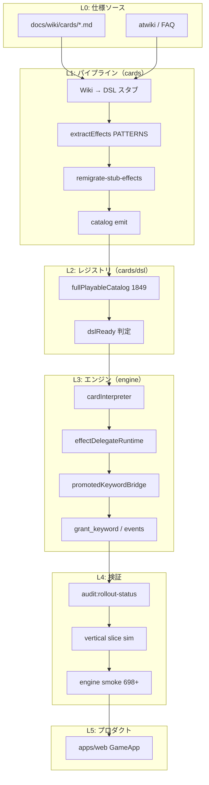

# 全カード反映プロセス（1,849 枚）

**目的:** Wiki 全カード（1,849 枚）をエンジンで対戦可能にし、DSL インタープリタ経由で効果が解決される状態まで到達する。  
**更新:** 2026-06-10（M20 時点ベースライン）  
**関連:** [card-generation-pipeline.md](./card-generation-pipeline.md), [implementation-feasibility.md](./implementation-feasibility.md), [card-classification-abcde.md](./card-classification-abcde.md)

---

## 1. 完了定義（Definition of Done）

「全カード反映完了」とは、次の **6 ゲート** をすべて満たすこととする。

| ゲート | 名称 | 完了条件 |
|--------|------|----------|
| **G0** | カタログ整合 | `fullPlayable === 1849`、`validationFailed === 0`、wiki ドリフトなし |
| **G1** | DSL 登録 | `dslReady === 1849`、`unimplemented === 0`、`fallbackOnly === 0` |
| **G2** | 効果プリミティブ化 | `effect_delegate === 0`、`enqueue_trigger` のみ === 0 |
| **G3** | エンジン解決 | 全 `grant_keyword` が interpreter / runtime bridge で解決、スモーク 698+ PASS |
| **G4** | 対戦検証 | vertical slice: `apply_failed === 0`、hybrid / full promoted シミュレーション PASS |
| **G5** | プロダクト接続 | Web `GameApp` が full-playable デッキで対戦可能 |

**現在地（G1–G3 完了）:** G0 ✅ / G1 ✅（1,849/1,849） / G2 ✅（delegate 0） / G3 ✅（`interpret_effect` 1,426） / G4 部分 / G5 未着手

---

## 2. レイヤー構造



| レイヤー | 責務 | 主な成果物 |
|----------|------|------------|
| L0 | 公式テキストの正 | `docs/wiki/`, `wiki-index.json` |
| L1 | テキスト → DSL | `src/generated/dsl-stubs/*.dsl.json` |
| L2 | カード定義の公開 | `fullPlayableCatalog`, `registry` |
| L3 | ルール実行 | `cardInterpreter`, keyword bridge |
| L4 | 回帰防止 | vitest, `pipeline/data/*.json` |
| L5 | UX | Web 対戦 UI |

---

## 3. イテレーションサイクル（推奨: 1 週間 = 1 マイルストーン）

各サイクルは **パターン追加 → リマイグレーション → エンジン → 検証 → メトリクス記録** の順で回す。

```
┌─────────────────────────────────────────────────────────────┐
│  Step A: パターン設計                                        │
│    audit:effect-keywords で上位 delegate を特定               │
│    extractEffects.ts に PATTERNS 追加                         │
│    extractEffects.rematch.test.ts にサンプル追加              │
├─────────────────────────────────────────────────────────────┤
│  Step B: DSL 同期                                            │
│    npm run pipeline:rollout-sync -w @rangers-strike/cards    │
│    （再コンパイル → remigrate → catalog → smoke → audit）     │
├─────────────────────────────────────────────────────────────┤
│  Step C: エンジン（必要時）                                   │
│    grant_keyword / promotedKeywordBridge / events 拡張        │
│    effectDelegateRuntime の rematch 対象確認                  │
├─────────────────────────────────────────────────────────────┤
│  Step D: 検証                                                │
│    npm run test -w @rangers-strike/cards                     │
│    npm run test -w @rangers-strike/engine                    │
│    audit:rollout-status でゲート確認                          │
├─────────────────────────────────────────────────────────────┤
│  Step E: 記録                                                │
│    rollout-status.json の delta を PR 説明に記載              │
│    目標: effect_delegate を週 50–150 削減                      │
└─────────────────────────────────────────────────────────────┘
```

---

## 4. ゲート別詳細手順

### G0 — カタログ整合

**いつ:** 初回セットアップ、wiki 更新後、大規模リコンパイル前

```bash
# Wiki スタブ生成（初回 or wiki 差分後）
npm run generate-wiki-stubs -w @rangers-strike/cards
npm run pipeline:batch -w @rangers-strike/cards

# フルパイプライン（時間がかかる）
npm run pipeline:all -w @rangers-strike/cards

# メトリクス
npm run metrics:full-playable -w @rangers-strike/cards
npm run wiki-drift -w @rangers-strike/cards
```

**合格:** `pipeline/data/full-playable-metrics.json` で `fullPlayable: 1849`, `validationFailed: 0`

---

### G1 — DSL 登録

**目標:** 全カードが `handler: interpreter` かつ `isDslInterpretableEffect === true`

```bash
npm run pipeline:recompile-vanilla -w @rangers-strike/cards
npm run pipeline:recompile-complexity -w @rangers-strike/cards
npm run emit-vanilla-catalog -w @rangers-strike/cards
npm run emit-complexity-catalog -w @rangers-strike/cards
npm run metrics:full-playable -w @rangers-strike/cards
```

**合格:** `dslReady: 1849`, `unimplemented: 0`, `fallbackOnly: 0`

**残 119 unimplemented の内訳確認:**

```bash
npm run test -w @rangers-strike/cards -- src/dsl/extendedRegistry.test.ts
```

---

### G2 — 効果プリミティブ化（現在の主戦場）

**目標:** `effect_*` delegate と `enqueue_trigger` のみをゼロにする

```bash
# 1. 上位キーワードを確認
npm run audit:effect-keywords -w @rangers-strike/cards
# → pipeline/data/effect-keyword-coverage.json

# 2. PATTERNS 追加後、スタブへ反映
npm run remigrate-stub-effects -w @rangers-strike/cards
npm run remigrate-enqueue-effects -w @rangers-strike/cards

# 3. 削減量を確認
npm run audit:runtime-effects -w @rangers-strike/cards
# → byPrimitive.effect_delegate, enqueue_trigger
```

**パターン追加の優先順位:**

1. `topEffectDelegate` の上位 20 キーワード（同一テキスト衝突は `hashEffectText` で解消済み）
2. `enqueue_trigger` 残 90 件（`audit:enqueue-coverage`）
3. ABCDE **B** 区分（単純 primitive 化が容易）
4. **C** 区分（条件付き choose + move/discard）
5. **D/E** は G3 と並行（エンジン基盤が必要）

**effect ID 衝突対策（M20 以降）:**

- ノート効果 ID は `noteEffectIdFromBody()`（本文ハッシュ 24 文字）
- リマイグレーションは `rematchExtractedEffect()` で id / trigger / condition も更新

---

### G3 — エンジン解決

**目標:** 実行時に未解決の `effect_*` が残らない

| 経路 | モジュール | 用途 |
|------|------------|------|
| ネイティブ primitive | `cardInterpreter.ts` | draw / move / choose / discard |
| grant_keyword | `grantKeyword.ts` | SP1, register, passive |
| runtime bridge | `effectDelegateRuntime.ts` | 実行時 rematch |
| キーワード bridge | `promotedKeywordBridge.ts` | BP/SP, 攻撃制限 |
| レガシー TS | `runtimeEffectDispatch.ts` | core 179 の段階移行 |

```bash
npm run generate-engine-smoke -w @rangers-strike/cards
npm run test -w @rangers-strike/engine
npm run audit:runtime-delegates -w @rangers-strike/cards
```

**エンジン拡張が必要な代表キーワード（C/E 区分）:**

| キーワード | 枚数規模 | 参照 |
|------------|----------|------|
| morph | ~68 | passive_native |
| resident | 多数 | 常駐 OP ゾーン |
| wing / chase | D 区分 | `packages/engine/src/keywords/` |
| commander / mothership | E 区分 | `rules/commander.ts` |
| ride_without_rc_* | delegate | ビークルライド |

---

### G4 — 対戦検証

```bash
# スターター 100 試合
npm run test -w @rangers-strike/engine -- src/verticalSlice/simulate100.test.ts

# ハイブリッド昇格（10/25/35 枚差し替え）
npm run test -w @rangers-strike/engine -- src/verticalSlice/simulatePromoted.test.ts

# フル昇格 40 枚デッキ × 50 試合
npm run test -w @rangers-strike/engine -- src/verticalSlice/simulateFullPromoted.test.ts
```

**合格基準:**

| テスト | 条件 |
|--------|------|
| simulate100 | `apply_failed: 0`, winner > 0 |
| simulatePromoted | 全 tier `apply_failed: 0`, rush/battle フェイズ到達 |
| simulateFullPromoted | `apply_failed: 0`, rush/battle フェイズ到達 |

---

### G5 — プロダクト接続

1. `GameApp` で `createFullPromotedGame` / `fullPlayableCatalog` を選択可能に
2. 効果ログに DSL `effectId` を表示（デバッグ）
3. スターター → 昇格のみの段階リリース

---

## 5. 一括コマンド

### 週次イテレーション（推奨）

```bash
# パターン追加後に 1 コマンドで同期 + 監査 + テスト
npm run pipeline:rollout-sync -w @rangers-strike/cards
```

### フル再構築（wiki 更新後）

```bash
npm run pipeline:all -w @rangers-strike/cards
npm run pipeline:rollout-sync -w @rangers-strike/cards
```

### 進捗ダッシュボード

```bash
npm run audit:rollout-status -w @rangers-strike/cards
# → packages/cards/pipeline/data/rollout-status.json
```

---

## 6. メトリクス一覧

| ファイル | 内容 |
|----------|------|
| `rollout-status.json` | **ゲート総合**（`audit:rollout-status`） |
| `full-playable-metrics.json` | dslReady / unimplemented |
| `effect-keyword-coverage.json` | delegate / engine / passive 内訳 |
| `runtime-effect-audit.json` | primitive 別集計 |
| `stub-effect-remigration.json` | 直近 remigrate 結果 |
| `enqueue-coverage-audit.json` | enqueue_trigger 残 |
| `implementation-feasibility.json` | A/B/C 区分 |
| `card-classification.json` | ABCDE 区分 |

### G1–G3 完了後メトリクス

| メトリクス | 値 |
|------------|-----|
| fullPlayable | 1,849 |
| dslReady | 1,849 |
| effect_delegate | **0** |
| enqueue_trigger のみ | **0** |
| interpret_effect | 1,426 |
| engine keywords | 524 |
| passive_native | 679 |

**一括コマンド（G1–G3）:**

```bash
npm run promote-dsl-ready -w @rangers-strike/cards
npm run finalize-effect-primitives -w @rangers-strike/cards
npm run audit:rollout-status -w @rangers-strike/cards
```

---

## 7. マイルストーン roadmap

| マイルストーン | 焦点 | 目標 delegate | 前提エンジン |
|----------------|------|---------------|--------------|
| **M20** ✅ | 衝突修正 + 高頻度パターン | 1,408 → 1,341 | effectDelegateSlot |
| **M21** | top-20 delegate パターン | < 1,200 | passive マーカー追加 |
| **M22** | enqueue ゼロ + B 区分 | < 800 | enqueue → primitive |
| **M23** | C 区分 choose 系 | < 400 | targetSelectors 拡張 |
| **M24** | D 区分キーワード | < 150 | wing/chase/resident |
| **M25** | E 区分 + G5 | **0** | commander, mothership |
| **Done** | 全ゲート | 0 | Web 接続 |

---

## 8. トラブルシューティング

| 症状 | 原因 | 対処 |
|------|------|------|
| remigrate で migrated: 0 | パターン未追加 or 既に primitive 化済み | `rematchExtractedEffect` を REPL で単体確認 |
| 同一 effect ID に異なるテキスト | 旧 `slugifyEffectId` 衝突 | `noteEffectIdFromBody` + 再コンパイル |
| engine 62 suite FAIL | 循環 import | `effectDelegateSlot.ts` パターンを維持 |
| smoke test が古い cardId | delegate サンプル変更 | `generate-engine-smoke` 再実行 |
| full promoted で strike 0 | CPU / デッキ構成 | hybrid デッキで strike 検証、full は phase 到達で判定 |

---

## 9. 関連ドキュメント

- [vertical-slice-gaps.md](./vertical-slice-gaps.md) — スターター完走と AI 品質
- [effect_catalog.md](./effect_catalog.md) — 効果パターン辞書
- [trigger_catalog.md](./trigger_catalog.md) — 誘発タイミング
- [card-flags-migration.md](./card-flags-migration.md) — Modifier / Event 移行
- [legend1-starter-dsl-gaps.md](./legend1-starter-dsl-gaps.md) — コア 179 の TS→DSL 移行
