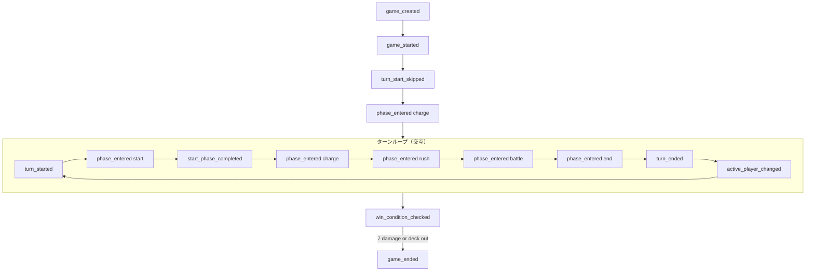
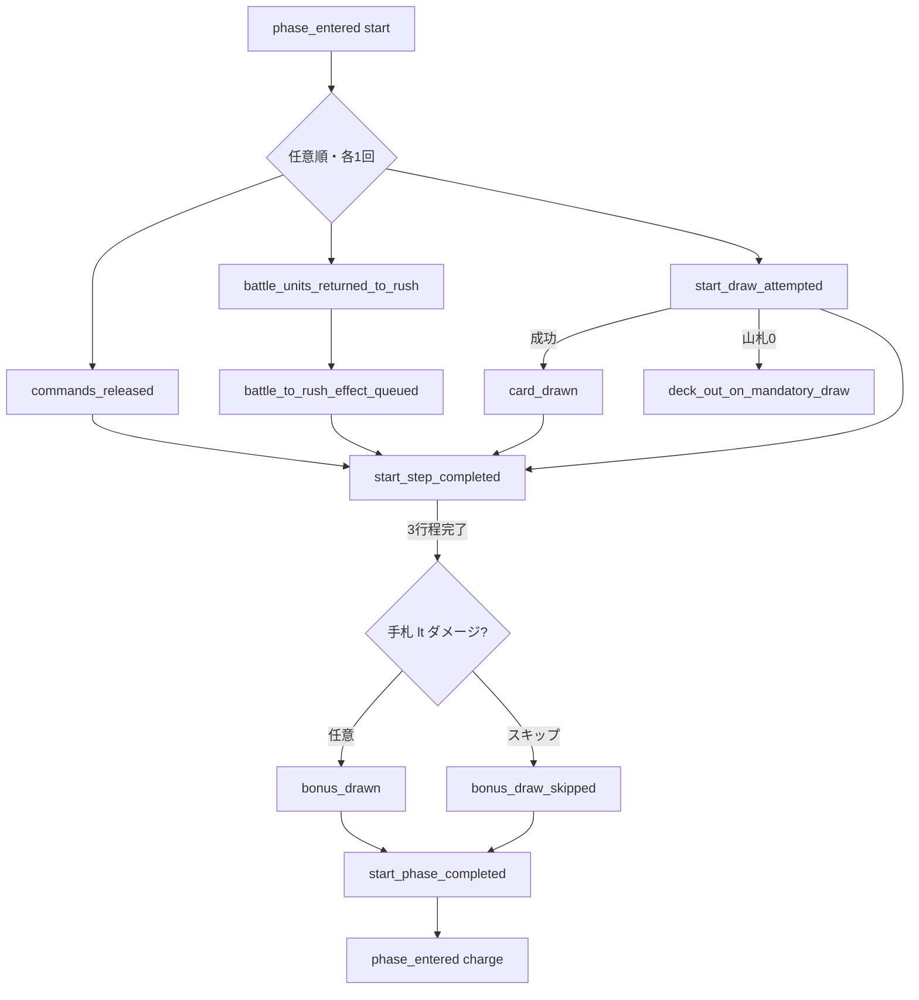
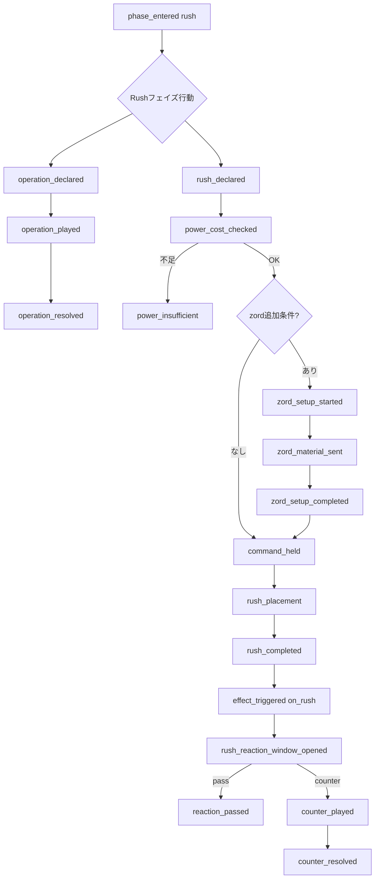
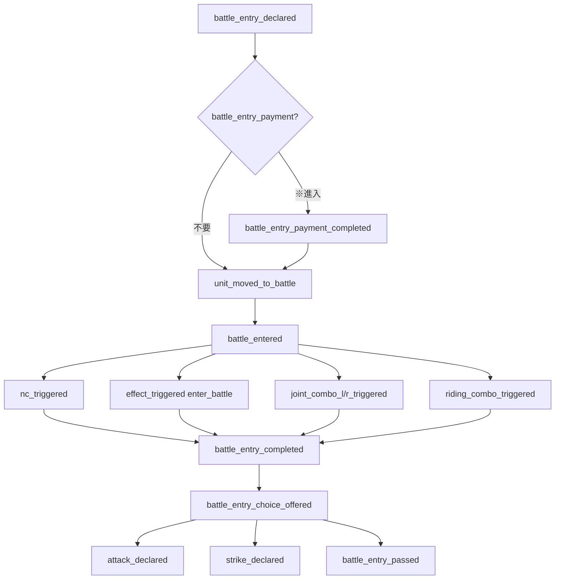
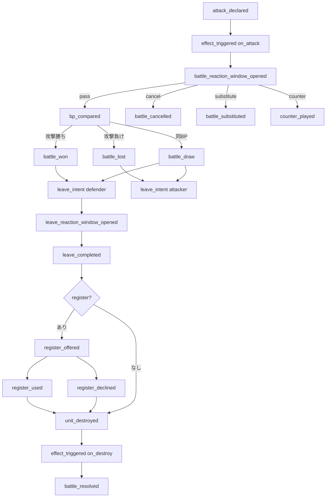
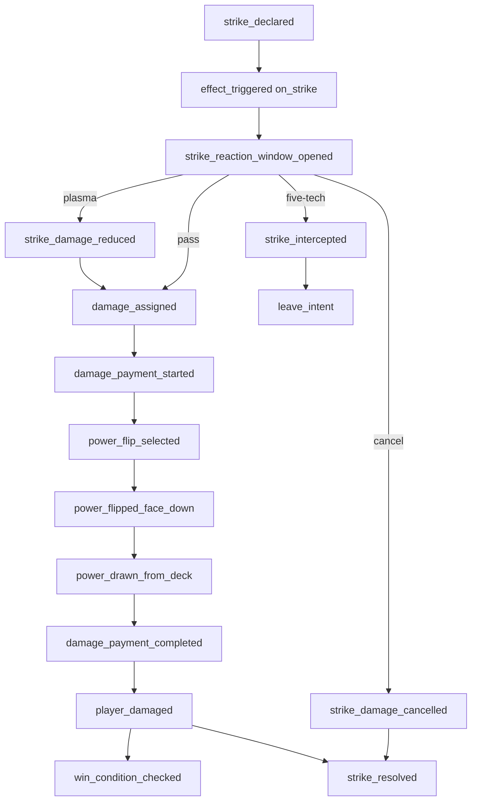
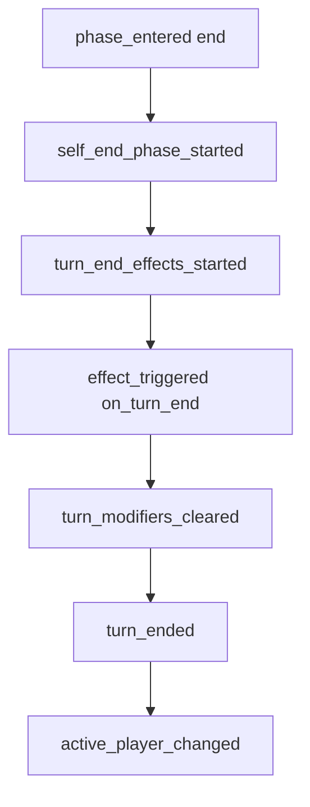
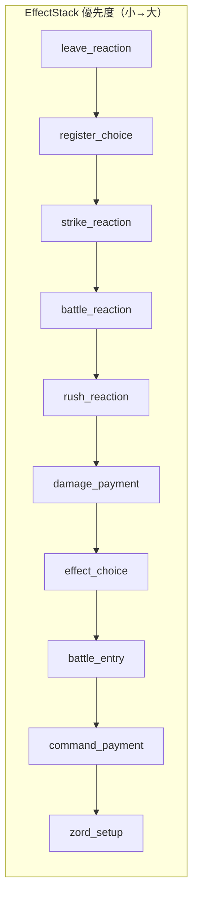
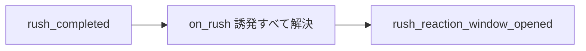

# ゲームイベント全一覧・イベントツリー

**目的:** レンジャーズストライク全ルールから発生しうるイベントを漏れなく列挙し、因果関係をツリー化する。  
**参照:** `docs/wiki/*`, [event-architecture.md](./event-architecture.md), [spec-review.md](./spec-review.md), `effectTaxonomy.ts`  
**日付:** 2026-06-09  
**命名:** `snake_case`。プレイヤー Action ではなく **ルール上起きた事実** を表す。

---

## 凡例

| 記号 | 意味 |
|------|------|
| **CORE** | カード効果なしで必ず発生しうるコアループ |
| **TRIG** | カード効果の誘発タイミング（Wiki 公式タイミング） |
| **REACT** | 反応窓・割り込み |
| **CHOICE** | プレイヤー選択待ち |
| **FUTURE** | ルール確定・未実装キーワード |
| **SCOPE** | 本シミュレーター v1 スコープ外 |

**合計: 162 イベント**（コア 68 / 誘発・修飾 24 / 反応 12 / 選択 14 / 勝敗 4 / 将来・スコープ外 4）

---

## 1. ゲーム・マッチ（4）

| # | イベント | 説明 | 分類 |
|---|----------|------|------|
| 1 | `game_created` | デッキ検証・インスタンス生成・初期手札7枚配布 | CORE |
| 2 | `game_started` | 先攻決定・先攻1T目スタート省略・チャージフェイズから開始 | CORE |
| 3 | `active_player_set` | 手番プレイヤー確定 | CORE |
| 4 | `definitions_loaded` | カード定義マップ構築完了 | CORE |

---

## 2. ターン・フェイズ（12）

| # | イベント | 説明 | 分類 |
|---|----------|------|------|
| 5 | `turn_started` | ターンプレイヤーのスタートフェイズ突入（2T目以降） | CORE |
| 6 | `turn_start_skipped` | 先攻1ターン目スタートフェイズ省略 | CORE |
| 7 | `phase_entered` | フェイズ突入（`start`/`charge`/`rush`/`battle`/`end`） | CORE |
| 8 | `phase_exited` | フェイズ離脱 | CORE |
| 9 | `phase_end_requested` | `end_phase` 宣言 | CORE |
| 10 | `phase_end_blocked` | 必須バトル進入未完了等でフェイズ終了不可 | CORE |
| 11 | `phase_advanced` | 次フェイズへ遷移確定 | CORE |
| 12 | `turn_ended` | エンドフェイズ完了・修飾子クリア前後 | CORE |
| 13 | `self_end_phase_started` | 「自軍エンドフェイズ」処理開始（ターン終了効果より先） | TRIG |
| 14 | `turn_end_effects_started` | 「ターンを終えるとき」効果処理開始 | TRIG |
| 15 | `turn_modifiers_cleared` | TurnModifiers・bpModifier 等ターン終了クリア | CORE |
| 16 | `active_player_changed` | 手番交代 | CORE |

---

## 3. スタートフェイズ（11）

| # | イベント | 説明 | 分類 |
|---|----------|------|------|
| 17 | `commands_released` | ホールド中コマンド全リリース | CORE |
| 18 | `battle_units_returned_to_rush` | バトル→ラッシュ一括戻し | CORE |
| 19 | `start_draw_attempted` | 必須ドロー試行 | CORE |
| 20 | `card_drawn` | 山札から手札へドロー成功 | CORE |
| 21 | `deck_out_on_mandatory_draw` | 必須ドロー時山札0で敗北 | CORE |
| 22 | `start_step_completed` | スタート3行程のいずれか1回完了 | CORE |
| 23 | `start_phase_completed` | 3行程すべて完了→チャージへ | CORE |
| 24 | `bonus_draw_offered` | 手札＜ダメージで追加ドロー可能 | CORE |
| 25 | `bonus_drawn` | 追加ドロー実行 | CORE |
| 26 | `bonus_draw_skipped` | 追加ドロースキップ | CORE |
| 27 | `battle_to_rush_effect_queued` | 戻し後の任意 battle→rush 効果キュー（ファルコンクロー等） | TRIG |

---

## 4. チャージフェイズ（4）

| # | イベント | 説明 | 分類 |
|---|----------|------|------|
| 28 | `charge_attempted` | チャージ宣言 | CORE |
| 29 | `charge_skipped` | チャージスキップ | CORE |
| 30 | `card_charged_to_power` | 手札→パワー（オモテ） | CORE |
| 31 | `card_charged_to_command` | 手札→コマンド（オモテ） | CORE |

---

## 5. パワー・コマンド・ゾーン（14）

| # | イベント | 説明 | 分類 |
|---|----------|------|------|
| 32 | `power_cost_checked` | 必要パワー充足確認（自軍+敵マルチ） | CORE |
| 33 | `power_cost_paid` | パワー消費（ラッシュ等） | CORE |
| 34 | `power_insufficient` | パワー不足で行動不可 | CORE |
| 35 | `command_held` | コマンド横向きホールド | CORE |
| 36 | `command_released` | コマンドリリース（縦向き） | CORE |
| 37 | `command_zone_overflow` | コマンド5枚超過→捨札 | CORE |
| 38 | `command_zone_replaced` | 満杯時効果による入替 | TRIG |
| 39 | `card_moved` | ゾーン間移動確定（汎用） | CORE |
| 40 | `card_discarded` | 捨札ゾーンへ | CORE |
| 41 | `card_exiled` | 除外ゾーンへ | TRIG |
| 42 | `card_returned_to_hand` | 手札へ戻す | TRIG |
| 43 | `card_put_on_deck_top` | 山札上へ | TRIG |
| 44 | `card_put_on_deck_bottom` | 山札下へ | TRIG |
| 45 | `deck_shuffled` | 山札シャッフル | TRIG |

---

## 6. ラッシュフェイズ — 手順（15）

| # | イベント | 説明 | 分類 |
|---|----------|------|------|
| 46 | `rush_declared` | ラッシュ宣言・検証開始 | CORE |
| 47 | `rush_additional_condition_checked` | ゾード追加条件可否確認 | CORE |
| 48 | `rush_command_hold_started` | カテゴリコマンドホールド開始 | CORE |
| 49 | `rush_command_hold_completed` | ラッシュ用ホールド完了 | CORE |
| 50 | `zord_setup_started` | ゾードセットアップ開始 | CORE |
| 51 | `zord_material_selected` | 融合素材選択 | CORE |
| 52 | `zord_material_sent` | 素材をパワー/捨札/コマンドへ | CORE |
| 53 | `zord_mothership_hold` | 母艦コマンドホールド支払い | CORE |
| 54 | `zord_setup_completed` | ゾードセットアップ完了 | CORE |
| 55 | `zord_setup_cancelled` | ゾードセットアップキャンセル | CORE |
| 56 | `rush_placement` | ユニットをラッシュゾーンへ配置 | CORE |
| 57 | `rush_completed` | ラッシュ完了（**ラッシュされたとき**入口） | CORE |
| 58 | `effect_rush_completed` | 効果によるラッシュ（手順省略） | TRIG |
| 59 | `rush_on_rush_suppressed` | 効果出しユニットの on_rush のみ無効 | CORE |
| 60 | `rush_from_command` | コマンドゾーンからのラッシュ | CORE |

---

## 7. オペレーション（8）

| # | イベント | 説明 | 分類 |
|---|----------|------|------|
| 61 | `operation_declared` | オペ使用宣言 | CORE |
| 62 | `operation_played` | オペ解決完了 | CORE |
| 63 | `operation_discarded` | 通常オペ使用後捨札 | CORE |
| 64 | `permanent_operation_placed` | 常駐オペ配置 | CORE |
| 65 | `permanent_operation_replaced` | 常駐上書き・旧常駐捨札 | CORE |
| 66 | `operation_target_selected` | オペ対象選択 | CHOICE |
| 67 | `operation_resolved` | オペ効果全文解決完了 | TRIG |
| 68 | `operation_fizzled` | 対象なし等で不発 | TRIG |

---

## 8. カウンター・反応（12）

| # | イベント | 説明 | 分類 |
|---|----------|------|------|
| 69 | `counter_declared` | カウンター使用宣言 | REACT |
| 70 | `counter_payment_started` | カウンター用コマンド支払い開始 | REACT |
| 71 | `counter_payment_completed` | カウンター支払い完了 | REACT |
| 72 | `counter_played` | カウンター効果解決完了 | REACT |
| 73 | `counter_blocked` | 無限連鎖等でカウンター不可 | REACT |
| 74 | `rush_reaction_window_opened` | ラッシュ後カウンター窓 | REACT |
| 75 | `battle_reaction_window_opened` | アタック後カウンター窓 | REACT |
| 76 | `strike_reaction_window_opened` | ストライク後応答窓 | REACT |
| 77 | `leave_reaction_window_opened` | 離場時応答窓 | REACT |
| 78 | `reaction_passed` | 反応パス（汎用） | REACT |
| 79 | `reaction_window_closed` | 反応窓クローズ | REACT |
| 80 | `stack_frame_resolved` | スタックフレーム1件解決 | REACT |

---

## 9. バトル進入・コンボ（16）

| # | イベント | 説明 | 分類 |
|---|----------|------|------|
| 81 | `battle_entry_declared` | バトル進入宣言 | CORE |
| 82 | `battle_entry_blocked` | 進入制限で不可 | CORE |
| 83 | `battle_entry_payment_started` | ※進入コマンド支払い開始 | CORE |
| 84 | `battle_entry_payment_completed` | 進入支払い完了 | CORE |
| 85 | `battle_entry_discard_paid` | 進入コスト捨札支払い（Sユニット等） | TRIG |
| 86 | `battle_entry_hand_discard_paid` | 進入コスト手札捨札 | TRIG |
| 87 | `unit_moved_to_battle` | ラッシュ→バトル配置（左詰め） | CORE |
| 88 | `battle_entered` | バトル配置完了（**バトルに出たとき**入口） | CORE |
| 89 | `ride_off` | RC ライドオフ | TRIG |
| 90 | `battle_position_assigned` | comboNumber 位置確定 | CORE |
| 91 | `nc_triggered` | ナンバーコンビネーション発動 | TRIG |
| 92 | `nc_skipped` | 任意 NC 不発 | TRIG |
| 93 | `joint_combo_l_triggered` | ジョイントコンボ L 付与 | TRIG |
| 94 | `joint_combo_r_triggered` | ジョイントコンボ R 発動 | TRIG |
| 95 | `riding_combo_triggered` | ライディングコンボ発動 | TRIG |
| 96 | `battle_entry_completed` | 進入効果・NC 解決完了 | CORE |
| 97 | `battle_entry_choice_offered` | アタック/ストライク/パス選択 | CHOICE |
| 98 | `battle_entry_passed` | バトル進入後パス | CORE |

---

## 10. アタック・バトル解決（14）

| # | イベント | 説明 | 分類 |
|---|----------|------|------|
| 99 | `attack_declared` | アタック宣言（**アタックするとき**入口） | CORE |
| 100 | `attack_target_selected` | 攻撃対象ユニット確定 | CORE |
| 101 | `bp_compared` | BP 比較実行 | CORE |
| 102 | `battle_won` | 攻撃側 BP 勝利 | CORE |
| 103 | `battle_lost` | 攻撃側 BP 敗北 | CORE |
| 104 | `battle_draw` | 同 BP 相討ち（同時撃破） | CORE |
| 105 | `battle_cancelled` | バトルキャンセル（RS-006 等） | REACT |
| 106 | `battle_substituted` | 代用ユニットバトル（RS-018 等） | REACT |
| 107 | `battle_resolved` | バトル処理完了 | CORE |
| 108 | `wing_attack_declared` | ウイングアタック宣言 | FUTURE |
| 109 | `defender_bp_overridden` | 印刷 BP 使用等 | TRIG |
| 110 | `attacker_bp_modified` | アタック時 BP 修正適用 | TRIG |
| 111 | `attack_blocked_by_restriction` | 攻撃制限で不可 | CORE |
| 112 | `unit_battle_acted` | 1ユニット1T1回消費 | CORE |

---

## 11. 離場・撃破・レジスト（12）

| # | イベント | 説明 | 分類 |
|---|----------|------|------|
| 113 | `leave_intent` | 離場処理開始 | CORE |
| 114 | `leave_completed` | 離場確定（**離れたとき**入口） | CORE |
| 115 | `unit_left_field` | フィールドからゾーンへ移動完了 | CORE |
| 116 | `unit_destroyed` | 撃破確定（**破壊されたとき**入口） | CORE |
| 117 | `unit_destroyed_by_battle` | バトル BP 比較による撃破 | CORE |
| 118 | `unit_destroyed_by_effect` | 効果による破壊 | TRIG |
| 119 | `register_offered` | レジスト選択提示 | REACT |
| 120 | `register_used` | レジスト留場採用 | REACT |
| 121 | `register_declined` | レジスト不採用 | REACT |
| 122 | `register_resolved` | レジスト処理完了 | REACT |
| 123 | `super_shield_offered` | スーパーシールド代用提示 | REACT |
| 124 | `super_shield_used` | 代用ユニット離場 | REACT |

---

## 12. ストライク・ダメージ（16）

| # | イベント | 説明 | 分類 |
|---|----------|------|------|
| 125 | `strike_declared` | ストライク宣言（**ストライクしたとき**入口） | CORE |
| 126 | `strike_blocked` | SP 不足等で不可 | CORE |
| 127 | `strike_intercepted` | ファイブテック迎撃 | REACT |
| 128 | `strike_damage_reduced` | プラズマエナジー等 | REACT |
| 129 | `strike_damage_cancelled` | ストライク無効化 | REACT |
| 130 | `strike_resolved` | ストライク効果・ダメージ量確定 | CORE |
| 131 | `damage_assigned` | プレイヤーへのダメージ量確定 | CORE |
| 132 | `damage_cancelled` | ダメージ不発 | TRIG |
| 133 | `damage_payment_started` | ダメージ支払い選択開始 | CHOICE |
| 134 | `power_flip_selected` | 裏返す表パワー選択 | CHOICE |
| 135 | `power_flipped_face_down` | パワー裏向き（ダメージマーカー） | CORE |
| 136 | `power_drawn_from_deck` | 山札から裏向きパワー追加 | CORE |
| 137 | `damage_payment_completed` | 支払い完了 | CORE |
| 138 | `player_damaged` | damage カウンタ更新 | CORE |
| 139 | `damage_threshold_reached` | 閾値到達（6ダメージ効果等） | TRIG |
| 140 | `tag_strike_declared` | タッグストライク | SCOPE |

---

## 13. 効果解決・選択（10）

| # | イベント | 説明 | 分類 |
|---|----------|------|------|
| 141 | `effect_triggered` | 誘発効果スタックへ投入 | TRIG |
| 142 | `effect_resolved` | 効果1件解決完了 | TRIG |
| 143 | `effect_fizzled` | 空撃ち・不発 | TRIG |
| 144 | `effect_choice_requested` | 対象/オプション選択開始 | CHOICE |
| 145 | `effect_choice_resolved` | 選択確定 | CHOICE |
| 146 | `effect_choice_skipped` | 任意効果スキップ | CHOICE |
| 147 | `simultaneous_effects_ordered` | 同時効果順序決定 | CHOICE |
| 148 | `triggered_effect_enqueued` | 誘発キューへ追加 | TRIG |
| 149 | `triggered_effect_resolved` | 誘発キューから1件解決 | TRIG |
| 150 | `modifier_applied` | BP/SP/制限修飾適用 | TRIG |

---

## 14. コマンド支払いウィザード（4）

| # | イベント | 説明 | 分類 |
|---|----------|------|------|
| 151 | `command_payment_started` | コマンド支払い Pending 開始 | CHOICE |
| 152 | `command_payment_completed` | ホールド確定・続行 | CORE |
| 153 | `command_payment_cancelled` | 支払いキャンセル | CORE |
| 154 | `continuation_executed` | 支払い後の rush/move/counter 続行 | CORE |

---

## 15. 勝敗（4）

| # | イベント | 説明 | 分類 |
|---|----------|------|------|
| 155 | `win_condition_checked` | 勝敗判定実行 | CORE |
| 156 | `game_won_by_damage` | 7ダメージ勝利 | CORE |
| 157 | `game_won_by_deck_out` | 相手必須ドロー失敗勝利 | CORE |
| 158 | `game_ended` | 試合終了 | CORE |

---

## 16. 将来キーワード（4）

| # | イベント | 説明 | 分類 |
|---|----------|------|------|
| 159 | `chase_triggered` | チェイス（ライド乗り換え） | FUTURE |
| 160 | `vehicle_mounted` | RC 乗車 | FUTURE |
| 161 | `blast_declared` | ブラスト（XG） | SCOPE |
| 162 | `commander_activated` | コマンダー（XG） | SCOPE |

---

## Wiki タイミング → イベント対応表

| Wiki タイミング | 入口イベント | 後続イベント（典型） |
|----------------|-------------|---------------------|
| （ゲーム開始） | `game_started` | `phase_entered(charge)` |
| スタート行程 | `turn_started` | `commands_released` / `battle_units_returned_to_rush` / `card_drawn` |
| チャージ | `card_charged_to_*` | — |
| ラッシュ手順 | `rush_declared` | `power_cost_paid` → `rush_completed` |
| **ラッシュされたとき** | `rush_completed` | `effect_triggered(on_rush)` → `rush_reaction_window_opened` |
| オペ使用 | `operation_played` | `operation_resolved` |
| **バトルに出たとき** | `battle_entered` | `nc_triggered` → `effect_triggered(enter_battle)` |
| NC / JC / RC | `nc_triggered` / `joint_combo_*` / `riding_combo_triggered` | `effect_resolved` |
| **アタックするとき** | `attack_declared` | `effect_triggered(on_attack)` → `battle_reaction_window_opened` |
| バトル解決 | `battle_resolved` | `leave_intent` → `unit_destroyed` |
| **破壊されたとき** | `unit_destroyed` | `effect_triggered(on_destroy)` |
| レジスト | `register_offered` | `register_used` / `register_declined` |
| **離れたとき** | `leave_completed` | `effect_triggered(on_leave)` |
| **ストライクしたとき** | `strike_declared` | `strike_reaction_window_opened` → `damage_assigned` |
| ダメージ支払い | `damage_payment_started` | `power_flipped_face_down` → `player_damaged` |
| **自軍エンドフェイズ** | `self_end_phase_started` | `effect_triggered` |
| **ターンを終えるとき** | `turn_end_effects_started` | `effect_triggered(on_turn_end)` |
| 場にいる間 | `modifier_applied` | while_in_field 常駐 |

---

## イベントツリー

### マクロ: 1ゲーム全体



### スタートフェイズ



### ラッシュフェイズ



### バトル進入 → NC



### アタック → 離場 → レジスト



### ストライク → ダメージ支払い



### エンドフェイズ



### 反応窓優先度（横断）



**RS-026 特例（ラッシュ）:**



---

## 統合ツリー（テキスト版）

```
game_created
└── game_started
    └── [先攻1T] turn_start_skipped → phase_entered(charge)
    └── [2T〜] ターンループ ─────────────────────────────────────
        ├── turn_started
        │   └── phase_entered(start)
        │       ├── commands_released
        │       ├── battle_units_returned_to_rush → battle_to_rush_effect_queued?
        │       ├── card_drawn | deck_out_on_mandatory_draw
        │       └── bonus_drawn? | bonus_draw_skipped?
        │   └── start_phase_completed
        │
        ├── phase_entered(charge)
        │   └── card_charged_to_power | card_charged_to_command | charge_skipped
        │
        ├── phase_entered(rush)
        │   ├── operation_declared → operation_played → operation_resolved
        │   └── rush_declared
        │       ├── power_cost_checked → power_cost_paid
        │       ├── zord_setup_* (optional)
        │       ├── command_held
        │       ├── rush_placement → rush_completed
        │       ├── effect_triggered(on_rush)*
        │       └── rush_reaction_window_opened
        │           ├── reaction_passed
        │           └── counter_played → counter_resolved
        │
        ├── phase_entered(battle)
        │   ├── battle_entry_declared
        │   │   ├── battle_entry_payment_*
        │   │   ├── unit_moved_to_battle → battle_entered
        │   │   ├── nc_triggered | joint_combo_* | riding_combo_triggered
        │   │   ├── effect_triggered(enter_battle)*
        │   │   └── battle_entry_choice_offered
        │   │       ├── attack_declared
        │   │       │   ├── effect_triggered(on_attack)*
        │   │       │   ├── battle_reaction_window_opened
        │   │       │   │   ├── battle_cancelled | battle_substituted
        │   │       │   │   ├── counter_played
        │   │       │   │   └── reaction_passed → bp_compared
        │   │       │   ├── battle_won | battle_lost | battle_draw
        │   │       │   ├── leave_intent → leave_reaction_window_opened
        │   │       │   ├── register_offered → register_used|declined
        │   │       │   ├── unit_destroyed → effect_triggered(on_destroy)*
        │   │       │   └── battle_resolved
        │   │       ├── strike_declared
        │   │       │   ├── effect_triggered(on_strike)*
        │   │       │   ├── strike_reaction_window_opened
        │   │       │   ├── damage_assigned → damage_payment_* → player_damaged
        │   │       │   └── strike_resolved
        │   │       └── battle_entry_passed
        │   └── phase_end_requested → phase_advanced | phase_end_blocked
        │
        └── phase_entered(end)
            ├── self_end_phase_started
            ├── turn_end_effects_started → effect_triggered(on_turn_end)*
            ├── turn_modifiers_cleared
            └── turn_ended → active_player_changed
    └── win_condition_checked → game_won_by_damage | game_won_by_deck_out → game_ended

* = カード効果依存（コアループでは発生しない）
```

---

## イベント分類サマリ

| 分類 | 件数 | 代表イベント |
|------|------|-------------|
| CORE（コアループ） | 68 | `rush_completed`, `battle_resolved`, `player_damaged` |
| TRIG（誘発タイミング） | 24 | `effect_triggered`, `nc_triggered`, `modifier_applied` |
| REACT（反応窓） | 12 | `*_reaction_window_opened`, `counter_played` |
| CHOICE（選択待ち） | 14 | `effect_choice_requested`, `damage_payment_started` |
| 勝敗 | 4 | `game_won_by_damage`, `game_ended` |
| FUTURE | 2 | `wing_attack_declared`, `chase_triggered` |
| SCOPE外 | 2 | `tag_strike_declared`, `blast_declared` |

---

## 実装マッピング（既存 event-architecture との差分）

| 本カタログ | event-architecture.md | 備考 |
|-----------|------------------------|------|
| `rush_completed` | 同左 | 一致 |
| `battle_won` / `battle_lost` / `battle_draw` | `battle_resolved` のみ | 本カタログは結果を細分化 |
| `power_flipped_face_down` | `power_flipped` | 同名統一推奨 |
| `game_started` | なし | 追加 |
| `effect_triggered` | なし（Resolver 内） | 誘発層の明示化 |
| `*_reaction_window_opened` | `reaction_window_opened` | 窓種別を細分化 |

---

## 参照

| 文書 | 役割 |
|------|------|
| [event-architecture.md](./event-architecture.md) | 既存 Event 提案 |
| [rules-engine-design.md](./rules-engine-design.md) | 解決ループ |
| [timing.md](../wiki/timing.md) | 優先順位 |
| [phases.md](../wiki/phases.md) | 5フェイズ |
| `packages/cards/src/effectTaxonomy.ts` | 誘発 trigger 型 |
