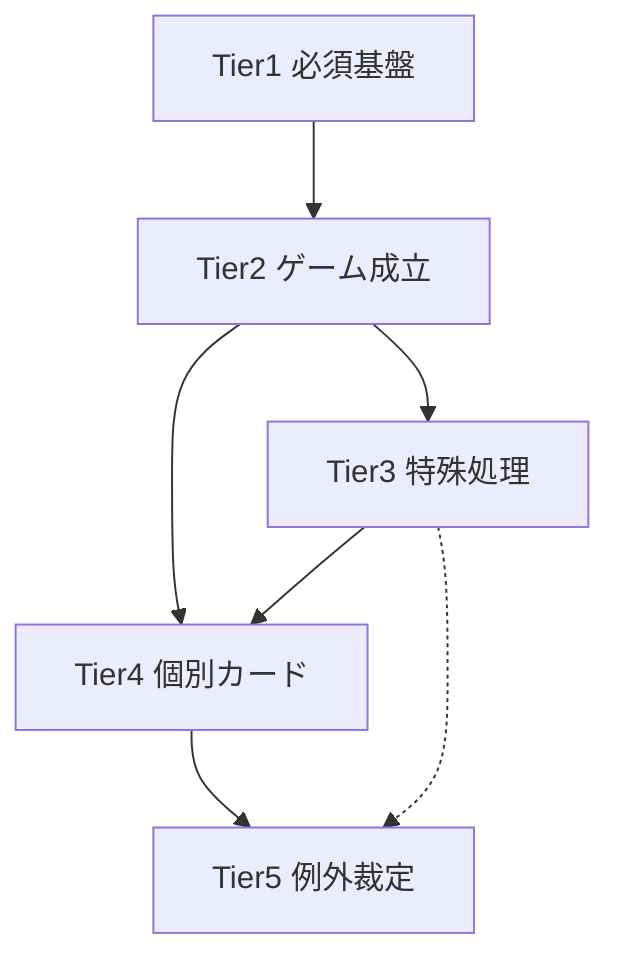

# 実装ロードマップ

**目的:** 最小リスクで Legend 1–3 コアループを完成させるための実装順序  
**対象:** `packages/engine`, `packages/cards`, `apps/web`  
**参照:** [event-architecture.md](./event-architecture.md), [state-gap-analysis.md](./state-gap-analysis.md), [spec-review.md](./spec-review.md)  
**日付:** 2026-06-09  
**コード変更:** なし（計画のみ）

---

## 方針

1. **下位 Tier を先に固める。** Tier 1 の不整合は全カード実装に波及する。
2. **横断基盤 → コアループ → 特殊キーワード → 個別カード → 裁定** の順で着手する。
3. **Event 層の全面導入は Tier 3 以降。** 現行 `applyAction` パイプラインで Legend 1–3 は動作可能（[event-architecture.md](./event-architecture.md) Phase 0）。
4. **カード追加の規約を Tier 2 完了時点で固定:** `EffectHandler 登録 → 対応タイミング発火 → 既存 Pending 再利用`。

### Tier 依存関係（全体）



---

## Tier 1: 必須基盤

ゲームエンジン・データ・型の「土台」。ここが揺れると上位 Tier すべてが再実装になる。

### 含まれる項目

| ID | 項目 | 現状 | 優先度 |
|----|------|------|--------|
| T1-01 | `GameState` / `PlayerState` / `CardInstance` 型 | 実装済（80%+ Wiki 整合） | — |
| T1-02 | `GameAction` / `isLegalAction` / `getLegalActions` | 実装済 | — |
| T1-03 | `EffectStack` 導出（`buildEffectStack`, `FRAME_PRIORITY`） | 実装済・テスト済 | — |
| T1-04 | **`countAvailablePower`** — 敵マルチコマンド加算 | **未実装**（I-01） | **P0** |
| T1-05 | `cards.json` ↔ Wiki 突合（`verify-wiki-effects`） | 未実行（1810枚） | P0 |
| T1-06 | エラッタ統一（grnrngr ↔ `errata.ts` ↔ cards.json） | 部分（C-06） | P0 |
| T1-07 | RS-143 等効果文欠落 5枚の先行修正 | 未対応（U-12） | P0 |
| T1-08 | `createGame` / デッキ検証 / ゾーン定数 | 実装済 | — |
| T1-09 | `pendingScry` レガシー削除 | deprecated 残存 | P1 |
| T1-10 | ドキュメント整合（禁止カード・先攻記述 C-01/C-02） | 不整合あり | P1 |

### 理由

- **ルール確定済みの仕様ギャップ**（パワー計算）が未修正のままだと、ラッシュ可否・コスト判定が全デッキで誤る（[spec-review.md](./spec-review.md) I-01）。
- **カードデータの正確性**は EffectHandler 実装の前提。効果文が UNKNOWN のまま個別カードに着手すると二重作業になる。
- State / Pending / EffectStack の骨格は既に Wiki `timing.md` と整合しており、**構造の作り直しは不要**。Tier 1 は「穴埋めとデータ整備」に限定する。

### 依存関係

| 依存元 | 依存先 |
|--------|--------|
| 全 Tier | T1-01〜03（型・合法 Action・スタック導出） |
| T1-05 | T1-07（5枚修正を verify のサンプルケースに） |
| T1-06 | T1-05（突合結果でエラッタ差分を検出） |
| Tier 2 以降 | T1-04（パワー計算はラッシュ・オペ・コスト全般に波及） |

**外部依存:** `docs/wiki/*`（確定仕様）、`packages/cards`（cards.json）

### 想定工数

| 項目 | 工数 | 備考 |
|------|------|------|
| T1-04 `countAvailablePower` | **1–2 人日** | `helpers.ts` + `canAffordPower` / `payPowerCost` 置換 + 単体テスト |
| T1-05 verify-wiki-effects 全弾 | **3–5 人日** | スクリプト実行・差分レビュー・修正 PR 分割 |
| T1-06 エラッタ統一 | **1–2 人日** | 差分リスト作成 + errata.ts / cards.json 反映 |
| T1-07 効果文 5枚 | **0.5 人日** | RS-020/023/044/068/143 |
| T1-09 pendingScry 削除 | **0.5 人日** | legalActions のみ |
| T1-10 ドキュメント | **0.5 人日** | docs のみ |
| **Tier 1 合計** | **7–11 人日** | 並行可能（T1-04 と T1-05 は独立） |

### リスク

| リスク | 深刻度 | 緩和策 |
|--------|--------|--------|
| T1-04 未実装のまま Tier 2 着手 | **HIGH** | Tier 2 のラッシュテスト前に必須マージ |
| verify 全弾で大量差分 | MED | Legend 1–3 サブセットを先に verify、残りはバッチ分割 |
| エラッタ原文不完全（U-05） | LOW | grnrngr errata.html を正とし、atwiki で補完 |
| `countAvailablePower` のマルチ判定誤り | MED | atwiki 110 / FAQ のテストケース固定（表裏不問・カテゴリ数不問） |

---

## Tier 2: ゲーム成立に必要

1 ゲームを最後までプレイできる「コアループ」。個別カード効果なしでもフェイズ遷移・勝敗判定が完結する層。

### 含まれる項目

| ID | 項目 | モジュール | 現状 |
|----|------|-----------|------|
| T2-01 | 5 フェイズ遷移・先攻 1T スタート省略 | `applyAction`, `createGame` | 実装済 |
| T2-02 | スタート行程（ドロー・リリース・バトル戻し） | `startPhase.ts` | 実装済 |
| T2-03 | チャージ（1T1枚） | `applyAction` | 実装済 |
| T2-04 | ラッシュ手順（パワー・ホールド・配置） | `applyAction`, `rushEffects` | 実装済（T1-04 待ち） |
| T2-05 | RS-026 順序（誘発 → 疾風カウンター窓） | `rushEffects`, `operationCounters` | 実装済 |
| T2-06 | カウンター（相手ターン・ホールド・リリース条件） | `operationCounters` | 実装済 |
| T2-07 | バトル進入（左詰め・コマンド支払い二段） | `battleEntry`, `commandPayment` | 実装済 |
| T2-08 | NC（comboNumber・再発動防止） | `combo.ts`, `ncEffects` | 実装済 |
| T2-09 | アタック（BP 比較・相討ち） | `applyAction` | 実装済 |
| T2-10 | ストライク（SP・反応窓・ダメージ） | `strikeReactions`, `damagePayment` | 実装済 |
| T2-11 | 離場 → レジスト → 離場完了 | `operationCounters`, `resist` | 実装済 |
| T2-12 | ダメージ支払い（表裏・デッキアウト敗北） | `damagePayment` | 実装済 |
| T2-13 | ゾードセットアップ | `zordSetup`, `zord` | 実装済 |
| T2-14 | 勝利判定（7 ダメージ・必須ドロー失敗） | `applyAction`, `helpers` | 実装済 |
| T2-15 | Pending 10 種 + `withSyncedEffectStack` | `effectStack.ts`, `types/game.ts` | 実装済 |
| T2-16 | 反応窓 5 種（leave/register/strike/battle/rush） | 各 `pending*` | 実装済 |
| T2-17 | エンドフェイズ基本（修飾子クリア・手番交代） | `applyAction`, `modifiers` | 実装済 |
| T2-18 | コアループ統合テスト | `gameplayFlow.integration.test.ts` 等 | 部分 |

### 理由

- Wiki 確定度 **HIGH** の領域（フェイズ・ラッシュ・バトル・ダメージ）であり、Legend 1–3 デッキの「骨格」となる。
- 現行エンジンは **Phase 0（命令型パイプライン）で既に大部分が動作** している。Tier 2 は「検証・穴埋め・回帰テスト強化」が主目的。
- 個別カード（Tier 4）の EffectHandler は、これらのタイミングフックにぶら下がるだけで済む。

### 依存関係

| 依存元 | 依存先 |
|--------|--------|
| T2-04 ラッシュ | **T1-04** `countAvailablePower` |
| T2-07 バトル進入 | T2-04（ラッシュゾーンからの移動） |
| T2-09〜12 バトル・ダメージ | T2-07, T2-15（Pending / Stack） |
| T2-05 カウンター窓 | T2-04, T2-06 |
| T2-18 統合テスト | T2-01〜17 すべて |
| Tier 3 / 4 | **Tier 2 完了**（コアループ E2E が通ること） |

### 想定工数

| 項目 | 工数 | 備考 |
|------|------|------|
| T1-04 反映後のラッシュ・コスト回帰 | **1–2 人日** | 既存テスト修正含む |
| T2-18 コアループ E2E 拡充 | **2–3 人日** | 反応窓連鎖・相討ち・レジスト・ゾード各 1 シナリオ |
| `deferredBattleEntry` の Stack 登録（P1） | **1–2 人日** | [state-gap-analysis.md](./state-gap-analysis.md) §P1-5 |
| hold-ready フラグ統合（P1） | **2–3 人日** | 任意。Tier 2 完了後でも可 |
| **Tier 2 合計（新規作業分）** | **6–10 人日** | 既存実装の検証・改善が中心 |

### リスク

| リスク | 深刻度 | 緩和策 |
|--------|--------|--------|
| T1-04 未反映でラッシュテストが偽陽性 | **HIGH** | Tier 1 と並行せず直列化 |
| `deferredBattleEntry` が Stack 外のまま | MED | UI/AI がブロック状態を誤解。P1 で frame 追加 |
| hold-ready boolean クリア漏れ | MED | 統合テストで中間状態を明示的に検証 |
| エンドフェイズ詳細不足（U-01） | LOW | atwiki 155 + `end_turn_menu` で暫定運用可 |

---

## Tier 3: 特殊処理

コアループを拡張する横断メカニクス・キーワード・保守改善。複数カードにまたがる「仕組み」単位。

### 含まれる項目

| ID | 項目 | 説明 | 現状 |
|----|------|------|------|
| T3-01 | **同時効果のプレイヤー順序選択** | `simultaneousGroupId` 書き込み + `simultaneous_order` Pending | インフラのみ（I-04） |
| T3-02 | **JC（ジョイントコンボ）** | L/R 配置・能力付加 | `jointComboEffects.ts` 部分 |
| T3-03 | **RC（ライディングコンボ）** | 乗車・ライドオフ・バトル進入 | `mountedOnInstanceId` あり、解決未確認（I-07） |
| T3-04 | **ウイング** | 空バトルエリア例外 | 未実装（U-06, I-05） |
| T3-05 | **チェイス** | 追撃・連鎖カウンター | 未実装（U-07, I-06） |
| T3-06 | オペレーション解決フレームワーク | `resolveOperation.ts` + 常駐/非常駐 | 実装済 |
| T3-07 | フィールドオーラ / BP 常駐修正 | `fieldAuras.ts`, `fieldEffects` | 実装済 |
| T3-08 | 名前付きユニット効果フレームワーク | `namedUnitEffects.ts` | 実装済 |
| T3-09 | NC 条件付き発動（進入時選択） | `enterBattleEffects`, `numberComboEffects` | 実装済 |
| T3-10 | エンドフェイズ詳細ステップ | 「ターンを終えるとき」段階管理 | 暫定（`endTurnEffects`） |
| T3-11 | Event 層 Phase 1–2 | rush/leave/strike の Event 発行 + Resolver 抽出 | 未着手（設計のみ） |
| T3-12 | `pendingEffectChoice` kind 別分割 | God Object 解消（1500 行超） | 未着手（P2） |
| T3-13 | `pendingBattleToRushQueue` の Stack 統合 | スタート効果キュー | 未着手（P3） |
| T3-14 | TurnModifiers 汎用化 | `Record<effectId, ModifierState>` 移行 | 未着手（P2） |

### 理由

- 単一カードではなく **ルールカテゴリまたはフレームワーク** として実装する層。ここを先に固めると Tier 4 のカード追加が「effectId 登録」に近づく。
- ウイング・チェイス・JC/RC は **複数カードが依存** するため、個別カード（Tier 4）より先に方針と骨格が必要。
- Event 層・Pending 分割は **保守性改善**。ゲーム成立（Tier 2）を阻害しないため Tier 3 に配置。

### 依存関係

| 依存元 | 依存先 |
|--------|--------|
| T3-02 JC | T2-08（NC / combo 基盤） |
| T3-03 RC | T2-07（バトル進入）, T2-11（離場） |
| T3-04 ウイング | T2-09（アタック制限の例外） |
| T3-05 チェイス | T2-06（カウンター）, T3-03（RC ライドオフ） |
| T3-01 同時順序 | T2-15（`pendingEffectChoice`） |
| T3-11 Event 層 | T2 コアループ安定後 |
| Tier 4 カード群 | T3-02〜05 のスコープ判断完了後 |

**プロダクト判断待ち:** I-05（ウイング）, I-06（チェイス）, I-07（JC/RC）— v1 スコープに含めるか要 ADR

### 想定工数

| 項目 | 工数 | 備考 |
|------|------|------|
| T3-01 同時順序 UI + エンジン | **3–5 人日** | Pending 拡張 + Web UI |
| T3-02 JC フレームワーク完成 | **3–4 人日** | combo.ts 拡張 + 代表カード 2–3 枚で検証 |
| T3-03 RC フレームワーク完成 | **4–6 人日** | 乗車・ライドオフ・進入連鎖 |
| T3-04 ウイング | **2–3 人日** | スコープ入りの場合 |
| T3-05 チェイス | **3–5 人日** | 新 Pending 候補。RC 後が望ましい |
| T3-10 エンドフェイズ詳細 | **1–2 人日** | grnrngr 画像未取得なら LOW 優先 |
| T3-11 Event Phase 1–2 | **5–8 人日** | 全面導入ではなく主要 3 経路のみ |
| T3-12 Pending 分割 | **5–8 人日** | リファクタ。機能追加と分離推奨 |
| **Tier 3 合計（フルスコープ）** | **26–41 人日** | ウイング/チェイス除外で **18–28 人日** |

### リスク

| リスク | 深刻度 | 緩和策 |
|--------|--------|--------|
| ウイング・チェイスのスコープ未決定 | **HIGH** | Tier 3 着手前に ADR。対象外なら依存カードをプール外明示 |
| JC/RC の engine 実装詳細不明（U-15） | MED | 用語集 + 代表 EXP カードでスパイク実装 |
| Event 層導入による回帰 | MED | Phase 1 は rush/leave/strike のみ。既存テストを維持 |
| ウイング + SP 撃破の裁定（C-04） | LOW | 実装時 grnrngr FAQ 再確認 |
| `pendingEffectChoice` 分割の大規模 diff | MED | kind 単位で PR 分割 |

---

## Tier 4: 個別カード

effectId 単位の EffectHandler 登録と Web UI 配線。Tier 2–3 のフックにぶら下がる作業。

### 含まれる項目

| サブセット | 範囲 | 参照 |
|-----------|------|------|
| T4-L1 | Legend 1 カード効果 | `legend2/*`, cards.json L1 |
| T4-L2 | Legend 2 カード効果 | `legend2/*` |
| T4-L3 | Legend 3 カード効果 | `legend3/*`, `legend3.integration.test.ts` |
| T4-OP | オペレーション（常駐/非常駐/カウンター） | `resolveOperation.ts`, `OPERATION_UI_MECHANISMS` |
| T4-NC | NC 個別効果 | `legend2/ncEffects`, `legend3/ncEffects` |
| T4-DATA | L3 効果文 UNKNOWN 約 40 枚 | U-13 |
| T4-UI | Web UI 未配線効果 | `webUiEffectCoverage.ts` gaps |
| T4-VERIFY | カード別回帰テスト | `rs*.test.ts`, `*.integration.test.ts` |

### 実装順（Legend 内）

1. **パッシブ / 常駐オペ** — タイミング単純、E2E 不要なものが多い  
2. **on_rush / on_enter_battle** — Tier 2 フック直結  
3. **on_attack / on_destroy** — バトル連鎖依存  
4. **選択 UI 系（effect_choice）** — `pendingChoices` 依存、工数大  
5. **エンドターン / 複合効果** — `endTurnEffects`, 支払い二段系  

### 理由

- カード効果は **データ駆動 + effectId マップ** が最も変更影響が小さい（[event-architecture.md](./event-architecture.md) §3.2）。
- 1810 枚一括は非現実的。**Legend 1–3 のプレイアブルデッキに必要な effectId** に絞る。
- `webUiEffectCoverage` のギャップはエンジン実装と **独立して並行可能** だが、エンジン未実装の effectId には UI を配線しない。

### 依存関係

| 依存元 | 依存先 |
|--------|--------|
| 全カード効果 | **Tier 1**（cards.json 正確性） |
| タイミング系効果 | **Tier 2**（対応 Pending / タイミング） |
| JC/RC/ウイング/チェイス依存カード | **Tier 3**（該当キーワード） |
| T4-DATA（UNKNOWN 40 枚） | Wiki 再取得 — Tier 4 着手前に推奨 |
| T4-UI | 対応 T4 エンジン effectId 完了後 |

### 想定工数

| 項目 | 工数 | 備考 |
|------|------|------|
| L3 UNKNOWN 40 枚データ整備 | **2–4 人日** | atwiki 再パース |
| Legend 3 未配線効果（エンジン） | **15–25 人日** | 1 効果 0.5–1 人日平均。複雑効果は 2–3 人日 |
| Legend 2 残効果 | **5–10 人日** | 大半実装済と想定 |
| Web UI 配線（L3 中心） | **8–12 人日** | モーダル種別ごとに再利用 |
| カード別回帰テスト追加 | **5–8 人日** | 重要カード・FAQ カード優先 |
| **Tier 4 合計（L1–3 スコープ）** | **35–59 人日** | 並行化でカレンダー 4–8 週 |

### リスク

| リスク | 深刻度 | 緩和策 |
|--------|--------|--------|
| 効果文 UNKNOWN のまま実装 | **HIGH** | T4-DATA を Tier 4 の先行バッチに固定 |
| `pendingChoices` への effectId 直書き増殖 | MED | Tier 3-12 分割と並行。新 kind は極力既存再利用 |
| TurnModifiers フィールド増殖 | MED | カードごとに boolean 追加禁止。Tier 3-14 を段階導入 |
| UI・エンジンの配線ズレ | MED | `webUiEffectCoverage` を CI で gap 検出 |
| 複雑カード（RS-013 シロンライト等）の三重トラッキング | LOW | 既知パターン。新カードでは単一ソース化 |

---

## Tier 5: 例外裁定

公式ソース間の競合・エッジケース・カード固有 FAQ。通常フローでは踏まないが、大会運用や FAQ カードで必須。

### 含まれる項目

| ID | 項目 | 出典 | confidence |
|----|------|------|------------|
| T5-01 | ラッシュ手順中断時の巻き戻し議論 | atwiki 146 vs 1974 | HIGH（146 優先） |
| T5-02 | レジスト「バトル」の範囲 | FAQ vs 1974 | HIGH（FAQ 優先） |
| T5-03 | BP「～になる」複数時の低い方優先 | FAQ | HIGH — Resolver 自動化可 |
| T5-04 | 「～するかわりに」前提不可時 | 1974 vs 一般 FAQ | LOW — カード別 |
| T5-05 | ウイング + SP 条件撃破時の on-destroy | 1974 | LOW — T3-04 後 |
| T5-06 | エラッタ追加（RS-003/052/058/065 等） | grnrngr vs errata.ts | MED |
| T5-07 | 効果スタック順序の公式全文照合 | U-02 | LOW — 現行順を暫定採用 |
| T5-08 | grnrngr FAQ card_3〜9 未取得 | U-04 | LOW |
| T5-09 | タッグストライク | 4 人ルール | スコープ外（U-08） |
| T5-10 | XG キーワード（ブラスト等） | engine-gaps | スコープ外（U-09） |
| T5-11 | 禁止カード・デッキ構築例外 | page-2079 | データ整備（T1-10） |
| T5-12 | カード個別 FAQ（L1/L2: 68/122 Q&A） | grnrngr | 該当カード実装時 |

### 理由

- **否定優先・強制効果** など一般原則は Tier 2 の Resolver に既に組み込み済み。Tier 5 は「原則では決まらない」個別裁定。
- 実装初期に手を付けるとスコープが爆発する。**カード実装（Tier 4）で問題が表面化した時点** で対応するのが最小リスク。
- スコープ外（タッグ・XG）は **明示的に実装しない** ことを文書化すれば Tier 5 の作業から除外できる。

### 依存関係

| 依存元 | 依存先 |
|--------|--------|
| T5-05 ウイング裁定 | T3-04 ウイング実装 |
| T5-06 追加エラッタ | T1-06 |
| T5-12 カード個別 FAQ | 該当 T4 カード実装 |
| 大会品質のシミュレーター | Tier 4 完了 + T5 の HIGH 項目 |

### 想定工数

| 項目 | 工数 | 備考 |
|------|------|------|
| 裁定 ADR 作成（C-01〜C-08 整理） | **1 人日** | 一度きり |
| T5-06 追加エラッタ反映 | **1–2 人日** | T1-06 の続き |
| カード個別 FAQ 対応 | **0.5–1 人日 / 件** | 必要になった分のみ |
| 公式スタック順序照合 | **1–2 人日** | 差分なしならドキュメントのみ |
| **Tier 5 合計（想定 10–15 件）** | **8–15 人日** | 継続的バックログ |

### リスク

| リスク | 深刻度 | 緩和策 |
|--------|--------|--------|
| コミュニティ情報（1974）を公式と混同 | MED | grnrngr FAQ > atwiki 裁定 > 1974 の優先順位を ADR 化 |
| エラッタ不完全で大会デッキが誤動作 | MED | T1-06 + T5-06 を早期完了 |
| Tier 5 を Tier 4 より先にやり過ぎる | LOW | 「問題が出たカードから」原則を守る |
| スコープ外キーワードの混入 | LOW | engine-gaps / unresolved で固定 |

---

## 推奨実装順序（マイルストーン）

最小リスクの **直列クリティカルパス**:

```
M0: Tier1 完了（パワー計算 + データ突合 + エラッタ）
    ↓
M1: Tier2 検証完了（コアループ E2E + deferredBattleEntry）
    ↓
M2: スコープ ADR（ウイング / チェイス / JC・RC の v1 含否）
    ↓
M3: Tier3 フレームワーク（同時順序 + 採用キーワードのみ）
    ↓
M4: Tier4 Legend3 効果（データ整備 → エンジン → UI）
    ↓
M5: Tier4 Legend2 残 + 回帰テスト拡充
    ↓
M6: Tier5 表面化した裁定のみ対応
```

### 並行可能な作業

| 並行バッチ | 内容 | 前提 |
|-----------|------|------|
| A | T1-05 verify + T1-06 エラッタ | なし |
| B | T1-04 countAvailablePower | なし |
| C | T1-10 ドキュメント修正 | なし |
| D | T3-11 Event Phase 1 | M1 完了後 |
| E | T4-UI 配線 | 対応 effectId の M4 完了後 |

### やってはいけない順序

| 順序 | 理由 |
|------|------|
| Tier 4 を Tier 1 より先 | 効果文・パワー計算の誤りがカードロジックに焼き付く |
| Event 全面導入を Tier 2 より先 | コアループ未検証のまま大規模リファクタ |
| ウイング/チェイスを JC/RC より先（採用時） | RC ライドオフがチェイス前提になるカードがある |
| Tier 5 全件を Tier 4 前に解決 | スコープ爆発。未使用カードの裁定は無駄 |

---

## 工数サマリ

| Tier | 合計工数（目安） | クリティカル度 |
|------|-----------------|---------------|
| Tier 1 | 7–11 人日 | **必須・最優先** |
| Tier 2 | 6–10 人日（新規分） | **必須** |
| Tier 3 | 18–41 人日（スコープ依存） | 高（キーワード判断後） |
| Tier 4 | 35–59 人日 | 高（プロダクト価値の本体） |
| Tier 5 | 8–15 人日（継続） | 中（品質・大会向け） |
| **総計** | **74–136 人日** | Legend 1–3 完遂目安 |

※ 1 人日 = 6–8 時間の実装・テスト・レビュー込みの概算。チーム並行でカレンダー換算は 3–5 ヶ月程度。

---

## 完了定義（Definition of Done）

| マイルストーン | 完了条件 |
|---------------|----------|
| **M0** | `countAvailablePower` テスト緑、verify-wiki-effects L1–3 差分ゼロ、エラッタ差分リスト CLOSED |
| **M1** | 効果なしデッキ同士で 1 ゲーム完走、反応窓 5 種 + ダメージ支払い E2E、monkey test クラッシュなし |
| **M3** | 採用キーワードの代表カード 2 枚ずつ E2E、同時順序が 1 シナリオで動作 |
| **M4** | Legend 3 スターター相当デッキが CPU 対戦可能、`webUiEffectCoverage` gaps ゼロ（L3 範囲） |
| **M6** | unresolved HIGH/MED が 0 またはスコープ外明示、C-01〜C-08 ADR 記載済 |

---

## 参照

| 文書 | 役割 |
|------|------|
| [spec-review.md](./spec-review.md) | 確定/未確定仕様、I-01〜14 |
| [state-gap-analysis.md](./state-gap-analysis.md) | State ギャップ、P0–P4 改善 |
| [event-architecture.md](./event-architecture.md) | Event 層移行 Phase 0–4 |
| [docs/wiki/engine-gaps.md](../wiki/engine-gaps.md) | 意図的未実装 |
| [docs/wiki/unresolved.md](../wiki/unresolved.md) | Issue トラッカー |
| [docs/wiki/timing.md](../wiki/timing.md) | スタック優先度 |
