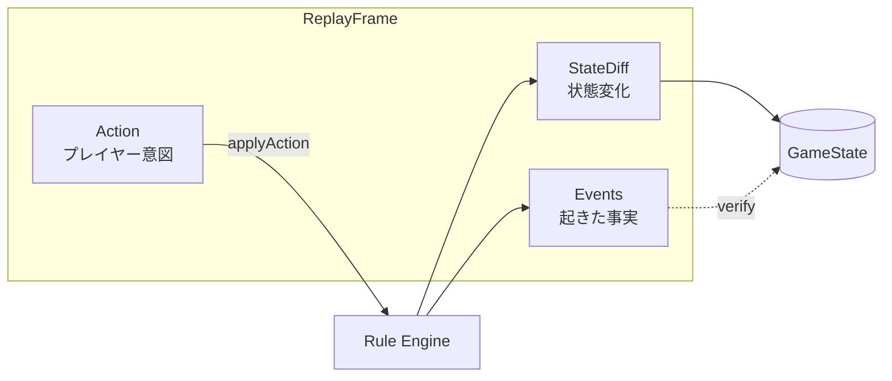
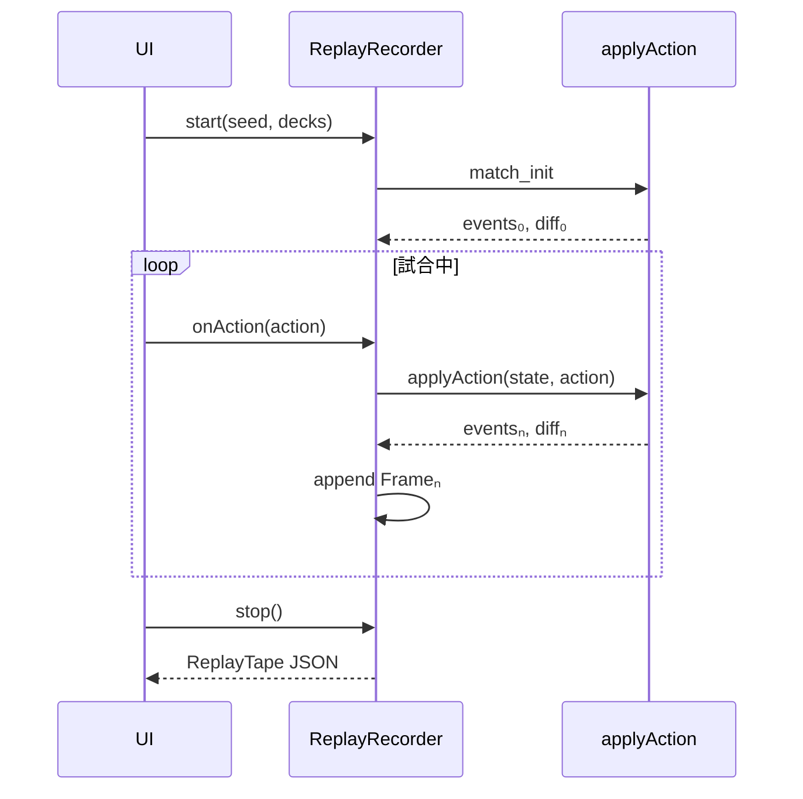

# Replay System 設計

**目的:** `Action` / `Event` / `StateDiff` の 3 種のみで試合を**完全再現**できるリプレイ形式を定義する  
**対象:** `packages/engine`  
**関連:** [test-strategy.md](./test-strategy.md), [game-events-catalog.md](./game-events-catalog.md)  
**日付:** 2026-06-09

---

## 0. 設計サマリ

| 項目 | 方針 |
|------|------|
| 保存単位 | **ReplayFrame**（1 プレイヤー操作 = 1 フレーム） |
| 保存フィールド | `action`, `events`, `diff` のみ（メタデータも Frame 0 に内包） |
| 再現方式 | **主:** Action 再実行 + diff/event 照合 / **副:** StateDiff 連鎖で状態復元 |
| 決定論 | `match_init` Action に `seed` + デッキ `cardId[]` を格納 |
| Event 命名 | [game-events-catalog.md](./game-events-catalog.md) の `snake_case` |
| バージョン | `ReplayTape.v = 1`（ファイル外枠は最小限） |

```
試合完全再現 =
  Frame₀(init: Action + Events + StateDiff)
  → Frame₁(action₁ → events₁ → diff₁)
  → Frame₂(action₂ → events₂ → diff₂)
  → …
```

---

## 1. 概念モデル

### 1.1 3 層の役割分担



| 層 | 役割 | 再現での使い方 |
|----|------|----------------|
| **Action** | プレイヤーが選んだ `GameAction` | **主経路:** 同じ seed で再実行 |
| **Event** | ルール上発生した事実の時系列ログ | **検証:** 再実行結果と一致するか assert |
| **StateDiff** | フレーム前後の `GameState` 差分 | **副経路:** エンジン非依存で任意フレームへ seek / 旧版互換 |

**完全再現の定義:**

1. Frame 0 適用後の状態が `diff₀.nextHash` と一致
2. 各 Frame *n* で `applyAction(stateₙ₋₁, actionₙ)` が成功
3. 再実行で得た `eventsₙ` が記録と **順序・payload 一致**
4. 再実行で得た `diffₙ.nextHash` が記録と一致
5. 最終フレームの状態が元試合の終局と一致

### 1.2 フレーム境界

**1 フレーム = 1 回の `applyAction` 呼び出し**（成功 or 失敗）。

- 1 Action が内部で複数 Event を発行してよい（`events[]` に全列挙）
- StateDiff は **その Action 適用後の確定状態** への差分 1 つ
- 自動処理（フェイズ進行のみ等）も Action が必要 — 将来 `system_advance` Action を追加するか、プレイヤー Action に含める

```
Player: rush(RS-046)
  events: [rush_declared, rush_completed, effect_triggered, reaction_window_opened, ...]
  diff:   { prevHash: "a1..", nextHash: "b2..", ops: [...] }
```

---

## 2. データ形式

### 2.1 ファイル構造（最小外枠）

ファイル自体は配列コンテナのみ。中身は Frame の列。

```json
{
  "v": 1,
  "frames": [ "...ReplayFrame[]" ]
}
```

| 外枠フィールド | 必須 | 説明 |
|---------------|------|------|
| `v` | ✓ | テープフォーマット版 |
| `frames` | ✓ | Frame 0 から順序保証 |

**Frame 0 以外にメタデータを置かない。** 試合 ID・日時・プレイヤー名は Frame 0 の `action.payload` に任意で含める。

### 2.2 ReplayFrame

```typescript
type ReplayFrame = {
  /** 0 始まり単調増加。欠番不可。 */
  seq: number;

  /** プレイヤー意図。Frame 0 は match_init。失敗 Action も記録可。 */
  action: ReplayAction;

  /** この Action 処理中に発行された Event（時系列順）。 */
  events: ReplayEvent[];

  /** action 適用前 → 適用後の状態差分。 */
  diff: StateDiff;

  /** 任意: applyAction が失敗した場合 */
  error?: string;
};
```

### 2.3 ReplayAction

既存 `GameAction` をそのまま使う。Frame 0 専用の合成 Action を追加。

```typescript
/** Frame 0 のみ。以降のフレーム再現に必要な最小ブートストラップ。 */
type MatchInitAction = {
  type: "match_init";
  /** Fisher-Yates 等と createGame が共有する RNG seed */
  seed: number;
  firstPlayer: PlayerId;
  player1Deck: string[];   // cardId の並び（枚数順）
  player2Deck: string[];
  /** cards パッケージの内容ハッシュ（definitions 再構築用） */
  catalogHash: string;
  /** 任意メタ */
  meta?: {
    matchId?: string;
    recordedAt?: string;
    player1Name?: string;
    player2Name?: string;
  };
};

type ReplayAction = GameAction | MatchInitAction;
```

`definitions` は State に含まれるが **diff では保存しない**（`catalogHash` からロード）。これによりテープサイズを抑えつつ再現性を担保。

### 2.4 ReplayEvent

[game-events-catalog.md](./game-events-catalog.md) 準拠。

```typescript
type ReplayEvent = {
  /** フレーム内の Event 順序。0 始まり。 */
  i: number;

  /** snake_case。例: rush_completed */
  type: string;

  /** イベント固有ペイロード（下表参照） */
  p?: ReplayEventPayload;

  /** 因果: この Event を引き起こした Event の i（同一フレーム内） */
  causedBy?: number;
};

type ReplayEventPayload = {
  playerId?: PlayerId;
  instanceId?: string;
  cardId?: string;
  zone?: ZoneName;
  fromZone?: ZoneName;
  toZone?: ZoneName;
  effectId?: string;
  damage?: number;
  phase?: Phase;
  /** 拡張用。未知キーは無視可能 */
  [key: string]: unknown;
};
```

**必須 Event（全フレーム共通ルール）:**

| タイミング | 先頭 Event | 末尾 Event |
|-----------|-----------|-----------|
| Frame 0 | `game_created` | `game_started` |
| 成功 Frame | `action_received` | `action_resolved` |
| 失敗 Frame | `action_received` | `action_rejected` |

`action_received.p` に `action.type` のコピーを含め、Event のみで UI ラベル再構成可能にする。

### 2.5 StateDiff

**増分差分形式。** 直前フレームの `nextHash` と `prevHash` でチェーンを形成。

```typescript
type StateDiff = {
  /** 適用前状態の指紋。Frame 0 は null */
  prevHash: string | null;

  /** 適用後状態の指紋 */
  nextHash: string;

  /** 差分操作の列（順序通りに適用） */
  ops: StateDiffOp[];
};
```

#### StateDiffOp 一覧

| op | 用途 | 例 |
|----|------|-----|
| `set` | スカラー / pending 丸ごと | `phase`, `winner`, `pendingStrike` |
| `clear` | pending フィールド削除 | `pendingRush` |
| `move` | カードゾーン移動 | hand → rush |
| `patch` | `CardInstance` フィールド | `bpModifier`, `faceDown` |
| `insert` | ゾーン先頭/末尾に追加 | ドロー |
| `remove` | ゾーンから除去 | 破棄前 |
| `shuffle` | 山札順序 | `deck` の instanceId 列 |
| `mod_turn` | `TurnModifiers` 部分更新 | `comboNumberDelta` |
| `mod_player` | `PlayerState` 非ゾーンフィールド | `damage`, hold-ready flags |
| `log_append` | `log[]` 追記 | 表示用（再現必須なら） |

```typescript
type StateDiffOp =
  | { op: "set"; path: StatePath; value: unknown }
  | { op: "clear"; path: StatePath }
  | { op: "move"; instanceId: string; from: ZoneRef; to: ZoneRef; index?: number }
  | { op: "patch"; instanceId: string; set: Partial<CardInstance>; unset?: (keyof CardInstance)[] }
  | { op: "insert"; zone: ZoneRef; cards: CardInstance[]; at?: "head" | "tail" }
  | { op: "remove"; zone: ZoneRef; instanceIds: string[] }
  | { op: "shuffle"; zone: ZoneRef; order: string[] }
  | { op: "mod_turn"; playerId: PlayerId; set: Partial<TurnModifiers> }
  | { op: "mod_player"; playerId: PlayerId; set: Partial<PlayerStateScalars> }
  | { op: "log_append"; lines: string[] };

type ZoneRef = {
  playerId: PlayerId;
  zone: ZoneName;
};

/** JSON Pointer 風。definitions / log 全体は対象外 */
type StatePath =
  | "phase" | "turn" | "activePlayer" | "firstPlayer" | "winner"
  | `pending.${PendingKey}`
  | `players.${PlayerId}.damage`
  | `players.${PlayerId}.turnModifiers`
  | `players.${PlayerId}.${ZoneName}`
  | `players.${PlayerId}.${PlayerScalarKey}`;
```

**除外（diff に含めない）:**

| フィールド | 理由 |
|-----------|------|
| `definitions` | `catalogHash` から決定論的ロード |
| `effectStack` | `pending*` から導出（再計算可能） |

`effectStack` を UI 同期用に含める場合は `set path: "effectStack"` を許可オプションとする（デフォルト off）。

### 2.6 状態指紋（hash）

```typescript
function stateFingerprint(state: GameState): string {
  // 1. definitions を除外
  // 2. 各ゾーンの instanceId 順序を保持
  // 3. CardInstance は安定キー順でシリアライズ
  // 4. pending* は undefined と省略を正規化
  // 5. SHA-256 → base64url 先頭 16 文字
}
```

同一状態なら常に同一 hash。リプレイ検証の核心。

---

## 3. ライフサイクル

### 3.1 記録（Record）



```typescript
class ReplayRecorder {
  start(opts: MatchInitAction): void;
  record(action: GameAction, result: ApplyResult): void;
  /** applyAction をラップ */
  wrapApply(apply: typeof applyAction): typeof applyAction;
  finish(): ReplayTape;
}
```

**記録フック位置（実装）:**

```
packages/engine/src/replay/
  record.ts      # ReplayRecorder
  capture.ts     # applyAction 前後の state 差分計算
  events.ts      # EventEmitter（Event 層導入後）または applyAction 内 tap
  diff.ts        # computeStateDiff(before, after)
  hash.ts        # stateFingerprint
```

現状 Event 層未実装 → **Phase 0:** `applyAction` 出口で `diff` のみ記録、`events` は `action_received` / `action_resolved` + `formatLog` からの段階的拡充。

### 3.2 再生（Play）

#### モード A — Action 再実行（推奨）

```typescript
function playReplay(tape: ReplayTape): PlayResult {
  let state: GameState | null = null;
  for (const frame of tape.frames) {
    if (frame.seq === 0) {
      state = initFromMatchInit(frame.action as MatchInitAction);
      assertDiff(null, state, frame.diff);
      assertEvents(frame.events);
      continue;
    }
    const result = applyAction(state!, frame.action as GameAction);
    verifyFrame(frame, result, state);
    state = result.ok ? result.state : state;
  }
  return { finalState: state, ok: true };
}
```

#### モード B — StateDiff 連鎖（エンジン非依存）

```typescript
function reconstructAt(tape: ReplayTape, seq: number): GameState {
  let state = emptyShell();
  for (const frame of tape.frames.slice(0, seq + 1)) {
    state = applyDiff(state, frame.diff);
    assert(stateFingerprint(state) === frame.diff.nextHash);
  }
  return state;
}
```

任意フレームへの **シーク**・**観戦 UI**・**エンジン版不一致時の表示** に使用。

#### モード C — ハイブリッド検証

```typescript
function verifyReplay(tape: ReplayTape): VerifyReport {
  // Action 再実行しつつ各フレームで:
  // - events 一致
  // - diff.nextHash 一致
  // - reconstruct(diff) と applyAction 結果の一致
}
```

### 3.3 失敗 Action の記録

非法 Action もリプレイ価値あり（バグ再現）。

```json
{
  "seq": 42,
  "action": { "type": "rush", "playerId": "player1", "instanceId": "x" },
  "events": [
    { "i": 0, "type": "action_received", "p": { "actionType": "rush" } },
    { "i": 1, "type": "action_rejected", "p": { "reason": "illegal_action" } }
  ],
  "diff": { "prevHash": "aa", "nextHash": "aa", "ops": [] },
  "error": "illegal_action"
}
```

`prevHash === nextHash` かつ `ops: []` で状態不変を明示。

---

## 4. 完全再現のための不変条件

| ID | 不変条件 |
|----|----------|
| RPL-01 | `frames[n].diff.prevHash === frames[n-1].diff.nextHash`（n ≥ 1） |
| RPL-02 | `frames[n].diff.nextHash === stateFingerprint(stateAfterₙ)` |
| RPL-03 | `match_init` 同一なら `createGame(seed, decks)` の instanceId 列が一致 |
| RPL-04 | カード総数保存: 全ゾーン + 除外の instanceId 集合サイズ不変（除外・生成効果除く） |
| RPL-05 | `events` 末尾は `action_resolved` or `action_rejected` |
| RPL-06 | `catalogHash` 不一致時は Action 再実行を拒否し Diff 再生にフォールバック |

---

## 5. ドメイン別 Event / Diff 指針

### 5.1 Rule Engine

| Action 例 | 主要 Event | Diff の主 op |
|-----------|-----------|-------------|
| `end_phase` | `phase_exited`, `phase_entered`, `active_player_changed` | `set phase`, `mod_turn` |
| `draw` | `card_drawn` | `move` hand←deck |
| `charge_power` | `card_charged_to_power` | `move` |

### 5.2 Card Effects

| パターン | Event | Diff |
|----------|-------|------|
| on_rush | `rush_completed`, `effect_triggered` | `move` + `patch` |
| NC | `nc_triggered`, `battle_entered` | `mod_turn`, `patch activatedNcEffects` |
| 選択効果 | `effect_choice_requested`, `effect_choice_resolved` | `set pendingEffectChoice` → `clear` |

### 5.3 Battle Resolution

| Action | Event | Diff |
|--------|-------|------|
| `battle` | `attack_declared`, `battle_resolved` | `move`（破壊）, `clear pendingBattle` |
| `strike` | `strike_declared` | `set pendingStrike` |

### 5.4 Counter

| Action | Event | Diff |
|--------|-------|------|
| `play_counter` | `counter_played`, `battle_cancelled` | `move`, `set pendingBattle.battleCancelled` |
| `pass_*_reaction` | `reaction_passed`, `reaction_window_closed` | `clear pending*` |

### 5.5 Damage

| Action | Event | Diff |
|--------|-------|------|
| `resolve_damage_payment` | `damage_assigned`, `power_flipped` | `patch faceDown`, `mod_player damage` |
| 6+ ダメージ | `player_damaged`, `game_ended` | `set winner` |

### 5.6 Win/Lose

| Event | Diff |
|-------|------|
| `game_ended` | `set winner`, 以降 `action_rejected` のみ |

---

## 6. API 設計

### 6.1 パッケージ配置

```
packages/engine/src/replay/
  types.ts           # ReplayTape, ReplayFrame, StateDiff, ReplayEvent
  hash.ts            # stateFingerprint
  diff.ts            # computeStateDiff, applyDiff
  events.ts          # EventCollector, normalizeEvent
  record.ts          # ReplayRecorder
  play.ts            # playReplay, reconstructAt
  verify.ts          # verifyReplay, assertFrame
  io.ts              # JSON parse/stringify, gzip 任意
  index.ts
```

### 6.2 公開 API

```typescript
// 記録
export function createRecorder(init: MatchInitAction): ReplayRecorder;
export function computeStateDiff(before: GameState, after: GameState): StateDiff;

// 再生
export function playReplay(tape: ReplayTape, mode?: "action" | "diff"): PlayResult;
export function reconstructAt(tape: ReplayTape, seq: number): GameState;
export function seekHash(tape: ReplayTape, hash: string): number | null;

// 検証
export function verifyReplay(tape: ReplayTape): VerifyReport;
export function diffFrames(a: ReplayFrame, b: ReplayFrame): FrameDiff;

// I/O
export function serializeTape(tape: ReplayTape): string;
export function parseTape(json: string): ReplayTape;
```

### 6.3 applyAction 統合

```typescript
// packages/engine/src/core/applyAction.ts（将来）
export function applyAction(
  state: GameState,
  action: GameAction,
  ctx?: { collector?: EventCollector },
): ApplyResult;
```

`EventCollector` は `applyAction` 内の既存分岐から `emit()` 呼び出し。リプレイ記録は:

```typescript
recorder.wrapApply(applyAction)(state, action);
// → 内部で before/after diff + collector.events を Frame 化
```

---

## 7. サイズ最適化

| 手法 | 効果 |
|------|------|
| `definitions` を diff から除外 | −30〜50% |
| `effectStack` 導出 | −5% |
| instanceId をフレーム内短縮 ID にしない | 再現性優先（短縮は v2 検討） |
| 同一 `ops` の run-length | 連続 `log_append` 結合 |
| gzip | テキスト JSON を配布時に圧縮 |

**目安:** 40 ターン試合 ≈ 80〜120 フレーム → 非圧縮 200〜500 KB。

---

## 8. 例: 最小テープ

```json
{
  "v": 1,
  "frames": [
    {
      "seq": 0,
      "action": {
        "type": "match_init",
        "seed": 42,
        "firstPlayer": "player1",
        "player1Deck": ["RS-080", "RS-080", "TST-P"],
        "player2Deck": ["RS-080", "TST-P", "TST-P"],
        "catalogHash": "sha256:abc..."
      },
      "events": [
        { "i": 0, "type": "game_created" },
        { "i": 1, "type": "game_started", "p": { "firstPlayer": "player1" } }
      ],
      "diff": {
        "prevHash": null,
        "nextHash": "H0",
        "ops": [
          { "op": "set", "path": "phase", "value": "charge" },
          { "op": "set", "path": "turn", "value": 1 },
          { "op": "insert", "zone": { "playerId": "player1", "zone": "hand" }, "cards": ["..."] }
        ]
      }
    },
    {
      "seq": 1,
      "action": { "type": "rush", "playerId": "player1", "instanceId": "RS-080-1" },
      "events": [
        { "i": 0, "type": "action_received", "p": { "actionType": "rush" } },
        { "i": 1, "type": "rush_declared", "p": { "instanceId": "RS-080-1" } },
        { "i": 2, "type": "rush_completed", "p": { "instanceId": "RS-080-1" }, "causedBy": 1 },
        { "i": 3, "type": "action_resolved" }
      ],
      "diff": {
        "prevHash": "H0",
        "nextHash": "H1",
        "ops": [
          { "op": "move", "instanceId": "RS-080-1", "from": { "playerId": "player1", "zone": "hand" }, "to": { "playerId": "player1", "zone": "rush" } },
          { "op": "set", "path": "pendingRush", "value": { "rusherPlayerId": "player1", "rushedInstanceId": "RS-080-1", "phasePlayerId": "player1" } }
        ]
      }
    }
  ]
}
```

---

## 9. テスト連携

| テスト種別 | 連携 |
|-----------|------|
| Replay Test | `replay/failures/*.json` を `verifyReplay` で常時実行 |
| Golden Test | Golden ケースを `ReplayTape` に変換し双方向検証 |
| Property Test | monkey 失敗時に Tape 自動保存 |
| Integration | `playReplay` 後 `getLegalActions` が元と一致 |

```typescript
// replay.test.ts
it("verifyReplay passes for all failure tapes", () => {
  for (const tape of loadFailureTapes()) {
    expect(verifyReplay(tape).ok).toBe(true);
  }
});
```

---

## 10. 実装フェーズ

### Phase 0（現行エンジン）

- [ ] `types.ts` / `hash.ts` / `diff.ts`（`pending*` + ゾーン move のみ）
- [ ] `ReplayRecorder` — events は `action_received` / `action_resolved` のみ
- [ ] `playReplay` Action モード
- [ ] monkey 失敗 → tape 保存

### Phase 1（Event 層）

- [ ] `EventCollector` を `applyAction` に接続
- [ ] [game-events-catalog.md](./game-events-catalog.md) CORE イベントを段階 emit
- [ ] `verifyReplay` で events 完全一致

### Phase 2（UI / 観戦）

- [ ] `reconstructAt` によるフレームシーク
- [ ] Web エクスポート / インポート（`ReplayTape` JSON）
- [ ] Event タイムライン UI（events のみで演出可能）

### Phase 3（圧縮・互換）

- [ ] `catalogHash` 検証と diff フォールバック
- [ ] v1 → v2 マイグレーション（フィールドリネーム時）

---

## 11. 非目標（v1）

- リプレイからの **分岐探索**（別 Action を試す）
- 音声・演出・アニメーションの保存（events から UI が導出）
- 未公開手札の **秘匿**（全状態 diff に含む — 観戦モードは別フィルタ層）
- ネットワーク同期（テープ送受信は v2）

---

## 参照

| 文書 / コード | 内容 |
|--------------|------|
| [test-strategy.md](./test-strategy.md) §4 | Replay Test 概要 |
| [game-events-catalog.md](./game-events-catalog.md) | Event 型一覧 |
| `packages/engine/src/types/actions.ts` | GameAction |
| `packages/engine/src/types/game.ts` | GameState |
| `packages/engine/src/core/createGame.ts` | seed / shuffle |
