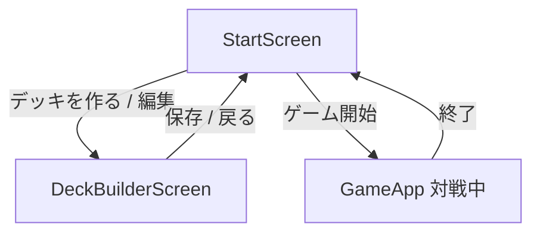

# Web フルプレイアブル要件（G5）

**目的:** Wiki 全カード（1,849 枚）を Web UI から「選べる・組める・対戦開始できる」状態に接続する。  
**更新:** 2026-06-10  
**関連:** [full-card-rollout-process.md](./full-card-rollout-process.md)（G5）, [card-generation-pipeline.md](./card-generation-pipeline.md), [effect_catalog.md](./effect_catalog.md), [vertical-slice-gaps.md](./vertical-slice-gaps.md)

---

## 前提（PO 確認済み・2026-06-10）

| 項目 | 決定 |
|------|------|
| デッキビルダー主カタログ | **1,849 枚を一括表示**（検索・フィルタ中心。L1–3 専用タブは廃止方向） |
| 未実装効果カードの扱い | **許可する**（保存時・対戦前に**警告バッジ**を表示） |
| 第一リリース（W1–W2）の成功定義 | **「組める・始められる」** — 1,849 枚から 40 枚デッキを作り CPU 対戦開始できること。効果の完全動作は W4–W5 で段階的に |
| OQ-01 禁止カード | **atwiki 禁止カード一覧（page 2079）**を正とする。適用は**通常大会禁止のみ**（タッグストライク専用 RS-244/289/348 は除外）。**W2** で `deckRules.ts` に最小実装。ソース: `docs/wiki/sources/atwiki/page-2079-banned.md` |
| OQ-02 expansion 表示名 | **Wiki の「収録」項目で統一**（例: 英雄の再誕、XG1 1stエンカウント）。技術キー（`vanilla-promoted` 等）は UI に出さない |
| OQ-03 警告粒度 | **枚数ベース MVP** — 「UI 未確認カードが N 枚含まれます」（保存時・開始時）。保存はブロックしない |
| OQ-04 主導線 | **スターター維持** — 既存プレイヤー向けデフォルト。フルプレイアブルは optgroup で併記 |
| OQ-05 画像方針 | **W1–W2 はプレースホルダ**（名前・BP・category）。**W3** で Wiki / grnrngr から段階取得に着手 |

> 「全カード対応済み」はエンジン／カード基盤（G0–G3）の構造完了を指す。本ドキュメントは **プロダクト接続（G5）** の要件であり、「選べる」「動く」「UI で操作できる」を分離して記述する。

---

## Phase 0 — 現状棚卸し

### 0-A: カタログ・デッキルール

| 項目 | 現状（事実） | 根拠 |
|------|-------------|------|
| `allCardsCatalog` 枚数 | **179**（L1: 70, L2: 52, L3: 57） | `packages/cards/src/catalog.ts`, `legend*/cards.json` |
| `fullPlayableCatalog` 枚数 | **1,849**（179 + vanilla 354 + complexity 1,316） | `packages/cards/src/extendedCatalog.ts` |
| ID 差分 | full のみ **1,670** 枚（promoted）。core は full の部分集合 | 上記 JSON 集計 |
| デッキビルダー参照カタログ | **`allCardsCatalog` のみ**（179 枚） | `DeckBuilderScreen.tsx` L68–74, `deckBuilder.ts` L61–75 |
| デッキ検証カタログ | **`allCardsCatalog`**（`validateDeckEntries` デフォルト） | `deckBuilder.ts` L60–62, `deckRules.ts` L44–47 |
| promoted `imageUrl` | **0 / 1,670**（全件欠損） | `generated/catalog/*-promoted/cards.json` 集計 |
| promoted `expansion` | 全件あり。値: `vanilla-promoted`, `complexity-promoted`, `legend1`–`legend3` | 同上 |
| promoted `category` | **1,670 / 1,670** あり | 同上 |
| `maxCopiesForCard` | 戦闘員・特定テキスト・`deck_copy_unlimited` ルールで 40 枚上限、それ以外 **3 枚** | `deckRules.ts` |
| 禁止カードリスト | **コード上なし**（公式 banned リスト未実装） | `deckRules.ts` 全体 |
| 40 枚制約 | `DECK_MIN_SIZE = 40`、スターターも 40 枚検証 | `deckRules.ts`, `validateStarterDeck` |
| full-playable で 40 枚ルール | **ロジックはそのまま使える**（カタログ引数を `fullPlayableCatalog` に差し替えれば可） | `validateDeckEntries(entries, catalog)` の設計 |
| `buildFullPromotedDeck` quotas | promoted のみ・**同名 1 枚**・サイズ別クォータ（M12/L10/XL2/OP6/vehicle2/S8） | `createPromotedGame.ts` |

**推測（根拠付き）:** 自作デッキに promoted ID を入れても、現状は検証で「不明なカード」エラー、保存後も `buildCardDefinitions` が `expandDeck` で throw する（`deckBuilder.ts` L64–75）。

---

### 0-B: 画面フロー

| 項目 | 現状（事実） | 根拠 |
|------|-------------|------|
| 画面状態 | `appScreen`: `"start"` \| `"deck-builder"`。対戦中は `state !== null` で GameApp 本体 | `GameApp.tsx` L138, L1421–1450 |
| デッキ種別 | **starter** — `buildStarterDeck` / **custom** — localStorage + `buildCardDefinitions` / **full-promoted** — `createFullPromotedGame` / **hybrid-promoted** — `buildHybridPromotedDeck` | `deckSelection.ts` |
| full-promoted 開始条件 | 人間・CPU **双方** full-promoted のときのみ `createFullPromotedGame`（専用経路） | `deckSelection.ts` L136–141 |
| custom + promoted 混在 | `createGameForDecks` 経路だが、custom は L1–3 カード定義のみ展開可能 | `deckSelection.ts` L107, `deckBuilder.ts` |
| localStorage キー | `rangers-strike/custom-decks/v1` | `deckBuilder.ts` L19 |
| スキーマ | `{ id, name, entries: [{cardId, count}], updatedAt }` — **カタログ版・警告フラグなし** | `deckBuilder.ts` L21–26 |
| URL 永続 | **なし**（Next.js ルートは単一、クエリ未使用） | `GameApp.tsx` 全体 |
| リロード時 | デッキ選択・CPU レベル・先攻は**初期値に戻る**（abarenoh / dekaranger / Lv3 / 人間先攻）。custom デッキ一覧のみ localStorage から復元 | `GameApp.tsx` L135–170, L209–211 |
| 削除デッキ参照 | `refreshCustomDecks` が starter にフォールバック | `GameApp.tsx` L217–224 |

**StartScreen デッキ選択 UI（現状）**

| optgroup | 内容 |
|----------|------|
| スターター | L1–3 公式 5 デッキ |
| フルプレイアブル | ランダム full-promoted / hybrid +10/+25/+35 |
| 自作デッキ | localStorage の custom（**L1–3 のみ構成可能**） |

---

### 0-C: ゲーム中 UI

#### `webUiEffectCoverage.ts` が明示マップする effectId

**オペレーション（38 effectId / 35 カード）** — L1–3 の `operationCatalog` 接続分のみ:

| 種別 | effectId 数 | 代表 UI 経路 |
|------|------------|-------------|
| instant | 18 | `operation_drag_direct`, `operation_drag_target_modal`, `operation_denji_effect_choice`, `operation_cyber_s_rider_modal` 等 |
| permanent | 15 | `operation_permanent_place`, `operation_permanent_click`, `command_payment_modal` 等 |
| counter | 5 | `operation_counter_reaction` |

**ユニット（named effectId 約 83）** — トリガー別の汎用経路マップ:

| トリガー | effectId 数 | UI 経路 |
|----------|------------|---------|
| on_rush | 18 | `board_target_tap`, `effect_choice_modal`, `effect_choice_banner` |
| conditional | 14 | `battle_entry_modal`, `effect_choice_modal` 等 |
| on_attack | 14 | `battle_drag_attack`, `passive_engine_only` |
| enter_battle | 11 | `battle_entry_modal`, `effect_choice_modal` |
| passive | 25 | `passive_engine_only`, `effect_choice_modal`, `damage_payment_modal` |
| on_turn_end | 1 | （`IMPLEMENTED_ON_TURN_END`、UI マップは passive 系に準ずる） |

> 根拠: `webUiEffectCoverage.ts`, `operationCatalog.ts`, `unitEffectCatalog.ts`

#### L1–3 以外のギャップ（推定）

| 観点 | 事実 / 推定 | 根拠 |
|------|------------|------|
| promoted カードの `getCardById` | Web 全体が **`getCardById`（179 枚）** を使用。promoted は **undefined** になりうる | `catalog.ts` L24–26, `GameApp` / modals 各所 |
| `getCardEffect` | **L1–3 オペ 35 枚のみ** | `effects.ts` L38–92 |
| `EffectChoiceModal` | `pendingEffectChoice` の **kind / effectId 分岐**で動作。DSL 汎用フォールバックは**限定的**（`effectChoiceHint.ts` に個別 effectId 文言） | `EffectChoiceModal.tsx`, `effectChoiceHint.ts` |
| full-promoted 対戦 | エンジンは `createFullPromotedGame` で起動可能。**UI はカード定義解決・画像が promoted で欠落**しやすい | `deckSelection.ts`, `CardImage.tsx` L76 |
| クラッシュ / illegal_action | vertical slice で **VS-BUG-01**（effectStack キャッシュ）修正済み。full promoted sim は `apply_failed: 0` を G4 目標とするが **Web 未検証** | `vertical-slice-gaps.md`, `full-card-rollout-process.md` §Phase 5 |
| G3.5 実行時 noop | rematch シミュレーションは **99.6% effective**（`rollout-status.json`）だが、**Web UI 未配線 effect** は別問題（操作不能でスタールの可能性） | `rollout-status.json` `effectResolution` |

---

### 0-D: 非機能

| 項目 | 現状（事実） | リスク |
|------|-------------|--------|
| 一覧レンダリング | **全件 `map`、仮想スクロールなし**。`max-height: 280px` + `overflow-y: auto` | 1,849 件で初回 DOM 肥大・スクロール重い |
| フィルタ | 検索・type・category・expansion（L1–3 のみ） | promoted フィルタ未対応 |
| モバイル | デッキビルダー縦積み、カタログ高さ 280px（768px+ で 360px） | 片手操作は検索＋スクロール中心で**操作可能だが長い** |
| 画像 | L1–3: `imageUrl` あり。promoted: **100% プレースホルダ**（ID 表示） | UX 低下、識別困難 |
| カード参照 API | `getCardById` ≠ `getFullPlayableCardById`（後者は export 済みだが Web 未使用） | `index.ts` L130–148 |

---

### 現状 vs 目標 比較表

| 観点 | 現状 | 目標（G5 / PO 前提） |
|------|------|---------------------|
| カタログ枚数（ビルダー） | 179 | 1,849 |
| カタログ枚数（検証） | 179 | 1,849 |
| 自作 full デッキ対戦 | 不可（promoted ID で破綻） | 可 |
| ランダム full-promoted 対戦 | 可 | 維持 |
| UI 効果カバレッジ | L1–3 named ~120 effectId | promoted DSL 効果は W4–W5 で可視化 |
| 画像 | promoted 0% | W3 でプレースホルダ改善最低限 |
| G5 ゲート | `unknown` / 未接続 | W1–W2 完了で pass 再定義 |

---

## Phase 1 — ギャップ分析

「選べる / 組める / 始められる / 動く / 操作できる / 分かる」の 6 観点。

| ID | ギャップ | 観点 | 深刻度 | ブロッカー |
|----|---------|------|--------|-----------|
| GAP-01 | デッキビルダーが `allCardsCatalog`（179）固定 | 選べる | **P0** | **G5 ブロッカー** |
| GAP-02 | `validateDeckEntries` / `buildCardDefinitions` が L1–3 カタログ固定 | 組める | **P0** | **G5 ブロッカー** |
| GAP-03 | custom デッキの game 生成が L1–3 展開のみ | 始められる | **P0** | **G5 ブロッカー** |
| GAP-04 | `getCardById` が promoted を解決しない（対戦 UI 全体） | 分かる | **P1** | GAP-03 とセット |
| GAP-05 | promoted `imageUrl` 全欠損 | 分かる | **P2** | 非ブロッカー（W3） |
| GAP-06 | `webUiEffectCoverage` が L1–3 named effect のみ | 操作できる | **P1** | W4 まで許容（警告で期待値調整） |
| GAP-07 | 未実装 UI 効果で `pendingEffectChoice` スタールの可能性 | 操作できる | **P1** | G4 + W4 |
| GAP-08 | 部分実装のユーザー通知なし | 分かる | **P1** | PO 方針（警告のみ）で W2 着手 |
| GAP-09 | 1,849 件リストのパフォーマンス未対策 | 選べる | **P2** | W1 は検索必須で緩和、W3 で本対策 |
| GAP-10 | デッキ選択・対戦設定がリロードで消失 | 始められる | **P3** | 非ブロッカー |
| GAP-11 | 公式 banned リスト未実装 | 組める | **P3** | PO 確認待ち |
| GAP-12 | `buildFullPromotedDeck` quotas と自作ルールの差（同名 1 vs 3） | 組める | **P2** | プリセット専用として文書化で可 |

### 深刻度定義

| 優先度 | 意味 |
|--------|------|
| P0 | W1–W2（第一リリース）必須。G5 未達 |
| P1 | 実用プレイ・期待値調整に必要（W2–W4） |
| P2 | 品質・速度改善（W3–W5） |
| P3 | 後回し可 |

---

## Phase 2 — 要件定義

### 1. 目的とスコープ

**目的:** ユーザーが 1,849 枚のカードプールから 40 枚デッキを組み、保存し、StartScreen で選択して CPU 対戦を開始できるようにする。

**スコープ内**

- StartScreen / DeckBuilderScreen / GameApp のカタログ・検証・game 生成接続
- 部分実装カードの警告表示（PO 方針）
- 既存 starter / custom（L1–3）・full-promoted プリセットの後方互換

**スコープ外**

- マルチプレイ、ランキング、公式大会ルールの完全再現
- G3.5 エンジン側パターン追加（cards/engine 担当。本要件は Web 接続と可視化）
- promoted カード画像の一括アセット制作（別プロジェクト）

**用語**

| 用語 | 定義 |
|------|------|
| 構造対応 | G0–G3: カタログ・DSL・エンジン配線完了 |
| ゲームプレイ対応 | G3.5–G4: 効果が実行時に解決し対戦が完走 |
| UI 対応 | G5: 選ぶ・組む・操作する・分かる |

---

### 2. ユーザーストーリー

1. **US-01:** プレイヤーとして 1,849 枚を検索・フィルタし 40 枚デッキを作り、保存して CPU 対戦したい。
2. **US-02:** スターターデッキを読み込み、数枚だけ promoted カードに差し替えたい。
3. **US-03:** デッキに部分実装カードが含まれるとき、保存前・対戦前に警告を見て期待値を調整したい。
4. **US-04:** ランダム full-promoted で試し、慣れたら自作 full デッキに切り替えたい。
5. **US-05:** 対戦中にカード名・テキストは見え、画像がなくても ID / 名前で識別したい。

---

### 3. 画面一覧と要件

#### 3.1 StartScreen（対戦設定）

| 要件 ID | 要件 | 優先度 |
|---------|------|--------|
| SS-01 | 自作デッキ optgroup に **full-playable 構成デッキ**を表示（現状維持＋ラベル改善） | W2 |
| SS-02 | 「フルプレイアブル」optgroup に **ランダムプリセット**と**自作**の併記。自作には枚数・警告バッジ | W2 |
| SS-03 | full-playable 自作選択時、対戦開始前に **部分実装警告**（1 行サマリー + 詳細リンク任意） | W2 |
| SS-04 | サブタイトル文言を「全カード（1,849枚）」に更新 | W1 |
| SS-05 | CPU レベル・先攻は現状維持 | — |
| SS-06 | 部分実装の注意書き（フッターまたは開始ボタン上）: 「一部カードは効果 UI 未対応の場合があります」 | W2 |

**非要件（W1–W2）:** optgroup をタブ UI に全面置換、URL クエリ永続。

---

#### 3.2 DeckBuilderScreen（デッキ作成）

| 要件 ID | 要件 | 優先度 |
|---------|------|--------|
| DB-01 | カタログソースを **`fullPlayableCatalog.cards`** に切替（PO: 一括 1,849） | W1 |
| DB-02 | カード解決に **`getFullPlayableCardById`**（または統合 `resolveCard`）を使用 | W1 |
| DB-03 | 検索: 名前・ID（現状維持）。**初期表示は検索促進**（空検索時は上位 N 件 or 促し文言） | W1 |
| DB-04 | フィルタ expansion: **Wiki「収録」セット名**（OQ-02）。`legend1`–`legend3` / promoted 技術キーは内部のみ | W1 |
| DB-05 | フィルタ type / category: 現状維持（full カタログ上で動作） | W1 |
| DB-06 | カード行に **実装ステータスバッジ**（例: Core / Promoted / UI未確認） | W4 |
| DB-07 | 保存時、デッキ内に **UI 未配線 or G3.5 要注意**カードがあれば **警告**（保存は許可） | W2 |
| DB-08 | 検証エラー表示: 不明 ID・枚数超過・40 枚未満（現状パターン拡張） | W1 |
| DB-09 | スターター読込: 現状維持（L1–3 テンプレ → full カタログ上で有効） | W1 |
| DB-10 | カード詳細（Modal）: `text` 表示。`dslReady` はデバッグ or W5 バッジ | W4 |
| DB-11 | パフォーマンス: W1 は検索フィルタ必須。W3 で仮想スクロール or ページング検討 | W3 |

**デッキ内容パネル:** `getCardById` → `getFullPlayableCardById` に統一（GAP-04 解消）。

---

#### 3.3 GameApp（対战中）

| 要件 ID | 要件 | 優先度 |
|---------|------|--------|
| GA-01 | custom full デッキは **`createGameForDecks`** + `fullPlayableCatalog` 展開で起動 | W2 |
| GA-02 | full-promoted 双方は現状 **`createFullPromotedGame`** 維持 | — |
| GA-03 | カード表示は **`getFullPlayableCardById` フォールバック**（全 Web コンポーネント） | W2 |
| GA-04 | 未知 `effectId` の `pendingEffectChoice`: 汎用 `EffectChoiceModal` + effectId 表示 + スキップ可能 | W4 |
| GA-05 | デバッグモード（開発時）: ログに `effectId` / `interpret_effect_unresolved` 表示 | W4 |
| GA-06 | L1–3 専用 modal（Denji, Cyber-S, BattleDance 等）は **既存優先**。promoted は汎用経路にフォールバック | W4 |
| GA-07 | `startGame` 前検証を full カタログ基準に更新 | W2 |

---

#### 3.4 共通

| 要件 ID | 要件 |
|---------|------|
| CM-01 | ラベル: 「Legend 1〜3」単独表記を「全カード（1,849枚）」に段階更新 |
| CM-02 | エラー: `formatActionError` 現状維持 + デッキ検証エラーは日本語明示 |
| CM-03 | a11y: ボタン `aria-label`、エラー `role="alert"` 維持。画像欠損時は `card.name` を alt 代替 |

---

### 4. データ・API 要件

| 要件 | 詳細 |
|------|------|
| `deckBuilder.ts` | `validateDeckEntries(entries, fullPlayableCatalog)` / `expandDeck(..., fullPlayableCatalog)` に変更 |
| `deckSelection.ts` | `buildCardDefinitions` が full カタログを返す。`resolveDeckCards` で custom が promoted を含めて起動 |
| localStorage | **v1 維持で可**（entries は cardId のみ）。警告は都度計算。将来 `coverageWarningsAckAt` を v2 で追加検討 |
| `@rangers-strike/cards` export | `getFullPlayableCardById` は既存。**追加推奨:** `resolvePlayableCard(id)` = core → full フォールバック統合関数 |
| カバレッジヘルパー | Web 用 `estimateCardUiCoverage(cardId)` — `webUiEffectCoverage` + DSL メタを集約（W5） |

---

### 5. デッキルール要件

| ルール | 要件 |
|--------|------|
| 枚数 | **40 枚固定**（`DECK_MIN_SIZE`） |
| 同名上限 | 基本 3 枚。戦闘員等は 40 枚（`maxCopiesForCard`） |
| 禁止カード | **W2 実装** — atwiki page 2079、通常大会禁止のみ（タッグ専用除外）。`deckRules.ts` に `BANNED_CARD_IDS` |
| promoted-only 自作 | ** quotas 不要**（`buildFullPromotedDeck` はランダムプリセット専用）。自作は通常 3 枚制限 |
| アプリ独自ルール | 公式フォーマット未定義のため、本アプリは「40 枚・同名 3（例外あり）・1,849 プール」を採用と明記 |

---

### 6. 品質・リスク

| リスク | 影響 | 緩和 |
|--------|------|------|
| G3.5 noop | カードは出るが効果無音 | 警告バッジ + W5 カバレッジ連動 |
| UI 未配線 | 操作待ちで進行不能 | W4 汎用 modal / スキップ。G4 sim で検出 |
| 画像欠損 | 識別困難 | プレースホルダに名前・category・BP。W3 でジェネレータ検討 |
| 1849 リスト DOM | 初回遅延・スクロール重い | 検索必須 + W3 仮想化 |
| `getCardById` 散在 | promoted 表示バグ | W2 で `resolvePlayableCard` 一括置換 |
| 既存 L1–3 デッキ破壊 | 回帰 | W2 受け入れ: starter / 既存 custom がそのまま動く |

---

### 7. フェーズ分割（実装ロードマップ）

| フェーズ | 内容 | 主な要件 ID | ユーザー価値 |
|---------|------|------------|--------------|
| **W1** | デッキビルダーを `fullPlayableCatalog` に接続 + 検索・expansion フィルタ | DB-01–05, DB-08–09, SS-04 | 全カードから組める |
| **W2** | 自作デッキで対戦開始 + 検証・game 生成 + カード解決統一 + 警告 | GAP-01–04, SS-02–03, GA-01–03, GA-07, DB-07 | 組んだデッキで遊べる |
| **W3** | パフォーマンス（仮想スクロール等）・画像プレースホルダ改善 | DB-11, GAP-05, GAP-09 | 実用速度 |
| **W4** | 未実装 UI / 効果の可視化 + 汎用 EffectChoice + デバッグ | DB-06, GA-04–06, GAP-06–07 | 期待値調整・スタール低減 |
| **W5** | G3.5 / rollout-status 連動カバレッジバッジ | DB-10, カバレッジヘルパー | 品質の見える化 |

**MVP = W1 + W2**（PO 成功定義: 組める・始められる）

---

### 8. 受け入れ基準（G5 再定義案）

| # | 基準 |
|---|------|
| AC-01 | デッキビルダーで `fullPlayableCatalog` から任意カードを検索・追加できる |
| AC-02 | 40 枚・枚数制限を満たす自作デッキを保存できる（部分実装カード含む。警告表示あり） |
| AC-03 | StartScreen で自作デッキを選択し CPU 対戦を開始できる |
| AC-04 | 対戦中、promoted カードが **名前・テキスト付き**で表示される（画像はプレースホルダ可） |
| AC-05 | 既存 starter 5 種・既存 L1–3 custom デッキ・full-promoted プリセットが回帰なく動作 |
| AC-06 | モバイル幅（〜767px）でデッキビルダーの検索・追加・保存が完了できる |
| AC-07 | （推奨・W4 以降）vertical slice / 手動 smoke で自作 full デッキの `apply_failed: 0` |

`audit:rollout-status` の G5 を **「AC-01–AC-06 満たす」** に更新する提案。

---

### 9. オープンクエスチョン（PO 確認事項）

| # | 質問 | 状態 |
|---|------|------|
| OQ-01 | 公式デッキルールで **banned リスト**はあるか。あればソースと適用範囲 | **確認済み:** atwiki page 2079。通常大会禁止のみ（現状ドギー・クルーガー XG2 相当）。W2 で `deckRules.ts` 実装 |
| OQ-02 | promoted の **expansion 表示名**（`vanilla-promoted` → ユーザー向けラベル） | **確認済み:** Wiki「収録」項目の表記で統一。フィルタは収録セット名ベース |
| OQ-03 | 部分実装カードの警告レベル（デッキ全体 % vs 枚数ベース） | **確認済み:** 枚数ベース MVP。「UI 未確認カードが N 枚」— 保存・開始時表示、保存ブロックなし |
| OQ-04 | ランダム full-promoted と自作の **主導線**（どちらをデフォルト強調するか） | **確認済み:** スターターデッキをデフォルト強調。フルプレイアブルは optgroup 併記 |
| OQ-05 | promoted 画像アセットの取得方針（Wiki / プレースホルダ永久） | **確認済み:** W1–W2 プレースホルダ。W3 で Wiki/grnrngr 段階取得着手 |

---

### 10. 関連タスク分解（実装バックログ・見出しのみ）

1. **W1:** `deckBuilder.ts` を `fullPlayableCatalog` 検証・展開に切替
2. **W1:** `DeckBuilderScreen` カタログソースと expansion フィルタ（promoted 系）追加
3. **W1:** `getFullPlayableCardById` によるデッキ内容パネル表示修正
4. **W1:** 空検索時 UX（件数表示・検索促進コピー）
5. **W2:** `resolvePlayableCard` ヘルパーを `@rangers-strike/cards` に追加し Web 一括置換
6. **W2:** `deckSelection.resolveDeckCards` / custom 経路の full 展開確認テスト
7. **W2:** デッキ保存時・StartScreen 開始時の部分実装警告コンポーネント
8. **W2:** `GameApp.startGame` 検証を full カタログ基準に更新
9. **W2:** StartScreen 文言・optgroup ラベル更新（全カード対応の明示）
10. **W2:** 回帰テスト — starter / L1–3 custom / full-promoted プリセット
11. **W3:** デッキビルダー仮想スクロール or ページング POC
12. **W3:** promoted カードプレースホルダ UI 改善（名前・BP・category 強調）
13. **W4:** `estimateCardUiCoverage` とデッキビルダーバッジ
14. **W4:** 汎用 `EffectChoiceModal` フォールバック（未知 effectId）
15. **W4:** 開発者向け effect ログ（effectId / unresolved）トグル
16. **W5:** `rollout-status.json` / G3.5 メトリクスと UI バッジ連動
17. **横断:** `webUiIntegration.test.ts` を full カタログのサンプルデッキで拡張
18. **横断:** `audit:rollout-status` G5 判定を AC-01–06 に同期（ドキュメント PR）
19. **将来:** localStorage v2（警告確認タイムスタンプ）設計
20. **将来:** 公式 banned リスト対応（`deckRules.ts`）

---

## Phase 3 — レビュー用サマリー（1 ページ）

### 現状 3 行

- エンジン／カード基盤は **1,849 枚（G0–G3 完了）**。G3.5 rematch は audit 上 **pass（99.6%）**。
- Web は **デッキビルダー・検証・custom 対戦が L1–3（179 枚）固定**。full-promoted **ランダムプリセットのみ** full 接続。
- 対戦 UI の effect 配線は **L1–3 named effect ~120 件**中心。promoted は `getCardById` 非解決・画像 0%。

### 最大ギャップ 5 件

1. **GAP-01** デッキビルダーが 179 枚カタログ固定（P0 / G5 ブロッカー）
2. **GAP-02** 検証・展開が `allCardsCatalog` 固定（P0）
3. **GAP-03** 自作デッキで full 対戦開始不可（P0）
4. **GAP-04** `getCardById` により promoted の対戦表示が欠落（P1）
5. **GAP-06/07** UI 効果カバレッジが L1–3 中心。未配線で操作不能リスク（P1）

### 推奨 W1–W2 スコープ

- **W1:** `fullPlayableCatalog` 接続、検索・expansion フィルタ、検証・表示修正
- **W2:** custom の `createGameForDecks` 起動、`resolvePlayableCard` 統一、警告バッジ、回帰テスト

→ PO 成功定義「**組める・始められる**」を満たし、G5 を **unknown → pass（再定義）** にできる最小セット。

### PO に聞くべき質問 3 件

1. 公式 **banned リスト**の有無とソース（OQ-01）
2. promoted **expansion のユーザー向け表示名**（OQ-02）
3. ランダム full-promoted と自作デッキ、**どちらを主導線**にするか（OQ-04）

---

## 変更履歴

| 日付 | 内容 |
|------|------|
| 2026-06-10 | 初版草稿（Phase 0–3、PO 前提反映） |
| 2026-06-10 | OQ 確定（OQ-01〜05 PO 回答反映、§前提追記） |
| 2026-06-10 | W5 完了: `estimateCardUiCoverage` バッジ + `audit:rollout-status` G5 pass |
